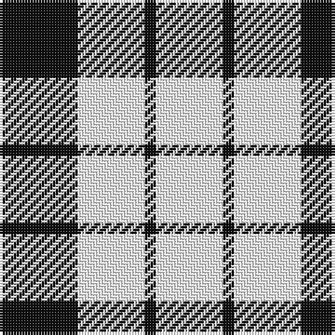

In pattern [KWKW](/patterns/kwkw/).

This was sourced from register-of-tartans.  It is a [4 stripes tartan](/stripes/stripes4/).

Original link https://www.tartanregister.gov.uk/tartanDetails.aspx?ref=5293

## Attestations

This cloth appears in 4 source records; the oldest owns this page.

- 01/01/1842 — Lendrum (B&W) (register-of-tartans, [record](https://www.tartanregister.gov.uk/tartanDetails.aspx?ref=5293))
- 1842 — Wallace Dress (Clan) (tartans-authority, [record](http://www.tartansauthority.com/tartan-ferret/display/1251/))
- 1842 — MacFarlane B & W (Clan) (tartans-authority, [record](http://www.tartansauthority.com/tartan-ferret/display/3051/))
- 1842 — Lendrum (B&W) (Clan) (tartans-authority, [record](http://www.tartansauthority.com/tartan-ferret/display/3086/))

## Thread count
K/28 W24 K4 W/24

## Palette
Each colour and its ΔE from the base-6 reference it is a variant of.

| Colour | Shade | Base | ΔE (OKLab) |
|---|---|---|---|
| K | <code style="background-color:#101010;">#101010</code> `#101010` | K <code style="background-color:#000000;">#000000</code> | 0.17 |
| W | <code style="background-color:#FCFCFC;">#FCFCFC</code> `#FCFCFC` | W <code style="background-color:#F7F7F7;">#F7F7F7</code> | 0.01 |

# Sample pattern

## Nearest tartans

The nearest existing variants by ΔTartan distance.

1. [MacFarlane B/W or Lendrum Clan Tartan Tartan Number: 1251. Earliest known date: 1842 The design comes from the Vestiarium Scoticum (1842). The authors, the Sobieski Stuart brothers, enjoyed a popular following among the Scottish gentry in the early Victorian era, and in the spirit of the times, added mystery, romance and some spurious historical documentation to the subject of tartan. Of the better known tartans, the book offers some minor variation, but in other cases it provides the only recorded version of many tartans in use today. See products available Copyright © Blair Urquhart, Comrie, 2015](/setts/s4/k7w6k1w6x2~k101010-we0e0e0/) — ΔT 0.44
1. [MacFarlane, Lendrum Black and White](/setts/s4/k7w6k1w6x4~k000000-we0e0e0/) — ΔT 1.01
1. [MacLeod Black & White](/setts/s5/w14k2w14k19w2x2~k101010-wfcfcfc/) — ΔT 1.18
1. [Wallace Dress](/setts/s6/k7w6k1w6k1w6x4~k101010-wfcfcfc/) — ΔT 1.21
1. [MacFarlane VS](/setts/s4/k7w6k1w6~k000000-wd0d0d0/) — ΔT 1.26
1. [MacLeod Black & White Clan Tartan Tartan Number: 1828. Earliest known date: 1906 Same sett as MacLeod Black and Red 1591. Similar to Erskine (1185) and very close ro Campbell of Armadie (3481). See products available Copyright © Blair Urquhart, Comrie, 2015](/setts/s5/w8k1w8k12w1x2~k101010-we0e0e0/) — ΔT 1.63
1. [MacPhee (Black and White)](/setts/s4/k22w3k3w22x2~k101010-wfcfcfc/) — ΔT 1.67
1. [MacPhee (B&W) Clan Tartan Tartan Number: 1252. Earliest known date: c.1930 In 1992, Sandy MacFie, the Chief of the MacPhees wrote to the Scottish Tartans Society from his home in Queensland Australia, with a request to register the MacPhee tartans. The existance of a black and white pattern was known to him but the precise details of the pattern were obscure. The Society had two reported examples of a MacPhee which met the description. One from the researches of a Canadian member, A.C. Lumsden, and the other from a Mr D. Brown in Leeds. The chosen black and white sett mirrors the clan pattern and was duly registered by the Society. The clan tartan was registered by Lord Lyon in the previous year. See products available Copyright © Blair Urquhart, Comrie, 2015](/setts/s4/k22w3k3w22x2~k101010-we0e0e0/) — ΔT 1.84
1. [MacMugen](/setts/s6/b3w16b4w3b12w2x3~b003c64-wfcf0c8/) — ΔT 1.86
1. [MacFarlane VS](/setts/s4/k7y6k1y6x2~k000000-yaaaaaa/) — ΔT 1.86

## Neighbour map

Every grey dot is one of 15726 variants placed by the first two principal components of the ΔTartan feature space (44% of its variance). Red is this tartan; blue dots are its nearest — click one to open its page.

<svg viewBox="0 0 640 380" role="img" style="max-width:100%;height:auto;border:1px solid #e0e0e0;border-radius:4px;display:block" xmlns="http://www.w3.org/2000/svg"><image href="/nn/cloud.v1.png" width="640" height="380"/><a href="/setts/s4/k7w6k1w6x2~k101010-we0e0e0/"><circle cx="291.4" cy="291.9" r="4" fill="#3465a4"><title>MacFarlane B/W or Lendrum Clan Tartan Tartan Number: 1251. Earliest known date: 1842 The design comes from the Vestiarium Scoticum (1842). The authors, the Sobieski Stuart brothers, enjoyed a popular following among the Scottish gentry in the early Victorian era, and in the spirit of the times, added mystery, romance and some spurious historical documentation to the subject of tartan. Of the better known tartans, the book offers some minor variation, but in other cases it provides the only recorded version of many tartans in use today. See products available Copyright © Blair Urquhart, Comrie, 2015</title></circle></a><a href="/setts/s4/k7w6k1w6x4~k000000-we0e0e0/"><circle cx="289.0" cy="294.2" r="4" fill="#3465a4"><title>MacFarlane, Lendrum Black and White</title></circle></a><a href="/setts/s5/w14k2w14k19w2x2~k101010-wfcfcfc/"><circle cx="311.3" cy="243.7" r="4" fill="#3465a4"><title>MacLeod Black &amp; White</title></circle></a><a href="/setts/s6/k7w6k1w6k1w6x4~k101010-wfcfcfc/"><circle cx="322.1" cy="258.9" r="4" fill="#3465a4"><title>Wallace Dress</title></circle></a><a href="/setts/s4/k7w6k1w6~k000000-wd0d0d0/"><circle cx="291.2" cy="296.3" r="4" fill="#3465a4"><title>MacFarlane VS</title></circle></a><a href="/setts/s5/w8k1w8k12w1x2~k101010-we0e0e0/"><circle cx="320.0" cy="235.8" r="4" fill="#3465a4"><title>MacLeod Black &amp; White Clan Tartan Tartan Number: 1828. Earliest known date: 1906 Same sett as MacLeod Black and Red 1591. Similar to Erskine (1185) and very close ro Campbell of Armadie (3481). See products available Copyright © Blair Urquhart, Comrie, 2015</title></circle></a><a href="/setts/s4/k22w3k3w22x2~k101010-wfcfcfc/"><circle cx="282.2" cy="257.7" r="4" fill="#3465a4"><title>MacPhee (Black and White)</title></circle></a><a href="/setts/s4/k22w3k3w22x2~k101010-we0e0e0/"><circle cx="286.8" cy="261.2" r="4" fill="#3465a4"><title>MacPhee (B&amp;W) Clan Tartan Tartan Number: 1252. Earliest known date: c.1930 In 1992, Sandy MacFie, the Chief of the MacPhees wrote to the Scottish Tartans Society from his home in Queensland Australia, with a request to register the MacPhee tartans. The existance of a black and white pattern was known to him but the precise details of the pattern were obscure. The Society had two reported examples of a MacPhee which met the description. One from the researches of a Canadian member, A.C. Lumsden, and the other from a Mr D. Brown in Leeds. The chosen black and white sett mirrors the clan pattern and was duly registered by the Society. The clan tartan was registered by Lord Lyon in the previous year. See products available Copyright © Blair Urquhart, Comrie, 2015</title></circle></a><a href="/setts/s6/b3w16b4w3b12w2x3~b003c64-wfcf0c8/"><circle cx="291.9" cy="234.2" r="4" fill="#3465a4"><title>MacMugen</title></circle></a><a href="/setts/s4/k7y6k1y6x2~k000000-yaaaaaa/"><circle cx="298.1" cy="302.0" r="4" fill="#3465a4"><title>MacFarlane VS</title></circle></a><circle cx="286.2" cy="287.8" r="5" fill="#c00000"/></svg>

ID: /setts/s4/k7w6k1w6x4~k101010-wfcfcfc/
