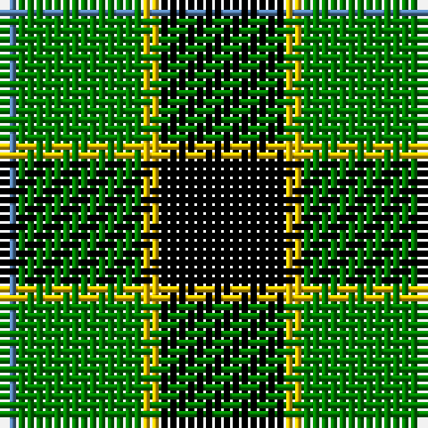

In pattern [BGYK](/patterns/bgyk/).

This was sourced from weddslist.  It is a [4 stripes tartan](/stripes/stripes4/).

Original link http://www.weddslist.com/cgi-bin/tartans/pg.pl?source=sts

## Thread count
B/2 G14 Y2 K/14

## Palette
Each colour and its ΔE from the base-6 reference it is a variant of.

| Colour | Shade | Base | ΔE (OKLab) |
|---|---|---|---|
| B | <code style="background-color:#5480B0;">#5480B0</code> `#5480B0` | B <code style="background-color:#2A418A;">#2A418A</code> | 0.19 |
| G | <code style="background-color:#008000;">#008000</code> `#008000` | G <code style="background-color:#006100;">#006100</code> | 0.10 |
| K | <code style="background-color:#000000;">#000000</code> `#000000` | K <code style="background-color:#000000;">#000000</code> | 0.00 |
| Y | <code style="background-color:#F0C000;">#F0C000</code> `#F0C000` | Y <code style="background-color:#F2BF00;">#F2BF00</code> | 0.00 |

# Sample pattern

## Nearest tartans

The nearest existing variants by ΔTartan distance.

1. [Wilson's, No 79](/setts/s4/k7w1g7b1x2~b5480b0-g008000-k000000-we0e0e0/) — ΔT 0.23
1. [Robert Gordon University](/setts/s5/k7r3k24g28y3x2~g30a010-k000000-rc00000-yf0c000/) — ΔT 0.88
1. [Douglas, Black](/setts/s5/k8b5g44k40r6~b3070fc-g007800-k000000-rc40000/) — ΔT 0.94
1. [Wilson's No.079](/setts/s4/k7w1g7b1x2~b5c8ca8-g006818-k101010-wfcfcfc/) — ΔT 1.01
1. [Innes, hunting](/setts/s4/k30b7g36k5x2~b304080-g008000-k000000/) — ΔT 1.05
1. [Wallace, hunting](/setts/s4/k4g33k33y4x2~g008000-k000000-yf0c000/) — ΔT 1.21
1. [Unnamed 3](/setts/s6/g2b4k6ba1g9k2x2~b8080d0-ba5480b0-g008000-k000000/) — ΔT 1.24
1. [Wilson's No.197](/setts/s4/g6y1k6y1x4~g006818-k101010-ye8c000/) — ΔT 1.29
1. [Sinclair, hunting](/setts/s7/g6r2g13k6w2k16r3x2~g008000-k000000-r900030-we0e0e0/) — ΔT 1.31
1. [Wallace Htg (Clan)](/setts/s4/k1g8k8y1x4~g006818-k000000-ydcbc00/) — ΔT 1.35

## Neighbour map

Every grey dot is one of 15726 variants placed by the first two principal components of the ΔTartan feature space (44% of its variance). Red is this tartan; blue dots are its nearest — click one to open its page.

<svg viewBox="0 0 640 380" role="img" style="max-width:100%;height:auto;border:1px solid #e0e0e0;border-radius:4px;display:block" xmlns="http://www.w3.org/2000/svg"><image href="/nn/cloud.v1.png" width="640" height="380"/><a href="/setts/s4/k7w1g7b1x2~b5480b0-g008000-k000000-we0e0e0/"><circle cx="196.4" cy="247.3" r="4" fill="#3465a4"><title>Wilson's, No 79</title></circle></a><a href="/setts/s5/k7r3k24g28y3x2~g30a010-k000000-rc00000-yf0c000/"><circle cx="229.9" cy="219.0" r="4" fill="#3465a4"><title>Robert Gordon University</title></circle></a><a href="/setts/s5/k8b5g44k40r6~b3070fc-g007800-k000000-rc40000/"><circle cx="234.1" cy="225.5" r="4" fill="#3465a4"><title>Douglas, Black</title></circle></a><a href="/setts/s4/k7w1g7b1x2~b5c8ca8-g006818-k101010-wfcfcfc/"><circle cx="218.6" cy="252.4" r="4" fill="#3465a4"><title>Wilson's No.079</title></circle></a><a href="/setts/s4/k30b7g36k5x2~b304080-g008000-k000000/"><circle cx="239.7" cy="274.3" r="4" fill="#3465a4"><title>Innes, hunting</title></circle></a><a href="/setts/s4/k4g33k33y4x2~g008000-k000000-yf0c000/"><circle cx="269.9" cy="260.4" r="4" fill="#3465a4"><title>Wallace, hunting</title></circle></a><a href="/setts/s6/g2b4k6ba1g9k2x2~b8080d0-ba5480b0-g008000-k000000/"><circle cx="186.2" cy="224.0" r="4" fill="#3465a4"><title>Unnamed 3</title></circle></a><a href="/setts/s4/g6y1k6y1x4~g006818-k101010-ye8c000/"><circle cx="221.5" cy="274.4" r="4" fill="#3465a4"><title>Wilson's No.197</title></circle></a><a href="/setts/s7/g6r2g13k6w2k16r3x2~g008000-k000000-r900030-we0e0e0/"><circle cx="199.8" cy="218.5" r="4" fill="#3465a4"><title>Sinclair, hunting</title></circle></a><a href="/setts/s4/k1g8k8y1x4~g006818-k000000-ydcbc00/"><circle cx="277.3" cy="265.8" r="4" fill="#3465a4"><title>Wallace Htg (Clan)</title></circle></a><circle cx="198.3" cy="247.8" r="5" fill="#c00000"/></svg>

ID: /setts/s4/k7y1g7b1x2~b5480b0-g008000-k000000-yf0c000/
