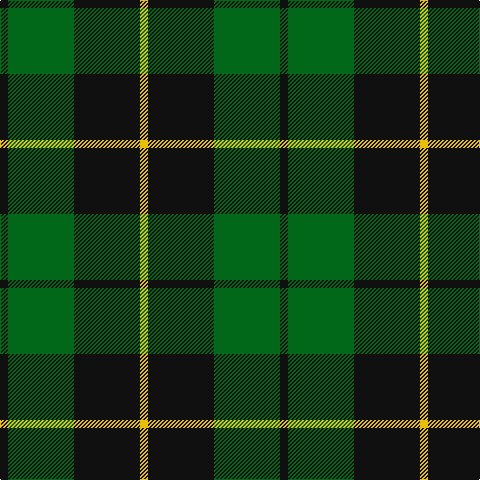

In pattern [KGKY](/patterns/kgky/).

This was sourced from house-of-tartan.  It is a [4 stripes tartan](/stripes/stripes4/).

Original link http://www.house-of-tartan.scotland.net/house/TartanViewjs.asp?colr=Def&tnam=1101

## Thread count
K/8 G66 K66 Y/8

## Palette
Each colour and its ΔE from the base-6 reference it is a variant of.

| Colour | Shade | Base | ΔE (OKLab) |
|---|---|---|---|
| G | <code style="background-color:#006818;">#006818</code> `#006818` | G <code style="background-color:#006400;">#006400</code> | 0.02 |
| K | <code style="background-color:#101010;">#101010</code> `#101010` | K <code style="background-color:#000000;">#000000</code> | 0.17 |
| Y | <code style="background-color:#E8C000;">#E8C000</code> `#E8C000` | Y <code style="background-color:#E8C000;">#E8C000</code> | 0.00 |

# Sample pattern

## Nearest tartans

The nearest existing variants by ΔTartan distance.

1. [Scotch Tape 2 (Corporate)](/setts/s4/k6g30k40y6-g006818-k101010-ye8c000/) — ΔT 0.69
1. [Innes Hunting](/setts/s4/k60w14g72k10-g006818-k101010-w98c8e8/) — ΔT 0.70
1. [MacArthur Clan Tartan Tartan Number: 1100. Earliest known date: 1842 MacArthurs were at one time linked with the MacDonalds and this tartan has the same basic form as the MacDonald, Lord of the Isles sett. MacArthurs, in Skye, held land as the hereditary pipers to the MacDonalds. There is also an older MacArthur of Milton tartan whose design reflects the links with Clan Campbell. See products available Copyright © Blair Urquhart, Comrie, 2015](/setts/s5/k32g6k12g30y3-g006818-k101010-ye8c000/) — ΔT 0.74
1. [MacArthur](/setts/s5/k36g12k12g48y8-g006818-k101010-ye8c000/) — ΔT 0.85
1. [Bumbee #1 (Fashion)](/setts/s4/g80k16b40g8-b300048-g006818-k000000/) — ΔT 1.03
1. [MacArthur-Fox Family Tartan Tartan Number: 1088. Earliest known date: 1986 This is the older of the two MacArthur setts, which links the clan with the Campbells. See products available Copyright © Blair Urquhart, Comrie, 2015](/setts/s5/k19g8k10g31r3-g006818-k101010-rc80000/) — ΔT 1.03
1. [Brooks Brothers (Corporate)](/setts/s4/r4g44k44y4-g006818-k101010-r880000-yd09800/) — ΔT 1.13
1. [Raeside](/setts/s5/k12g8ga88k82w8-g289c18-ga006818-k101010-we0e0e0/) — ΔT 1.22
1. [Douglas (alternative threadcount)](/setts/s5/k12b8g88k82w8-b1c0070-g006818-k101010-we0e0e0/) — ΔT 1.25
1. [Wallace Htg (Clan)](/setts/s4/k4g32k32y4-g006818-k000000-ydcbc00/) — ΔT 1.28

## Neighbour map

Every grey dot is one of 15726 variants placed by the first two principal components of the ΔTartan feature space (44% of its variance). Red is this tartan; blue dots are its nearest — click one to open its page.

<svg viewBox="0 0 640 380" role="img" style="max-width:100%;height:auto;border:1px solid #e0e0e0;border-radius:4px;display:block" xmlns="http://www.w3.org/2000/svg"><image href="/nn/cloud.v1.png" width="640" height="380"/><a href="/setts/s4/k6g30k40y6-g006818-k101010-ye8c000/"><circle cx="311.4" cy="277.6" r="4" fill="#3465a4"><title>Scotch Tape 2 (Corporate)</title></circle></a><a href="/setts/s4/k60w14g72k10-g006818-k101010-w98c8e8/"><circle cx="263.3" cy="275.6" r="4" fill="#3465a4"><title>Innes Hunting</title></circle></a><a href="/setts/s5/k32g6k12g30y3-g006818-k101010-ye8c000/"><circle cx="332.8" cy="258.9" r="4" fill="#3465a4"><title>MacArthur Clan Tartan Tartan Number: 1100. Earliest known date: 1842 MacArthurs were at one time linked with the MacDonalds and this tartan has the same basic form as the MacDonald, Lord of the Isles sett. MacArthurs, in Skye, held land as the hereditary pipers to the MacDonalds. There is also an older MacArthur of Milton tartan whose design reflects the links with Clan Campbell. See products available Copyright © Blair Urquhart, Comrie, 2015</title></circle></a><a href="/setts/s5/k36g12k12g48y8-g006818-k101010-ye8c000/"><circle cx="281.6" cy="277.0" r="4" fill="#3465a4"><title>MacArthur</title></circle></a><a href="/setts/s4/g80k16b40g8-b300048-g006818-k000000/"><circle cx="354.9" cy="262.0" r="4" fill="#3465a4"><title>Bumbee #1 (Fashion)</title></circle></a><a href="/setts/s5/k19g8k10g31r3-g006818-k101010-rc80000/"><circle cx="346.1" cy="267.9" r="4" fill="#3465a4"><title>MacArthur-Fox Family Tartan Tartan Number: 1088. Earliest known date: 1986 This is the older of the two MacArthur setts, which links the clan with the Campbells. See products available Copyright © Blair Urquhart, Comrie, 2015</title></circle></a><a href="/setts/s4/r4g44k44y4-g006818-k101010-r880000-yd09800/"><circle cx="294.4" cy="241.8" r="4" fill="#3465a4"><title>Brooks Brothers (Corporate)</title></circle></a><a href="/setts/s5/k12g8ga88k82w8-g289c18-ga006818-k101010-we0e0e0/"><circle cx="286.9" cy="218.6" r="4" fill="#3465a4"><title>Raeside</title></circle></a><a href="/setts/s5/k12b8g88k82w8-b1c0070-g006818-k101010-we0e0e0/"><circle cx="290.5" cy="220.0" r="4" fill="#3465a4"><title>Douglas (alternative threadcount)</title></circle></a><a href="/setts/s4/k4g32k32y4-g006818-k000000-ydcbc00/"><circle cx="279.4" cy="261.8" r="4" fill="#3465a4"><title>Wallace Htg (Clan)</title></circle></a><circle cx="308.9" cy="268.2" r="5" fill="#c00000"/></svg>

ID: /setts/s4/k8g66k66y8-g006818-k101010-ye8c000/
