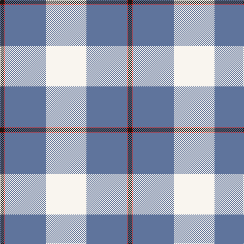

In pattern [KRBW](/patterns/krbw/).

This was sourced from register-of-tartans.  It is a [4 stripes tartan](/stripes/stripes4/).

Original link https://www.tartanregister.gov.uk/tartanDetails.aspx?ref=10539

## Thread count
K/8 R2 B80 W/80

## Palette
Each colour and its ΔE from the base-6 reference it is a variant of.

| Colour | Shade | Base | ΔE (OKLab) |
|---|---|---|---|
| B | <code style="background-color:#5F749C;">#5F749C</code> `#5F749C` | B <code style="background-color:#2C4084;">#2C4084</code> | 0.17 |
| K | <code style="background-color:#1C1714;">#1C1714</code> `#1C1714` | K <code style="background-color:#000000;">#000000</code> | 0.21 |
| R | <code style="background-color:#CA2625;">#CA2625</code> `#CA2625` | R <code style="background-color:#C80000;">#C80000</code> | 0.03 |
| W | <code style="background-color:#F9F5EF;">#F9F5EF</code> `#F9F5EF` | W <code style="background-color:#F4F4F0;">#F4F4F0</code> | 0.01 |

# Sample pattern

ID: /setts/s4/k8r2b80w80-b5f749c-k1c1714-rca2625-wf9f5ef/
