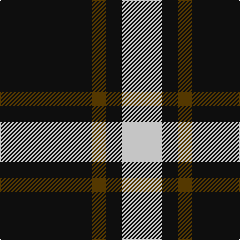

In pattern [KGKW](/patterns/kgkw/).

This was sourced from tartans-authority.  It is a [4 stripes tartan](/stripes/stripes4/).

Original link http://www.tartansauthority.com/tartan-ferret/display/1218/

## Thread count
K/92 T14 K16 W/40

## Palette
Each colour and its ΔE from the base-6 reference it is a variant of.

| Colour | Shade | Base | ΔE (OKLab) |
|---|---|---|---|
| K | <code style="background-color:#101010;">#101010</code> `#101010` | K <code style="background-color:#000000;">#000000</code> | 0.17 |
| T | <code style="background-color:#604000;">#604000</code> `#604000` | G <code style="background-color:#006400;">#006400</code> | 0.14 |
| W | <code style="background-color:#FCFCFC;">#FCFCFC</code> `#FCFCFC` | W <code style="background-color:#F4F4F0;">#F4F4F0</code> | 0.03 |

# Sample pattern

## Nearest tartans

The nearest existing variants by ΔTartan distance.

1. [Lords of Skye Trade Tartan Tartan Number: 1218. Earliest known date: 1983 Nothing See products available Copyright © Blair Urquhart, Comrie, 2015](/setts/s4/k92g14k16w40-g604000-k101010-we0e0e0/) — ΔT 0.24
1. [Lords of Skye](/setts/s4/k92g14k16w40-g503c14-k101010-we0e0e0/) — ΔT 0.26
1. [Lords, of Skye](/setts/s4/k92r14k16w40-k000000-r806050-we0e0e0/) — ΔT 1.07
1. [Takla Makan #2 (Artefact)](/setts/s4/k8y30k8w4-k000000-we0e0e0-ya08858/) — ΔT 1.15
1. [Juchter (Personal)](/setts/s3/g40w10r6-g003820-rc80000-we0e0e0/) — ΔT 1.34
1. [Juchter (Personal)](/setts/s4/g40w10r6w10-g003820-rc80000-we0e0e0/) — ΔT 1.35
1. [Glen Coe #1 (Fashion)](/setts/s5/k74w18k6g18w6-g006818-k101010-wfcfcfc/) — ΔT 1.43
1. [Burberry Black](/setts/s5/y18k18y18k60r6-k000000-rc80000-yb0b0b0/) — ΔT 1.43
1. [Glen Coe Trade Tartan Tartan Number: 1243. Earliest known date: Modern Many new designs have been given district names to promote their Scottish connections. However, these names should not be confused with the District tartans which have earned their title through 'use and wont' and not a little history. See products available Copyright © Blair Urquhart, Comrie, 2015](/setts/s5/k74w18k6g18w6-g003820-k101010-we0e0e0/) — ΔT 1.50
1. [Shembe Zulu Church](/setts/s5/k10w50r12k90w8-k101010-rc80000-wfcfcfc/) — ΔT 1.51

## Neighbour map

Every grey dot is one of 15726 variants placed by the first two principal components of the ΔTartan feature space (44% of its variance). Red is this tartan; blue dots are its nearest — click one to open its page.

<svg viewBox="0 0 640 380" role="img" style="max-width:100%;height:auto;border:1px solid #e0e0e0;border-radius:4px;display:block" xmlns="http://www.w3.org/2000/svg"><image href="/nn/cloud.v1.png" width="640" height="380"/><a href="/setts/s4/k92g14k16w40-g604000-k101010-we0e0e0/"><circle cx="341.9" cy="255.5" r="4" fill="#3465a4"><title>Lords of Skye Trade Tartan Tartan Number: 1218. Earliest known date: 1983 Nothing See products available Copyright © Blair Urquhart, Comrie, 2015</title></circle></a><a href="/setts/s4/k92g14k16w40-g503c14-k101010-we0e0e0/"><circle cx="342.0" cy="255.8" r="4" fill="#3465a4"><title>Lords of Skye</title></circle></a><a href="/setts/s4/k92r14k16w40-k000000-r806050-we0e0e0/"><circle cx="337.8" cy="258.4" r="4" fill="#3465a4"><title>Lords, of Skye</title></circle></a><a href="/setts/s4/k8y30k8w4-k000000-we0e0e0-ya08858/"><circle cx="309.0" cy="238.7" r="4" fill="#3465a4"><title>Takla Makan #2 (Artefact)</title></circle></a><a href="/setts/s3/g40w10r6-g003820-rc80000-we0e0e0/"><circle cx="391.5" cy="270.1" r="4" fill="#3465a4"><title>Juchter (Personal)</title></circle></a><a href="/setts/s4/g40w10r6w10-g003820-rc80000-we0e0e0/"><circle cx="306.8" cy="245.0" r="4" fill="#3465a4"><title>Juchter (Personal)</title></circle></a><a href="/setts/s5/k74w18k6g18w6-g006818-k101010-wfcfcfc/"><circle cx="363.0" cy="203.5" r="4" fill="#3465a4"><title>Glen Coe #1 (Fashion)</title></circle></a><a href="/setts/s5/y18k18y18k60r6-k000000-rc80000-yb0b0b0/"><circle cx="348.5" cy="235.8" r="4" fill="#3465a4"><title>Burberry Black</title></circle></a><a href="/setts/s5/k74w18k6g18w6-g003820-k101010-we0e0e0/"><circle cx="372.2" cy="208.0" r="4" fill="#3465a4"><title>Glen Coe Trade Tartan Tartan Number: 1243. Earliest known date: Modern Many new designs have been given district names to promote their Scottish connections. However, these names should not be confused with the District tartans which have earned their title through 'use and wont' and not a little history. See products available Copyright © Blair Urquhart, Comrie, 2015</title></circle></a><a href="/setts/s5/k10w50r12k90w8-k101010-rc80000-wfcfcfc/"><circle cx="316.6" cy="201.4" r="4" fill="#3465a4"><title>Shembe Zulu Church</title></circle></a><circle cx="336.6" cy="252.5" r="5" fill="#c00000"/></svg>

ID: /setts/s4/k92g14k16w40-g604000-k101010-wfcfcfc/
