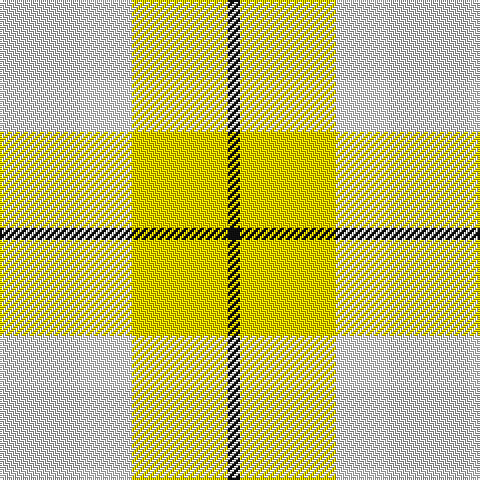

**Bands:** [KYWW](/stripes/kyww/) · **Stripes:** [K LY W LB](/stripes/stripes4/) K LY W LB

This was sourced from register-of-tartans.  It is a [4 band tartan](/bands/bands4/).

Original link https://www.tartanregister.gov.uk/tartanDetails.aspx?ref=5818

## Register references

External register numbers recorded for this tartan.

- Scottish Register of Tartans: [5818](https://www.tartanregister.gov.uk/tartanDetails.aspx?ref=5818)
- Scottish Tartans Authority (ITI): 7871

## Thread count
N/40 W26 Y48 K/6

## Palette
Each colour and its ΔE from the base-6 reference it is a variant of.

| Colour | Shade | Base | ΔE (OKLab) |
|---|---|---|---|
| B | <code style="background-color:#0000FF;">#0000FF</code> `#0000FF` | B <code style="background-color:#2A418A;">#2A418A</code> | 0.20 |
| G | <code style="background-color:#008000;">#008000</code> `#008000` | G <code style="background-color:#006100;">#006100</code> | 0.10 |
| K | <code style="background-color:#101010;">#101010</code> `#101010` | K <code style="background-color:#000000;">#000000</code> | 0.17 |
| N | <code style="background-color:#D3D3D3;">#D3D3D3</code> `#D3D3D3` | W <code style="background-color:#F7F7F7;">#F7F7F7</code> | 0.11 |
| W | <code style="background-color:#FFFFFF;">#FFFFFF</code> `#FFFFFF` | W <code style="background-color:#F7F7F7;">#F7F7F7</code> | 0.02 |
| Y | <code style="background-color:#FFD700;">#FFD700</code> `#FFD700` | Y <code style="background-color:#F2BF00;">#F2BF00</code> | 0.06 |

# Sample pattern

## Nearest tartans

The nearest existing variants by ΔTartan distance.

1. [Spirit of Riverside (Corporate)](/setts/s4/o20w13ly24k3~x2/) — ΔT 1.19
1. [Trinity Bicycles (Corporate)](/setts/s5/r4lb30y14lb11y4~x2/) — ΔT 2.22
1. [Barbie's Plaid](/setts/s6/n2ly4b22ly20g19ly2~x2/) — ΔT 2.26
1. [Cairngorm](/setts/s6/n2w2ly7lb14n2w2~x2/) — ΔT 2.27
1. [Eastern Townshippers (Corporate)](/setts/s5/g1w5g5w5ly1~x8/) — ΔT 2.34
1. [Wild Mustard Dreams](/setts/s5/lo17ly17lo17g26db5~x2/) — ΔT 2.43
1. [Dunoon](/setts/s4/w2g13lo13w2~x6/) — ΔT 2.56
1. [Cairngorm](/setts/s6/n2w2ly7o14n2w2~x2/) — ΔT 2.57
1. [de Meuron Dress (Family)](/setts/s7/lb40dp5lb6ly26o13lb9dy3~x2/) — ΔT 2.61
1. [Samye #2](/setts/s5/ly28r11g11db11w2~x2/) — ΔT 2.62

## Neighbour map

Every grey dot is one of 14299 variants placed by the first two principal components of the ΔTartan feature space (44% of its variance). Red is this tartan; blue dots are its nearest — click one to open its page.

<svg viewBox="0 0 640 380" role="img" style="max-width:100%;height:auto;border:1px solid #e0e0e0;border-radius:4px;display:block" xmlns="http://www.w3.org/2000/svg"><image href="/nn/cloud.v1.png" width="640" height="380"/><a href="/setts/s4/o20w13ly24k3~x2/"><circle cx="183.1" cy="249.8" r="4" fill="#3465a4"><title>Spirit of Riverside (Corporate)</title></circle></a><a href="/setts/s5/r4lb30y14lb11y4~x2/"><circle cx="234.6" cy="220.7" r="4" fill="#3465a4"><title>Trinity Bicycles (Corporate)</title></circle></a><a href="/setts/s6/n2ly4b22ly20g19ly2~x2/"><circle cx="185.8" cy="194.7" r="4" fill="#3465a4"><title>Barbie's Plaid</title></circle></a><a href="/setts/s6/n2w2ly7lb14n2w2~x2/"><circle cx="262.9" cy="213.8" r="4" fill="#3465a4"><title>Cairngorm</title></circle></a><a href="/setts/s5/g1w5g5w5ly1~x8/"><circle cx="71.2" cy="231.4" r="4" fill="#3465a4"><title>Eastern Townshippers (Corporate)</title></circle></a><a href="/setts/s5/lo17ly17lo17g26db5~x2/"><circle cx="145.9" cy="273.0" r="4" fill="#3465a4"><title>Wild Mustard Dreams</title></circle></a><a href="/setts/s4/w2g13lo13w2~x6/"><circle cx="250.7" cy="254.7" r="4" fill="#3465a4"><title>Dunoon</title></circle></a><a href="/setts/s6/n2w2ly7o14n2w2~x2/"><circle cx="251.6" cy="211.6" r="4" fill="#3465a4"><title>Cairngorm</title></circle></a><a href="/setts/s7/lb40dp5lb6ly26o13lb9dy3~x2/"><circle cx="286.5" cy="166.4" r="4" fill="#3465a4"><title>de Meuron Dress (Family)</title></circle></a><a href="/setts/s5/ly28r11g11db11w2~x2/"><circle cx="183.6" cy="180.3" r="4" fill="#3465a4"><title>Samye #2</title></circle></a><circle cx="183.4" cy="246.5" r="5" fill="#c00000"/></svg>

ID: /setts/s4/lb20w13ly24k3~x2/
