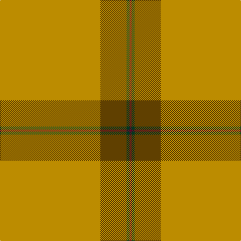

**Bands:** [YGGB](/stripes/yggb/) · **Stripes:** [LO DY DG DR](/stripes/stripes4/) LO DY DG DR

This was sourced from house-of-tartan.  It is a [4 band tartan](/bands/bands4/).

Original link http://www.house-of-tartan.scotland.net/house/TartanViewjs.asp?colr=Def&tnam=1544

## Thread count
DY/200 T52 DG6 DR/4

## Palette
Each colour and its ΔE from the base-6 reference it is a variant of.

| Colour | Shade | Base | ΔE (OKLab) |
|---|---|---|---|
| DG | <code style="background-color:#003820;">#003820</code> `#003820` | G <code style="background-color:#006100;">#006100</code> | 0.15 |
| DR | <code style="background-color:#680028;">#680028</code> `#680028` | B <code style="background-color:#2A418A;">#2A418A</code> | 0.21 |
| DY | <code style="background-color:#BC8C00;">#BC8C00</code> `#BC8C00` | Y <code style="background-color:#F2BF00;">#F2BF00</code> | 0.16 |
| T | <code style="background-color:#604000;">#604000</code> `#604000` | G <code style="background-color:#006100;">#006100</code> | 0.14 |
| Y | <code style="background-color:#E8C000;">#E8C000</code> `#E8C000` | Y <code style="background-color:#F2BF00;">#F2BF00</code> | 0.02 |

# Sample pattern

## Nearest tartans

The nearest existing variants by ΔTartan distance.

1. [Canadian Irish Regiment](/setts/s4/lo100dy26g3r2~x2/) — ΔT 0.47
1. [Reid (1939)](/setts/s6/y40r8y4w2y4ly5~x2/) — ΔT 1.96
1. [Reece, Mathew](/setts/s7/w2o44dt8o2dt2o3r1~x2/) — ΔT 2.38
1. [Reece (Name)](/setts/s7/w2lo44db8lo2db2lo3r1~x2/) — ΔT 2.40
1. [KIltwalk, The (Corporate)](/setts/s9/dy2lb2lo4dy5lo5dy46lo7dy1w2~x2/) — ΔT 2.46
1. [Perry, Arisaid](/setts/s5/y65r27w2y4ly5~x2/) — ΔT 2.46
1. [MacLaine of Lochbuie](/setts/s4/r32g8t4ly1~x2/) — ΔT 2.50
1. [Dutch Football (Corporate)](/setts/s4/lo24r1w1dt1~x11/) — ΔT 2.52
1. [Unnamed Brown (Teddy Bear)](/setts/s5/r1dy7o25dy7r1~x2/) — ΔT 2.53
1. [Kenspeckle](/setts/s5/g50r1r20k2w1~x2/) — ΔT 2.53

## Neighbour map

Every grey dot is one of 14299 variants placed by the first two principal components of the ΔTartan feature space (44% of its variance). Red is this tartan; blue dots are its nearest — click one to open its page.

<svg viewBox="0 0 640 380" role="img" style="max-width:100%;height:auto;border:1px solid #e0e0e0;border-radius:4px;display:block" xmlns="http://www.w3.org/2000/svg"><image href="/nn/cloud.v1.png" width="640" height="380"/><a href="/setts/s4/lo100dy26g3r2~x2/"><circle cx="603.2" cy="170.3" r="4" fill="#3465a4"><title>Canadian Irish Regiment</title></circle></a><a href="/setts/s6/y40r8y4w2y4ly5~x2/"><circle cx="565.8" cy="187.6" r="4" fill="#3465a4"><title>Reid (1939)</title></circle></a><a href="/setts/s7/w2o44dt8o2dt2o3r1~x2/"><circle cx="626.0" cy="136.1" r="4" fill="#3465a4"><title>Reece, Mathew</title></circle></a><a href="/setts/s7/w2lo44db8lo2db2lo3r1~x2/"><circle cx="589.6" cy="118.6" r="4" fill="#3465a4"><title>Reece (Name)</title></circle></a><a href="/setts/s9/dy2lb2lo4dy5lo5dy46lo7dy1w2~x2/"><circle cx="551.2" cy="113.8" r="4" fill="#3465a4"><title>KIltwalk, The (Corporate)</title></circle></a><a href="/setts/s5/y65r27w2y4ly5~x2/"><circle cx="508.1" cy="174.4" r="4" fill="#3465a4"><title>Perry, Arisaid</title></circle></a><a href="/setts/s4/r32g8t4ly1~x2/"><circle cx="511.9" cy="169.4" r="4" fill="#3465a4"><title>MacLaine of Lochbuie</title></circle></a><a href="/setts/s4/lo24r1w1dt1~x11/"><circle cx="626.0" cy="188.3" r="4" fill="#3465a4"><title>Dutch Football (Corporate)</title></circle></a><a href="/setts/s5/r1dy7o25dy7r1~x2/"><circle cx="475.2" cy="200.4" r="4" fill="#3465a4"><title>Unnamed Brown (Teddy Bear)</title></circle></a><a href="/setts/s5/g50r1r20k2w1~x2/"><circle cx="498.8" cy="147.5" r="4" fill="#3465a4"><title>Kenspeckle</title></circle></a><circle cx="590.2" cy="163.9" r="5" fill="#c00000"/></svg>

ID: /setts/s4/lo100dy26dg3dr2~x2/
