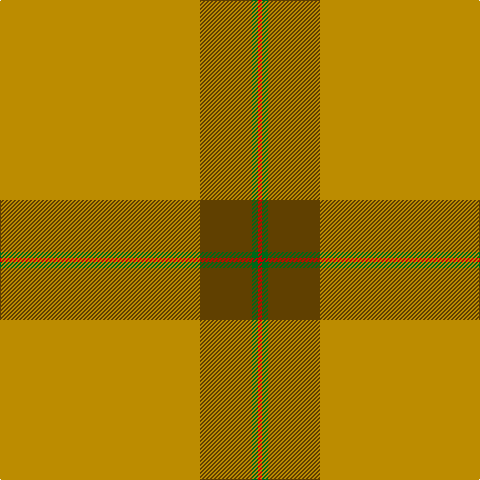

**Bands:** [RGGY](/stripes/rggy/) · **Stripes:** [R G DY LO](/stripes/stripes4/) R G DY LO

This was sourced from register-of-tartans.  It is a [4 band tartan](/bands/bands4/).

Original link https://www.tartanregister.gov.uk/tartanDetails.aspx?ref=548

## Attestations

This cloth appears in 2 source records; the oldest owns this page.

- 01/01/1935 — Canadian Irish Regiment (register-of-tartans, [record](https://www.tartanregister.gov.uk/tartanDetails.aspx?ref=548))
- pre 1935 — Canadian Irish Regiment (Military) (tartans-authority, [record](http://www.tartansauthority.com/tartan-ferret/display/1544/))

## Register references

External register numbers recorded for this tartan.

- Scottish Register of Tartans: [548](https://www.tartanregister.gov.uk/tartanDetails.aspx?ref=548)
- Scottish Tartans Authority (ITI): 1544
- Scottish Tartans World Register: 1544

## Thread count
DY/200 T52 G6 R/4

## Palette
Each colour and its ΔE from the base-6 reference it is a variant of.

| Colour | Shade | Base | ΔE (OKLab) |
|---|---|---|---|
| DG | <code style="background-color:#003820;">#003820</code> `#003820` | G <code style="background-color:#006100;">#006100</code> | 0.15 |
| DY | <code style="background-color:#BC8C00;">#BC8C00</code> `#BC8C00` | Y <code style="background-color:#F2BF00;">#F2BF00</code> | 0.16 |
| G | <code style="background-color:#006818;">#006818</code> `#006818` | G <code style="background-color:#006100;">#006100</code> | 0.02 |
| O | <code style="background-color:#E86000;">#E86000</code> `#E86000` | R <code style="background-color:#CC0000;">#CC0000</code> | 0.14 |
| R | <code style="background-color:#C80000;">#C80000</code> `#C80000` | R <code style="background-color:#CC0000;">#CC0000</code> | 0.01 |
| T | <code style="background-color:#604000;">#604000</code> `#604000` | G <code style="background-color:#006100;">#006100</code> | 0.14 |

# Sample pattern

## Nearest tartans

The nearest existing variants by ΔTartan distance.

1. [Canadian Irish Regiment Regimental Tartan Tartan Number: 1544. Earliest known date: 1930 The Canadian Irish Regiment was formed in April 1914 and formally gazetted on October 15th, 1915, as the 110th (Irish) Regiment of Canada. In 1931 they became the only kilted Irish Regiment in the world. The Regiment served on active service during World War II and was also the first Irish Regiment to provide a Royal Guard. (P.E.MacDonald, 1982) See products available Copyright © Blair Urquhart, Comrie, 2015](/setts/s4/lo100dy26dg3dr2~x2/) — ΔT 0.47
1. [Reid (1939)](/setts/s6/y40r8y4w2y4ly5~x2/) — ΔT 1.85
1. [Reece, Mathew](/setts/s7/w2o44dt8o2dt2o3r1~x2/) — ΔT 2.36
1. [Dutch Football (Corporate)](/setts/s4/lo24r1w1dt1~x11/) — ΔT 2.43
1. [Perry, Arisaid](/setts/s5/y65r27w2y4ly5~x2/) — ΔT 2.48
1. [Houston #2 (Personal)](/setts/s12/lo32do2lo12dy2lo1g2lo1dy2lo1g2lo1dy2~x2/) — ΔT 2.57
1. [Unnamed Brown (Teddy Bear)](/setts/s5/r1dy7o25dy7r1~x2/) — ΔT 2.58
1. [Reece (Name)](/setts/s7/w2lo44db8lo2db2lo3r1~x2/) — ΔT 2.63
1. [KIltwalk, The (Corporate)](/setts/s9/dy2lb2lo4dy5lo5dy46lo7dy1w2~x2/) — ΔT 2.64
1. [Kenspeckle](/setts/s5/g50r1r20k2w1~x2/) — ΔT 2.67

## Neighbour map

Every grey dot is one of 14313 variants placed by the first two principal components of the ΔTartan feature space (44% of its variance). Red is this tartan; blue dots are its nearest — click one to open its page.

<svg viewBox="0 0 640 380" role="img" style="max-width:100%;height:auto;border:1px solid #e0e0e0;border-radius:4px;display:block" xmlns="http://www.w3.org/2000/svg"><image href="/nn/cloud.v1.png" width="640" height="380"/><a href="/setts/s4/lo100dy26dg3dr2~x2/"><circle cx="590.8" cy="164.2" r="4" fill="#3465a4"><title>Canadian Irish Regiment Regimental Tartan Tartan Number: 1544. Earliest known date: 1930 The Canadian Irish Regiment was formed in April 1914 and formally gazetted on October 15th, 1915, as the 110th (Irish) Regiment of Canada. In 1931 they became the only kilted Irish Regiment in the world. The Regiment served on active service during World War II and was also the first Irish Regiment to provide a Royal Guard. (P.E.MacDonald, 1982) See products available Copyright © Blair Urquhart, Comrie, 2015</title></circle></a><a href="/setts/s6/y40r8y4w2y4ly5~x2/"><circle cx="566.4" cy="187.8" r="4" fill="#3465a4"><title>Reid (1939)</title></circle></a><a href="/setts/s7/w2o44dt8o2dt2o3r1~x2/"><circle cx="626.0" cy="136.3" r="4" fill="#3465a4"><title>Reece, Mathew</title></circle></a><a href="/setts/s4/lo24r1w1dt1~x11/"><circle cx="626.0" cy="188.7" r="4" fill="#3465a4"><title>Dutch Football (Corporate)</title></circle></a><a href="/setts/s5/y65r27w2y4ly5~x2/"><circle cx="508.7" cy="174.6" r="4" fill="#3465a4"><title>Perry, Arisaid</title></circle></a><a href="/setts/s12/lo32do2lo12dy2lo1g2lo1dy2lo1g2lo1dy2~x2/"><circle cx="604.9" cy="115.0" r="4" fill="#3465a4"><title>Houston #2 (Personal)</title></circle></a><a href="/setts/s5/r1dy7o25dy7r1~x2/"><circle cx="475.7" cy="200.6" r="4" fill="#3465a4"><title>Unnamed Brown (Teddy Bear)</title></circle></a><a href="/setts/s7/w2lo44db8lo2db2lo3r1~x2/"><circle cx="590.3" cy="119.0" r="4" fill="#3465a4"><title>Reece (Name)</title></circle></a><a href="/setts/s9/dy2lb2lo4dy5lo5dy46lo7dy1w2~x2/"><circle cx="551.8" cy="114.0" r="4" fill="#3465a4"><title>KIltwalk, The (Corporate)</title></circle></a><a href="/setts/s5/g50r1r20k2w1~x2/"><circle cx="499.1" cy="147.6" r="4" fill="#3465a4"><title>Kenspeckle</title></circle></a><circle cx="603.9" cy="170.6" r="5" fill="#c00000"/></svg>

ID: /setts/s4/lo100dy26g3r2~x2/
