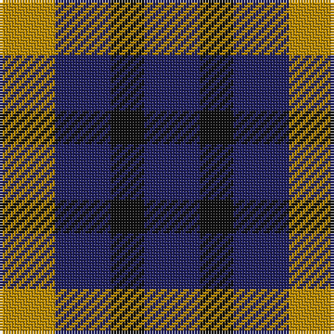

This page is one **sett** — a single exact thread-count. It belongs to the [tartan](/tartans/dy5db5k3/)
(the same proportion at any scale), whose colour order is pattern [BKBY](/stripes/bkby/).

Sourced from register-of-tartans.  It is a [4 stripe tartan](/stripes/stripes4/).

Original link https://www.tartanregister.gov.uk/tartanDetails.aspx?ref=5137

## Register references

External register numbers recorded for this tartan.

- Scottish Register of Tartans: [5137](https://www.tartanregister.gov.uk/tartanDetails.aspx?ref=5137)
- Scottish Tartans Authority (ITI): 3096

## Thread count
DY/20 DB20 K12 DB/20

## Palette
Each colour and the base-6 reference it is a variant of.

| Colour | Shade | Base |
|---|---|---|
| DB | <code style="background-color:#202060;">#202060</code> `oklch(28.9% 0.111 276.9)` <small>#202060</small> | B <code style="background-color:#2A418A;">#2A418A</code> |
| DY | <code style="background-color:#BC8C00;">#BC8C00</code> `oklch(66.8% 0.137 84.1)` <small>#BC8C00</small> | Y <code style="background-color:#F2BF00;">#F2BF00</code> |
| K | <code style="background-color:#101010;">#101010</code> `oklch(17.3% 0.000 89.9)` <small>#101010</small> | K <code style="background-color:#000000;">#000000</code> |

# Sample pattern

## Nearest tartans

The nearest existing variants by ΔTartan distance, with this tartan at the top so the swatches line up against it.

ΔTartan

Tartan

Sett

—

<a href="/ttd/edit/#slug=lo5db5k3~x4">Kazakhstan Relic</a> <a class="nn-out" href="/setts/s4/lo5db5k3~x4/" title="open its dictionary page">↗</a>

1.43

<a href="/ttd/edit/#slug=r4k7t4~x2">Wilson's No.198</a> <a class="nn-out" href="/setts/s3/r4k7t4~x2/" title="open its dictionary page">↗</a>

1.64

<a href="/ttd/edit/#slug=g4k5g4r2~x2">Wilson's No.094</a> <a class="nn-out" href="/setts/s4/g4k5g4r2~x2/" title="open its dictionary page">↗</a>

1.77

<a href="/ttd/edit/#slug=lo5db5k3~x4">Kazakhstan Relic (Artefact)</a> <a class="nn-out" href="/setts/s3/lo5db5k3~x4/" title="open its dictionary page">↗</a>

1.79

<a href="/ttd/edit/#slug=r4dg7t4~x2">Wilson's No.061</a> <a class="nn-out" href="/setts/s3/r4dg7t4~x2/" title="open its dictionary page">↗</a>

1.81

<a href="/ttd/edit/#slug=g4dp5g4t2~x2">Wilson's No.209</a> <a class="nn-out" href="/setts/s4/g4dp5g4t2~x2/" title="open its dictionary page">↗</a>

1.90

<a href="/ttd/edit/#slug=dt1k2r1~x42">Allen, Nicholas (Personal)</a> <a class="nn-out" href="/setts/s3/dt1k2r1~x42/" title="open its dictionary page">↗</a>

1.99

<a href="/ttd/edit/#slug=r4k7g4~x2">Wilson's No.200</a> <a class="nn-out" href="/setts/s3/r4k7g4~x2/" title="open its dictionary page">↗</a>

2.00

<a href="/ttd/edit/#slug=r3k6dy4k6y3~x2">Daks (Black)</a> <a class="nn-out" href="/setts/s5/r3k6dy4k6y3~x2/" title="open its dictionary page">↗</a>

2.00

<a href="/ttd/edit/#slug=p5g4t2~x2">Wilson's, No 209</a> <a class="nn-out" href="/setts/s3/p5g4t2~x2/" title="open its dictionary page">↗</a>

2.02

<a href="/ttd/edit/#slug=r3k6dy4k6ly3~x2">Daks, Black (Fashion)</a> <a class="nn-out" href="/setts/s5/r3k6dy4k6ly3~x2/" title="open its dictionary page">↗</a>

## Neighbour map

Every grey dot is one of 14299 variants placed by the first two principal components of the ΔTartan feature space (44% of its variance). Red is this tartan; blue dots are its nearest — click one to open its page.

<svg viewBox="0 0 640 380" role="img" style="max-width:100%;height:auto;border:1px solid #e0e0e0;border-radius:4px;display:block" xmlns="http://www.w3.org/2000/svg"><image href="/nn/cloud.v1.png" width="640" height="380"/><a href="/setts/s3/r4k7t4~x2/"><circle cx="142.3" cy="366.0" r="4" fill="#3465a4"><title>Wilson's No.198</title></circle></a><a href="/setts/s4/g4k5g4r2~x2/"><circle cx="200.2" cy="359.2" r="4" fill="#3465a4"><title>Wilson's No.094</title></circle></a><a href="/setts/s3/lo5db5k3~x4/"><circle cx="94.3" cy="366.0" r="4" fill="#3465a4"><title>Kazakhstan Relic (Artefact)</title></circle></a><a href="/setts/s3/r4dg7t4~x2/"><circle cx="161.9" cy="366.0" r="4" fill="#3465a4"><title>Wilson's No.061</title></circle></a><a href="/setts/s4/g4dp5g4t2~x2/"><circle cx="217.4" cy="366.0" r="4" fill="#3465a4"><title>Wilson's No.209</title></circle></a><a href="/setts/s3/dt1k2r1~x42/"><circle cx="207.6" cy="366.0" r="4" fill="#3465a4"><title>Allen, Nicholas (Personal)</title></circle></a><a href="/setts/s3/r4k7g4~x2/"><circle cx="159.1" cy="366.0" r="4" fill="#3465a4"><title>Wilson's No.200</title></circle></a><a href="/setts/s5/r3k6dy4k6y3~x2/"><circle cx="184.9" cy="348.2" r="4" fill="#3465a4"><title>Daks (Black)</title></circle></a><a href="/setts/s3/p5g4t2~x2/"><circle cx="185.7" cy="361.2" r="4" fill="#3465a4"><title>Wilson's, No 209</title></circle></a><a href="/setts/s5/r3k6dy4k6ly3~x2/"><circle cx="147.0" cy="327.0" r="4" fill="#3465a4"><title>Daks, Black (Fashion)</title></circle></a><circle cx="171.7" cy="366.0" r="5" fill="#c00000"/></svg>

ID: /setts/s4/lo5db5k3~x4/
