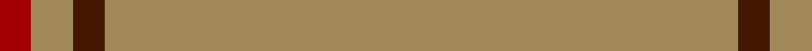

**Bands:** [RYBY](/stripes/ryby/) · **Stripes:** [R LO DO LO](/stripes/stripes4/) R LO DO LO

This was sourced from tartans-authority.  It is a [4 band tartan](/bands/bands4/).

Original link http://www.tartansauthority.com/tartan-ferret/display/7530/

## Attestations

This cloth appears in 2 source records; the oldest owns this page.

- pre 2008 — Rabbie's Dram (Fashion) (tartans-authority, [record](http://www.tartansauthority.com/tartan-ferret/display/7530/))
- undated — Rabbie's Dram (register-of-tartans, [record](https://www.tartanregister.gov.uk/tartanDetails.aspx?ref=5566))

## Register references

External register numbers recorded for this tartan.

- Scottish Register of Tartans: [5566](https://www.tartanregister.gov.uk/tartanDetails.aspx?ref=5566)
- Scottish Tartans Authority (ITI): 7530

## Thread count
DRa/6 LT8 DR6 LT/120

## Palette
Each colour and its ΔE from the base-6 reference it is a variant of.

| Colour | Shade | Base | ΔE (OKLab) |
|---|---|---|---|
| DR | <code style="background-color:#441800;">#441800</code> `#441800` | B <code style="background-color:#2A418A;">#2A418A</code> | 0.23 |
| DRa | <code style="background-color:#A00000;">#A00000</code> `#A00000` | R <code style="background-color:#CC0000;">#CC0000</code> | 0.09 |
| LT | <code style="background-color:#A08858;">#A08858</code> `#A08858` | Y <code style="background-color:#F2BF00;">#F2BF00</code> | 0.21 |

# Sample pattern

## Nearest tartans

The nearest existing variants by ΔTartan distance.

1. [Dutch Football (Corporate)](/setts/s4/lo24r1w1dt1~x11/) — ΔT 1.63
1. [Dunbar of Pitgaveny](/setts/s3/r1y19w1~x2/) — ΔT 1.64
1. [Dunbar of Pitgaveny (Clan)](/setts/s3/m1o19w1~x2/) — ΔT 1.69
1. [Kincardine Tweed](/setts/s4/o30r1o15db4/) — ΔT 2.19
1. [Dunbar of Pitgaveny](/setts/s4/o19w1o19m1~x2/) — ΔT 2.30
1. [Pasteur](/setts/s4/dy10ly1dy30y3~x4/) — ΔT 2.45
1. [Walters (Personal)](/setts/s6/g2dp2g20g2g2dp1~x4/) — ΔT 2.89
1. [Connacht](/setts/s10/o64g6o2g3o2g6o64dr2o2dr6~x2/) — ΔT 2.92
1. [MacNab, Ancient](/setts/s5/dg62r7k4r4dg62~x2/) — ΔT 2.96
1. [Connacht (1993)](/setts/s10/o64dg6o2dg3o2dg6o64dy2o2dy6~x2/) — ΔT 2.97

## Neighbour map

Every grey dot is one of 14313 variants placed by the first two principal components of the ΔTartan feature space (44% of its variance). Red is this tartan; blue dots are its nearest — click one to open its page.

<svg viewBox="0 0 640 380" role="img" style="max-width:100%;height:auto;border:1px solid #e0e0e0;border-radius:4px;display:block" xmlns="http://www.w3.org/2000/svg"><image href="/nn/cloud.v1.png" width="640" height="380"/><a href="/setts/s4/lo24r1w1dt1~x11/"><circle cx="626.0" cy="188.7" r="4" fill="#3465a4"><title>Dutch Football (Corporate)</title></circle></a><a href="/setts/s3/r1y19w1~x2/"><circle cx="626.0" cy="258.6" r="4" fill="#3465a4"><title>Dunbar of Pitgaveny</title></circle></a><a href="/setts/s3/m1o19w1~x2/"><circle cx="626.0" cy="247.5" r="4" fill="#3465a4"><title>Dunbar of Pitgaveny (Clan)</title></circle></a><a href="/setts/s4/o30r1o15db4/"><circle cx="626.0" cy="223.7" r="4" fill="#3465a4"><title>Kincardine Tweed</title></circle></a><a href="/setts/s4/o19w1o19m1~x2/"><circle cx="626.0" cy="276.3" r="4" fill="#3465a4"><title>Dunbar of Pitgaveny</title></circle></a><a href="/setts/s4/dy10ly1dy30y3~x4/"><circle cx="626.0" cy="239.5" r="4" fill="#3465a4"><title>Pasteur</title></circle></a><a href="/setts/s6/g2dp2g20g2g2dp1~x4/"><circle cx="626.0" cy="226.6" r="4" fill="#3465a4"><title>Walters (Personal)</title></circle></a><a href="/setts/s10/o64g6o2g3o2g6o64dr2o2dr6~x2/"><circle cx="626.0" cy="189.2" r="4" fill="#3465a4"><title>Connacht</title></circle></a><a href="/setts/s5/dg62r7k4r4dg62~x2/"><circle cx="626.0" cy="264.8" r="4" fill="#3465a4"><title>MacNab, Ancient</title></circle></a><a href="/setts/s10/o64dg6o2dg3o2dg6o64dy2o2dy6~x2/"><circle cx="626.0" cy="138.1" r="4" fill="#3465a4"><title>Connacht (1993)</title></circle></a><circle cx="626.0" cy="227.4" r="5" fill="#c00000"/></svg>

ID: /setts/s4/lo60do3lo4r3~x2/
