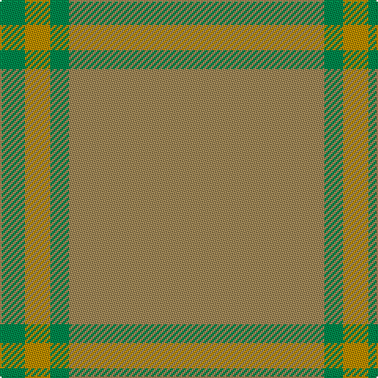

This page is one **sett** — a single exact thread-count. It belongs to the [tartan](/tartans/lo81g6lo8g8/)
(the same proportion at any scale), whose colour order is pattern [GYGY](/stripes/gygy/).

Sourced from tartans-authority.  It is a [4 stripe tartan](/stripes/stripes4/).

Original link http://www.tartansauthority.com/tartan-ferret/display/10241/

## Thread count
LT/162 G12 DY16 G/16

## Palette

Palette: <strong>Tartan Register</strong> <small style="color:#888">(2 of 3 colours)</small>
<table><thead><tr><th>Colour</th><th>Threads</th><th>Shade</th><th>Base</th><th>OKLCh</th></tr></thead><tbody><tr><td>LT/</td><td style="text-align:right;font-variant-numeric:tabular-nums">162</td><td><code style="background-color:#A08858;">#A08858</code> <small style="color:#888">#A08858</small></td><td>Y <code style="background-color:#F2BF00;">#F2BF00</code></td><td><small style="color:#888">oklch(63.7% 0.071 84.0)</small></td></tr><tr><td>G</td><td style="text-align:right;font-variant-numeric:tabular-nums">12</td><td><code style="background-color:#00884C;">#00884C</code> <small style="color:#888">#00884C</small></td><td>G <code style="background-color:#006100;">#006100</code></td><td><small style="color:#888">oklch(55.0% 0.137 154.8)</small></td></tr><tr><td>DY</td><td style="text-align:right;font-variant-numeric:tabular-nums">16</td><td><code style="background-color:#BC8C00;">#BC8C00</code> <small style="color:#888">#BC8C00</small></td><td>Y <code style="background-color:#F2BF00;">#F2BF00</code></td><td><small style="color:#888">oklch(66.8% 0.137 84.1)</small></td></tr><tr><td>G/</td><td style="text-align:right;font-variant-numeric:tabular-nums">16</td><td><code style="background-color:#00884C;">#00884C</code> <small style="color:#888">#00884C</small></td><td>G <code style="background-color:#006100;">#006100</code></td><td><small style="color:#888">oklch(55.0% 0.137 154.8)</small></td></tr></tbody></table>

# Sample pattern

## Nearest tartans

The nearest existing variants by ΔTartan distance, with this tartan at the top so the swatches line up against it.

ΔTartan

Tartan

Sett

—

<a href="/ttd/edit/#slug=lo81g6lo8g8~x2">Young in Australia (Name)</a> <a class="nn-out" href="/setts/s4/lo81g6lo8g8~x2/" title="open its dictionary page">↗</a>

2.83

<a href="/ttd/edit/#slug=n2o3n3o3n10o2n18o1~x4">Hebridean Cairn (Fashion)</a> <a class="nn-out" href="/setts/s8/n2o3n3o3n10o2n18o1~x4/" title="open its dictionary page">↗</a>

2.92

<a href="/ttd/edit/#slug=n2y3n3y3n10y2n18y1~x4">Hebridean Cairn Fashion Tartan Tartan Number: 6822. Earliest known date: 2005 For a new House of Edgar Collection in wedding gray. See products available Copyright © Blair Urquhart, Comrie, 2015</a> <a class="nn-out" href="/setts/s8/n2y3n3y3n10y2n18y1~x4/" title="open its dictionary page">↗</a>

3.00

<a href="/ttd/edit/#slug=y9y52dy15ly4~x2">McGuigan, Julia (St Monans, Fife) (Personal)</a> <a class="nn-out" href="/setts/s4/y9y52dy15ly4~x2/" title="open its dictionary page">↗</a>

3.03

<a href="/ttd/edit/#slug=y2o2y12dy2y32o2y1g2y1o2y1g2~x2">Houston</a> <a class="nn-out" href="/setts/s12/y2o2y12dy2y32o2y1g2y1o2y1g2~x2/" title="open its dictionary page">↗</a>

3.15

<a href="/ttd/edit/#slug=y37dy9y3do9dy3~x2">Glen Boig Trade Tartan Tartan Number: 915. Earliest known date: Modern Many new designs have been given district names to promote their Scottish connections. However, these names should not be confused with the District tartans which have earned their title through 'use and wont' and not a little history. See products available Copyright © Blair Urquhart, Comrie, 2015</a> <a class="nn-out" href="/setts/s5/y37dy9y3do9dy3~x2/" title="open its dictionary page">↗</a>

3.20

<a href="/ttd/edit/#slug=g13dy3g1do3dy1~x6">Glen Boig</a> <a class="nn-out" href="/setts/s5/g13dy3g1do3dy1~x6/" title="open its dictionary page">↗</a>

3.20

<a href="/ttd/edit/#slug=o60lo15o4lo2o2lo2o2lo2~x2">Masai Shuka 09 (Artefact)</a> <a class="nn-out" href="/setts/s8/o60lo15o4lo2o2lo2o2lo2~x2/" title="open its dictionary page">↗</a>

3.22

<a href="/ttd/edit/#slug=y100o26dg3dr2">13, Irish Regiment</a> <a class="nn-out" href="/setts/s4/y100o26dg3dr2/" title="open its dictionary page">↗</a>

3.25

<a href="/ttd/edit/#slug=o12o6o2ly1~x4">Loch Garth</a> <a class="nn-out" href="/setts/s4/o12o6o2ly1~x4/" title="open its dictionary page">↗</a>

3.33

<a href="/ttd/edit/#slug=t4lo15t4lo15t4w2~x2">Takla Makan #2</a> <a class="nn-out" href="/setts/s6/t4lo15t4lo15t4w2~x2/" title="open its dictionary page">↗</a>

## Neighbour map

Every grey dot is one of 14299 variants placed by the first two principal components of the ΔTartan feature space (44% of its variance). Red is this tartan; blue dots are its nearest — click one to open its page.

<svg viewBox="0 0 640 380" role="img" style="max-width:100%;height:auto;border:1px solid #e0e0e0;border-radius:4px;display:block" xmlns="http://www.w3.org/2000/svg"><image href="/nn/cloud.v1.png" width="640" height="380"/><a href="/setts/s8/n2o3n3o3n10o2n18o1~x4/"><circle cx="626.0" cy="297.9" r="4" fill="#3465a4"><title>Hebridean Cairn (Fashion)</title></circle></a><a href="/setts/s8/n2y3n3y3n10y2n18y1~x4/"><circle cx="626.0" cy="322.6" r="4" fill="#3465a4"><title>Hebridean Cairn Fashion Tartan Tartan Number: 6822. Earliest known date: 2005 For a new House of Edgar Collection in wedding gray. See products available Copyright © Blair Urquhart, Comrie, 2015</title></circle></a><a href="/setts/s4/y9y52dy15ly4~x2/"><circle cx="537.8" cy="304.1" r="4" fill="#3465a4"><title>McGuigan, Julia (St Monans, Fife) (Personal)</title></circle></a><a href="/setts/s12/y2o2y12dy2y32o2y1g2y1o2y1g2~x2/"><circle cx="626.0" cy="204.7" r="4" fill="#3465a4"><title>Houston</title></circle></a><a href="/setts/s5/y37dy9y3do9dy3~x2/"><circle cx="554.6" cy="298.1" r="4" fill="#3465a4"><title>Glen Boig Trade Tartan Tartan Number: 915. Earliest known date: Modern Many new designs have been given district names to promote their Scottish connections. However, these names should not be confused with the District tartans which have earned their title through 'use and wont' and not a little history. See products available Copyright © Blair Urquhart, Comrie, 2015</title></circle></a><a href="/setts/s5/g13dy3g1do3dy1~x6/"><circle cx="568.5" cy="307.0" r="4" fill="#3465a4"><title>Glen Boig</title></circle></a><a href="/setts/s8/o60lo15o4lo2o2lo2o2lo2~x2/"><circle cx="626.0" cy="271.0" r="4" fill="#3465a4"><title>Masai Shuka 09 (Artefact)</title></circle></a><a href="/setts/s4/y100o26dg3dr2/"><circle cx="626.0" cy="223.1" r="4" fill="#3465a4"><title>13, Irish Regiment</title></circle></a><a href="/setts/s4/o12o6o2ly1~x4/"><circle cx="619.8" cy="354.9" r="4" fill="#3465a4"><title>Loch Garth</title></circle></a><a href="/setts/s6/t4lo15t4lo15t4w2~x2/"><circle cx="521.4" cy="315.0" r="4" fill="#3465a4"><title>Takla Makan #2</title></circle></a><circle cx="626.0" cy="314.0" r="5" fill="#c00000"/></svg>

ID: /setts/s4/lo81g6lo8g8~x2/
