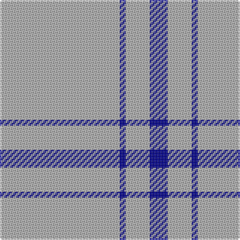

This page is one **sett** — a single exact thread-count. It belongs to the [tartan](/tartans/lr20db1lr4db3/)
(the same proportion at any scale), whose colour order is pattern [BYBY](/stripes/byby/).

Sourced from register-of-tartans.  It is a [4 stripe tartan](/stripes/stripes4/).

Original link https://www.tartanregister.gov.uk/tartanDetails.aspx?ref=4937

## Register references

External register numbers recorded for this tartan.

- Scottish Register of Tartans: [4937](https://www.tartanregister.gov.uk/tartanDetails.aspx?ref=4937)
- Scottish Tartans Authority (ITI): 3633

## Thread count
N/80 DB4 N16 DB/12

## Palette

Palette: <strong>Tartan Register</strong>
<table><thead><tr><th>Colour</th><th>Threads</th><th>Shade</th><th>Base</th><th>OKLCh</th></tr></thead><tbody><tr><td>N/</td><td style="text-align:right;font-variant-numeric:tabular-nums">80</td><td><code style="background-color:#B0B0B0;">#B0B0B0</code> <small style="color:#888">#B0B0B0</small></td><td>Y <code style="background-color:#F2BF00;">#F2BF00</code></td><td><small style="color:#888">oklch(75.7% 0.000 89.9)</small></td></tr><tr><td>DB</td><td style="text-align:right;font-variant-numeric:tabular-nums">4</td><td><code style="background-color:#00008C;">#00008C</code> <small style="color:#888">#00008C</small></td><td>B <code style="background-color:#2A418A;">#2A418A</code></td><td><small style="color:#888">oklch(28.9% 0.200 264.1)</small></td></tr><tr><td>N</td><td style="text-align:right;font-variant-numeric:tabular-nums">16</td><td><code style="background-color:#B0B0B0;">#B0B0B0</code> <small style="color:#888">#B0B0B0</small></td><td>Y <code style="background-color:#F2BF00;">#F2BF00</code></td><td><small style="color:#888">oklch(75.7% 0.000 89.9)</small></td></tr><tr><td>DB/</td><td style="text-align:right;font-variant-numeric:tabular-nums">12</td><td><code style="background-color:#00008C;">#00008C</code> <small style="color:#888">#00008C</small></td><td>B <code style="background-color:#2A418A;">#2A418A</code></td><td><small style="color:#888">oklch(28.9% 0.200 264.1)</small></td></tr></tbody></table>

# Sample pattern

## Nearest tartans

The nearest existing variants by ΔTartan distance, with this tartan at the top so the swatches line up against it.

ΔTartan

Tartan

Sett

—

<a href="/ttd/edit/#slug=lr20db1lr4db3~x4">Loevenstein Castle #2</a> <a class="nn-out" href="/setts/s4/lr20db1lr4db3~x4/" title="open its dictionary page">↗</a>

1.82

<a href="/ttd/edit/#slug=w45b2w4b15w7~x2">Asahi (Estimated threadcount)</a> <a class="nn-out" href="/setts/s5/w45b2w4b15w7~x2/" title="open its dictionary page">↗</a>

1.83

<a href="/ttd/edit/#slug=ly6b38k3b38ly6~x2">The Poulain League</a> <a class="nn-out" href="/setts/s5/ly6b38k3b38ly6~x2/" title="open its dictionary page">↗</a>

2.17

<a href="/ttd/edit/#slug=ly6t38k3~x2">Poulain League (Corporate)</a> <a class="nn-out" href="/setts/s3/ly6t38k3~x2/" title="open its dictionary page">↗</a>

2.28

<a href="/ttd/edit/#slug=lr10k2w5k4lr50b2~x2">London Fog Safari (Fashion)</a> <a class="nn-out" href="/setts/s6/lr10k2w5k4lr50b2~x2/" title="open its dictionary page">↗</a>

2.29

<a href="/ttd/edit/#slug=w50db7w7t7w18~x2">Sephardim (Corporate)</a> <a class="nn-out" href="/setts/s5/w50db7w7t7w18~x2/" title="open its dictionary page">↗</a>

2.39

<a href="/ttd/edit/#slug=w81dg6lo8dg8~x2">Young in Australia</a> <a class="nn-out" href="/setts/s4/w81dg6lo8dg8~x2/" title="open its dictionary page">↗</a>

2.51

<a href="/ttd/edit/#slug=w30k1w1k2~x2">Covenanter</a> <a class="nn-out" href="/setts/s4/w30k1w1k2~x2/" title="open its dictionary page">↗</a>

2.77

<a href="/ttd/edit/#slug=db1lo9db2lo9r1~x4">Brooks Brothers Tattersall Camel</a> <a class="nn-out" href="/setts/s5/db1lo9db2lo9r1~x4/" title="open its dictionary page">↗</a>

2.79

<a href="/ttd/edit/#slug=db32r3db4ly3~x2">MacLaine of Lochbuie</a> <a class="nn-out" href="/setts/s4/db32r3db4ly3~x2/" title="open its dictionary page">↗</a>

2.84

<a href="/ttd/edit/#slug=dt102lr11dt14w11">Westfield (Corporate?)</a> <a class="nn-out" href="/setts/s4/dt102lr11dt14w11/" title="open its dictionary page">↗</a>

## Neighbour map

Every grey dot is one of 14299 variants placed by the first two principal components of the ΔTartan feature space (44% of its variance). Red is this tartan; blue dots are its nearest — click one to open its page.

<svg viewBox="0 0 640 380" role="img" style="max-width:100%;height:auto;border:1px solid #e0e0e0;border-radius:4px;display:block" xmlns="http://www.w3.org/2000/svg"><image href="/nn/cloud.v1.png" width="640" height="380"/><a href="/setts/s5/w45b2w4b15w7~x2/"><circle cx="534.4" cy="196.2" r="4" fill="#3465a4"><title>Asahi (Estimated threadcount)</title></circle></a><a href="/setts/s5/ly6b38k3b38ly6~x2/"><circle cx="540.9" cy="225.6" r="4" fill="#3465a4"><title>The Poulain League</title></circle></a><a href="/setts/s3/ly6t38k3~x2/"><circle cx="529.8" cy="248.3" r="4" fill="#3465a4"><title>Poulain League (Corporate)</title></circle></a><a href="/setts/s6/lr10k2w5k4lr50b2~x2/"><circle cx="552.1" cy="138.8" r="4" fill="#3465a4"><title>London Fog Safari (Fashion)</title></circle></a><a href="/setts/s5/w50db7w7t7w18~x2/"><circle cx="513.5" cy="228.3" r="4" fill="#3465a4"><title>Sephardim (Corporate)</title></circle></a><a href="/setts/s4/w81dg6lo8dg8~x2/"><circle cx="497.4" cy="183.8" r="4" fill="#3465a4"><title>Young in Australia</title></circle></a><a href="/setts/s4/w30k1w1k2~x2/"><circle cx="626.0" cy="157.6" r="4" fill="#3465a4"><title>Covenanter</title></circle></a><a href="/setts/s5/db1lo9db2lo9r1~x4/"><circle cx="534.7" cy="248.8" r="4" fill="#3465a4"><title>Brooks Brothers Tattersall Camel</title></circle></a><a href="/setts/s4/db32r3db4ly3~x2/"><circle cx="590.7" cy="239.4" r="4" fill="#3465a4"><title>MacLaine of Lochbuie</title></circle></a><a href="/setts/s4/dt102lr11dt14w11/"><circle cx="540.7" cy="240.4" r="4" fill="#3465a4"><title>Westfield (Corporate?)</title></circle></a><circle cx="600.9" cy="214.9" r="5" fill="#c00000"/></svg>

ID: /setts/s4/lr20db1lr4db3~x4/
