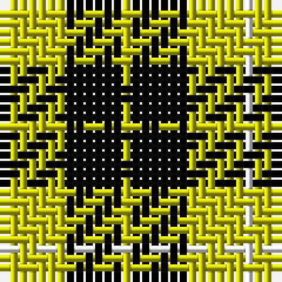

**Bands:** [WYKY](/stripes/wyky/) · **Stripes:** [W LY K LY](/stripes/stripes4/) W LY K LY

This was sourced from weddslist.  It is a [4 band tartan](/bands/bands4/).

Original link http://www.weddslist.com/cgi-bin/tartans/pg.pl?source=rb

## Register references

External register numbers recorded for this tartan.

- Scottish Register of Tartans: [2540](https://www.tartanregister.gov.uk/tartanDetails.aspx?ref=2540)
- Scottish Register of Tartans: [2666](https://www.tartanregister.gov.uk/tartanDetails.aspx?ref=2666)
- Scottish Register of Tartans: [3808](https://www.tartanregister.gov.uk/tartanDetails.aspx?ref=3808)
- Scottish Tartans Authority (ITI): 218
- Scottish Tartans World Register: 1010
- Scottish Tartans World Register: 1585
- Scottish Tartans World Register: 218

## Variants

Other setts woven to the same stripe pattern.

- [Barclay Dress Clan Tartan Tartan Number: 1879. Earliest known date: 1906 Based on the earlier hunting sett which appeared in the Vestiarium Scoticum in 1842. Barclay's appear to have no 'regular' tartan. The dress version assumes this role and is the sett most commonly associated with the name. The Aberdeenshire Barclays of Tolly held lands for over 600 years, and their descendant, Michael Andreas Barclay, was made Prince Barclay de Tolly for his part in the defeat of Napoleon. There is also a green hunting version of the same pattern. See products available Copyright © Blair Urquhart, Comrie, 2015](/setts/s4/ly1k6ly6w1~x8/)
- [Barclay, dress](/setts/s4/ly1k6ly6w1~x2/)
- [Silvicola](/setts/s4/ly20k15ly20w3~x2/)

## Thread count
W/1 Y6 K6 Y/1

## Palette
Each colour and its ΔE from the base-6 reference it is a variant of.

| Colour | Shade | Base | ΔE (OKLab) |
|---|---|---|---|
| K | <code style="background-color:#000000;">#000000</code> `#000000` | K <code style="background-color:#000000;">#000000</code> | 0.00 |
| W | <code style="background-color:#FFFFFF;">#FFFFFF</code> `#FFFFFF` | W <code style="background-color:#F7F7F7;">#F7F7F7</code> | 0.02 |
| Y | <code style="background-color:#C8C800;">#C8C800</code> `#C8C800` | Y <code style="background-color:#F2BF00;">#F2BF00</code> | 0.07 |

# Sample pattern

## Nearest tartans

The nearest existing variants by ΔTartan distance.

1. [Barclay Dress](/setts/s4/lr1ly6k6ly1~x2/) — ΔT 0.60
1. [Barclay, dress](/setts/s4/ly1k6ly6w1~x2/) — ΔT 0.63
1. [Barclay Dress Clan Tartan Tartan Number: 1879. Earliest known date: 1906 Based on the earlier hunting sett which appeared in the Vestiarium Scoticum in 1842. Barclay's appear to have no 'regular' tartan. The dress version assumes this role and is the sett most commonly associated with the name. The Aberdeenshire Barclays of Tolly held lands for over 600 years, and their descendant, Michael Andreas Barclay, was made Prince Barclay de Tolly for his part in the defeat of Napoleon. There is also a green hunting version of the same pattern. See products available Copyright © Blair Urquhart, Comrie, 2015](/setts/s4/ly1k6ly6w1~x8/) — ΔT 0.85
1. [Barclay Dress](/setts/s4/ly5dt32ly32w5~x2/) — ΔT 1.03
1. [MacLeod Dress Clan Tartan Tartan Number: 1272. Earliest known date: 1829 See illustration in Bain where red is 4 threads. Sir Thomas Dick Lauder in a letter to Sir Walter Scott in 1829 wrote, MacLeod has got a sketch of this splendid tartan, "three black stryps upon ain yellow fylde," See products available Copyright © Blair Urquhart, Comrie, 2015](/setts/s5/k4ly1k4ly6r1~x4/) — ΔT 1.07
1. [MacLeod #3](/setts/s6/k6ly1k6ly9r1ly2~x2/) — ΔT 1.30
1. [Silvicola (Corporate)](/setts/s3/k15ly20w3~x2/) — ΔT 1.36
1. [Romsdal](/setts/s5/g40k10r7k10r7/) — ΔT 1.40
1. [Nooten-Boom (Personal)](/setts/s7/k10ly2k10w2k2ly13w3~x2/) — ΔT 1.41
1. [MacLeod of Lewis (Vestiarium Scoticum)](/setts/s5/k8ly1k8ly12r1~x4/) — ΔT 1.51

## Neighbour map

Every grey dot is one of 14313 variants placed by the first two principal components of the ΔTartan feature space (44% of its variance). Red is this tartan; blue dots are its nearest — click one to open its page.

<svg viewBox="0 0 640 380" role="img" style="max-width:100%;height:auto;border:1px solid #e0e0e0;border-radius:4px;display:block" xmlns="http://www.w3.org/2000/svg"><image href="/nn/cloud.v1.png" width="640" height="380"/><a href="/setts/s4/lr1ly6k6ly1~x2/"><circle cx="241.6" cy="255.5" r="4" fill="#3465a4"><title>Barclay Dress</title></circle></a><a href="/setts/s4/ly1k6ly6w1~x2/"><circle cx="238.5" cy="245.7" r="4" fill="#3465a4"><title>Barclay, dress</title></circle></a><a href="/setts/s4/ly1k6ly6w1~x8/"><circle cx="241.8" cy="244.9" r="4" fill="#3465a4"><title>Barclay Dress Clan Tartan Tartan Number: 1879. Earliest known date: 1906 Based on the earlier hunting sett which appeared in the Vestiarium Scoticum in 1842. Barclay's appear to have no 'regular' tartan. The dress version assumes this role and is the sett most commonly associated with the name. The Aberdeenshire Barclays of Tolly held lands for over 600 years, and their descendant, Michael Andreas Barclay, was made Prince Barclay de Tolly for his part in the defeat of Napoleon. There is also a green hunting version of the same pattern. See products available Copyright © Blair Urquhart, Comrie, 2015</title></circle></a><a href="/setts/s4/ly5dt32ly32w5~x2/"><circle cx="249.4" cy="241.6" r="4" fill="#3465a4"><title>Barclay Dress</title></circle></a><a href="/setts/s5/k4ly1k4ly6r1~x4/"><circle cx="234.8" cy="250.7" r="4" fill="#3465a4"><title>MacLeod Dress Clan Tartan Tartan Number: 1272. Earliest known date: 1829 See illustration in Bain where red is 4 threads. Sir Thomas Dick Lauder in a letter to Sir Walter Scott in 1829 wrote, MacLeod has got a sketch of this splendid tartan, &quot;three black stryps upon ain yellow fylde,&quot; See products available Copyright © Blair Urquhart, Comrie, 2015</title></circle></a><a href="/setts/s6/k6ly1k6ly9r1ly2~x2/"><circle cx="256.4" cy="217.0" r="4" fill="#3465a4"><title>MacLeod #3</title></circle></a><a href="/setts/s3/k15ly20w3~x2/"><circle cx="244.0" cy="267.7" r="4" fill="#3465a4"><title>Silvicola (Corporate)</title></circle></a><a href="/setts/s5/g40k10r7k10r7/"><circle cx="261.8" cy="245.2" r="4" fill="#3465a4"><title>Romsdal</title></circle></a><a href="/setts/s7/k10ly2k10w2k2ly13w3~x2/"><circle cx="235.8" cy="219.4" r="4" fill="#3465a4"><title>Nooten-Boom (Personal)</title></circle></a><a href="/setts/s5/k8ly1k8ly12r1~x4/"><circle cx="297.1" cy="220.1" r="4" fill="#3465a4"><title>MacLeod of Lewis (Vestiarium Scoticum)</title></circle></a><circle cx="234.7" cy="249.6" r="5" fill="#c00000"/></svg>

ID: /setts/s4/ly1k6ly6w1/
