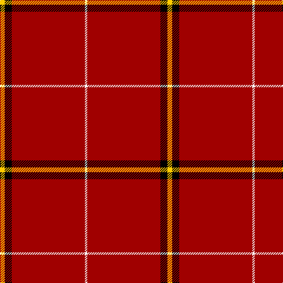

In pattern [WRKY](/stripes/wrky/).

This was sourced from register-of-tartans.  It is a [4 stripe tartan](/stripes/stripes4/).

Original link https://www.tartanregister.gov.uk/tartanDetails.aspx?ref=11548

## Register references

External register numbers recorded for this tartan.

- Scottish Register of Tartans: [11548](https://www.tartanregister.gov.uk/tartanDetails.aspx?ref=11548)

## Thread count
Y/8 K12 DR124 W/4

## Palette
Each colour and its ΔE from the base-6 reference it is a variant of.

| Colour | Shade | Base | ΔE (OKLab) |
|---|---|---|---|
| DR | <code style="background-color:#A00000;">#A00000</code> `#A00000` | R <code style="background-color:#CC0000;">#CC0000</code> | 0.09 |
| K | <code style="background-color:#000000;">#000000</code> `#000000` | K <code style="background-color:#000000;">#000000</code> | 0.00 |
| W | <code style="background-color:#F8F8F8;">#F8F8F8</code> `#F8F8F8` | W <code style="background-color:#F7F7F7;">#F7F7F7</code> | 0.00 |
| Y | <code style="background-color:#FCCC00;">#FCCC00</code> `#FCCC00` | Y <code style="background-color:#F2BF00;">#F2BF00</code> | 0.04 |

# Sample pattern

## Nearest tartans

The nearest existing variants by ΔTartan distance.

1. [Chalet](/setts/s6/g4r16k5r50g4w1~x4/) — ΔT 1.31
1. [MacGregor #2](/setts/s5/r39dg6r2dg3w1~x2/) — ΔT 1.87
1. [MacAndrew Dress (Name)](/setts/s6/r72k8r4g16r7o2~x2/) — ΔT 1.90
1. [Princess Elizabeth](/setts/s8/r42k4w1k6ly1db1ly1r12~x2/) — ΔT 1.90
1. [Gudbrandsdalen, Rondastakken #2](/setts/s8/r65w1r6k8g8r6k3r11~x2/) — ΔT 1.95
1. [Hackston, or Halkerston](/setts/s8/r56w2k12ly3r12ly3r12g3~x2/) — ΔT 1.97
1. [Princess Elizabeth (Royal)](/setts/s8/r72k6lb2k11ly2db2ly2r18~x2/) — ΔT 2.00
1. [Masai Shuka 18 (Artefact)](/setts/s4/ly6k3r40w3~x2/) — ΔT 2.03
1. [MacGregor](/setts/s5/r39g6r2g3w1~x2/) — ΔT 2.03
1. [McPeek (Fictitious clan)](/setts/s4/r63k8k8ly5~x2/) — ΔT 2.07

## Neighbour map

Every grey dot is one of 14299 variants placed by the first two principal components of the ΔTartan feature space (44% of its variance). Red is this tartan; blue dots are its nearest — click one to open its page.

<svg viewBox="0 0 640 380" role="img" style="max-width:100%;height:auto;border:1px solid #e0e0e0;border-radius:4px;display:block" xmlns="http://www.w3.org/2000/svg"><image href="/nn/cloud.v1.png" width="640" height="380"/><a href="/setts/s6/g4r16k5r50g4w1~x4/"><circle cx="605.9" cy="114.6" r="4" fill="#3465a4"><title>Chalet</title></circle></a><a href="/setts/s5/r39dg6r2dg3w1~x2/"><circle cx="626.0" cy="145.8" r="4" fill="#3465a4"><title>MacGregor #2</title></circle></a><a href="/setts/s6/r72k8r4g16r7o2~x2/"><circle cx="563.5" cy="132.8" r="4" fill="#3465a4"><title>MacAndrew Dress (Name)</title></circle></a><a href="/setts/s8/r42k4w1k6ly1db1ly1r12~x2/"><circle cx="544.7" cy="72.2" r="4" fill="#3465a4"><title>Princess Elizabeth</title></circle></a><a href="/setts/s8/r65w1r6k8g8r6k3r11~x2/"><circle cx="616.9" cy="101.3" r="4" fill="#3465a4"><title>Gudbrandsdalen, Rondastakken #2</title></circle></a><a href="/setts/s8/r56w2k12ly3r12ly3r12g3~x2/"><circle cx="499.5" cy="95.7" r="4" fill="#3465a4"><title>Hackston, or Halkerston</title></circle></a><a href="/setts/s8/r72k6lb2k11ly2db2ly2r18~x2/"><circle cx="551.5" cy="84.7" r="4" fill="#3465a4"><title>Princess Elizabeth (Royal)</title></circle></a><a href="/setts/s4/ly6k3r40w3~x2/"><circle cx="507.5" cy="173.5" r="4" fill="#3465a4"><title>Masai Shuka 18 (Artefact)</title></circle></a><a href="/setts/s5/r39g6r2g3w1~x2/"><circle cx="626.0" cy="154.7" r="4" fill="#3465a4"><title>MacGregor</title></circle></a><a href="/setts/s4/r63k8k8ly5~x2/"><circle cx="475.8" cy="185.7" r="4" fill="#3465a4"><title>McPeek (Fictitious clan)</title></circle></a><circle cx="600.1" cy="143.5" r="5" fill="#c00000"/></svg>

ID: /setts/s4/ly2k3r31w1~x4/
