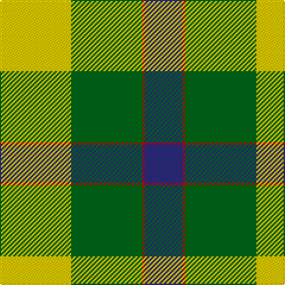

This page is one **sett** — a single exact thread-count. It belongs to the [tartan](/tartans/y30g30r1db16/)
(the same proportion at any scale), whose colour order is pattern [BRGY](/stripes/brgy/).

Sourced from tartans-authority.  It is a [4 stripe tartan](/stripes/stripes4/).

Original link http://www.tartansauthority.com/tartan-ferret/display/10535/

## Thread count
Y/60 G60 R2 DB/32

## Palette
Each colour and the base-6 reference it is a variant of.

| Colour | Shade | Base |
|---|---|---|
| DB | <code style="background-color:#2C2C80;">#2C2C80</code> `oklch(35.0% 0.138 276.6)` <small>#2C2C80</small> | B <code style="background-color:#2A418A;">#2A418A</code> |
| G | <code style="background-color:#006818;">#006818</code> `oklch(45.0% 0.142 145.0)` <small>#006818</small> | G <code style="background-color:#006100;">#006100</code> |
| R | <code style="background-color:#C80000;">#C80000</code> `oklch(52.3% 0.215 29.2)` <small>#C80000</small> | R <code style="background-color:#CC0000;">#CC0000</code> |
| Y | <code style="background-color:#FCCC00;">#FCCC00</code> `oklch(86.2% 0.176 91.5)` <small>#FCCC00</small> | Y <code style="background-color:#F2BF00;">#F2BF00</code> |

# Sample pattern

## Nearest tartans

The nearest existing variants by ΔTartan distance, with this tartan at the top so the swatches line up against it.

ΔTartan

Tartan

Sett

—

<a href="/ttd/edit/#slug=ly30g30r1db16~x2">Barber Family (Personal)</a> <a class="nn-out" href="/setts/s4/ly30g30r1db16~x2/" title="open its dictionary page">↗</a>

1.26

<a href="/ttd/edit/#slug=g22w14r7ly1~x2">Loch Lomond</a> <a class="nn-out" href="/setts/s4/g22w14r7ly1~x2/" title="open its dictionary page">↗</a>

1.32

<a href="/ttd/edit/#slug=k5g25k10lg15ly1lg5~x2">Delaware Fine Spirits Guild (Corp)</a> <a class="nn-out" href="/setts/s6/k5g25k10lg15ly1lg5~x2/" title="open its dictionary page">↗</a>

1.57

<a href="/ttd/edit/#slug=k10g25k10lg15w1lg5~x2">Delaware Fine Spirits Guild</a> <a class="nn-out" href="/setts/s6/k10g25k10lg15w1lg5~x2/" title="open its dictionary page">↗</a>

1.81

<a href="/ttd/edit/#slug=g22w14r7ly2~x2">Loch Lomond #3</a> <a class="nn-out" href="/setts/s4/g22w14r7ly2~x2/" title="open its dictionary page">↗</a>

1.82

<a href="/ttd/edit/#slug=g18w55o19g20w2g20k5">Michigan State University</a> <a class="nn-out" href="/setts/s7/g18w55o19g20w2g20k5/" title="open its dictionary page">↗</a>

1.90

<a href="/ttd/edit/#slug=dg27r9n2ly14~x4">Englehart, City of</a> <a class="nn-out" href="/setts/s4/dg27r9n2ly14~x4/" title="open its dictionary page">↗</a>

1.99

<a href="/ttd/edit/#slug=g9o7w7r1~x4">MacKinnon, dress</a> <a class="nn-out" href="/setts/s4/g9o7w7r1~x4/" title="open its dictionary page">↗</a>

2.06

<a href="/ttd/edit/#slug=db8ly1dg5ly12r1dg2~x6">McCabe (2016)</a> <a class="nn-out" href="/setts/s6/db8ly1dg5ly12r1dg2~x6/" title="open its dictionary page">↗</a>

2.10

<a href="/ttd/edit/#slug=ly83k35w3g35k3ly10">Brandon Manitoba Trade Tartan Tartan Number: 1884. Earliest known date: pre 1997 From Dalgleish as Hamilton of Brandon. There is a similarity to Cape Breton. And to Paton's Jacobite. See products available Copyright © Blair Urquhart, Comrie, 2015</a> <a class="nn-out" href="/setts/s6/ly83k35w3g35k3ly10/" title="open its dictionary page">↗</a>

2.12

<a href="/ttd/edit/#slug=ly25r10g10db11w2~x2">Samye</a> <a class="nn-out" href="/setts/s5/ly25r10g10db11w2~x2/" title="open its dictionary page">↗</a>

## Neighbour map

Every grey dot is one of 14299 variants placed by the first two principal components of the ΔTartan feature space (44% of its variance). Red is this tartan; blue dots are its nearest — click one to open its page.

<svg viewBox="0 0 640 380" role="img" style="max-width:100%;height:auto;border:1px solid #e0e0e0;border-radius:4px;display:block" xmlns="http://www.w3.org/2000/svg"><image href="/nn/cloud.v1.png" width="640" height="380"/><a href="/setts/s4/g22w14r7ly1~x2/"><circle cx="268.0" cy="193.9" r="4" fill="#3465a4"><title>Loch Lomond</title></circle></a><a href="/setts/s6/k5g25k10lg15ly1lg5~x2/"><circle cx="225.1" cy="172.6" r="4" fill="#3465a4"><title>Delaware Fine Spirits Guild (Corp)</title></circle></a><a href="/setts/s6/k10g25k10lg15w1lg5~x2/"><circle cx="186.3" cy="178.6" r="4" fill="#3465a4"><title>Delaware Fine Spirits Guild</title></circle></a><a href="/setts/s4/g22w14r7ly2~x2/"><circle cx="214.9" cy="213.1" r="4" fill="#3465a4"><title>Loch Lomond #3</title></circle></a><a href="/setts/s7/g18w55o19g20w2g20k5/"><circle cx="218.9" cy="145.0" r="4" fill="#3465a4"><title>Michigan State University</title></circle></a><a href="/setts/s4/dg27r9n2ly14~x4/"><circle cx="265.6" cy="218.1" r="4" fill="#3465a4"><title>Englehart, City of</title></circle></a><a href="/setts/s4/g9o7w7r1~x4/"><circle cx="149.5" cy="246.7" r="4" fill="#3465a4"><title>MacKinnon, dress</title></circle></a><a href="/setts/s6/db8ly1dg5ly12r1dg2~x6/"><circle cx="188.2" cy="175.0" r="4" fill="#3465a4"><title>McCabe (2016)</title></circle></a><a href="/setts/s6/ly83k35w3g35k3ly10/"><circle cx="242.6" cy="121.1" r="4" fill="#3465a4"><title>Brandon Manitoba Trade Tartan Tartan Number: 1884. Earliest known date: pre 1997 From Dalgleish as Hamilton of Brandon. There is a similarity to Cape Breton. And to Paton's Jacobite. See products available Copyright © Blair Urquhart, Comrie, 2015</title></circle></a><a href="/setts/s5/ly25r10g10db11w2~x2/"><circle cx="159.8" cy="183.6" r="4" fill="#3465a4"><title>Samye</title></circle></a><circle cx="214.5" cy="189.2" r="5" fill="#c00000"/></svg>

ID: /setts/s4/ly30g30r1db16~x2/
