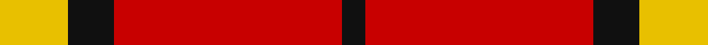

In pattern [KRKY](/stripes/krky/).

This was sourced from tartans-authority.  It is a [4 stripe tartan](/stripes/stripes4/).

Original link http://www.tartansauthority.com/tartan-ferret/display/7286/

## Thread count
Y/12 K8 R40 K/4

## Palette
Each colour and the base-6 reference it is a variant of.

| Colour | Shade | Base |
|---|---|---|
| K | <code style="background-color:#101010;">#101010</code> `oklch(17.3% 0.000 89.9)` <small>#101010</small> | K <code style="background-color:#000000;">#000000</code> |
| R | <code style="background-color:#C80000;">#C80000</code> `oklch(52.3% 0.215 29.2)` <small>#C80000</small> | R <code style="background-color:#CC0000;">#CC0000</code> |
| Y | <code style="background-color:#E8C000;">#E8C000</code> `oklch(81.9% 0.168 93.7)` <small>#E8C000</small> | Y <code style="background-color:#F2BF00;">#F2BF00</code> |

# Sample pattern

## Nearest tartans

The nearest existing variants by ΔTartan distance.

1. [Loch Morar](/setts/s5/r38w9r3dr9w3~x2/) — ΔT 1.09
1. [Loch Morar Trade Tartan Tartan Number: 1701. Earliest known date: pre 2003 Nothing See products available Copyright © Blair Urquhart, Comrie, 2015](/setts/s5/r38w9r3do9w3~x2/) — ΔT 1.13
1. [McPeek (Fashion)](/setts/s4/r125k26lb20lo16/) — ΔT 1.17
1. [MacKeane](/setts/s5/r4k8r12k1ly1~x2/) — ΔT 1.22
1. [MacKinnon #6](/setts/s4/r3dg20r25w3~x4/) — ΔT 1.27
1. [MacGregor, Black (Personal)](/setts/s5/r41k19r7k9w3~x2/) — ΔT 1.30
1. [Billy Apple® Red](/setts/s4/g1r13k8ly1~x6/) — ΔT 1.34
1. [Masai Shuka 20 (Artefact)](/setts/s3/r30k10ly3~x4/) — ΔT 1.35
1. [Glen Shiel (Fashion)](/setts/s5/r13lb3r1dg3lb1~x6/) — ΔT 1.38
1. [Dunbar (District)](/setts/s4/r28k4w2k13~x2/) — ΔT 1.39

## Neighbour map

Every grey dot is one of 14299 variants placed by the first two principal components of the ΔTartan feature space (44% of its variance). Red is this tartan; blue dots are its nearest — click one to open its page.

<svg viewBox="0 0 640 380" role="img" style="max-width:100%;height:auto;border:1px solid #e0e0e0;border-radius:4px;display:block" xmlns="http://www.w3.org/2000/svg"><image href="/nn/cloud.v1.png" width="640" height="380"/><a href="/setts/s5/r38w9r3dr9w3~x2/"><circle cx="412.6" cy="182.4" r="4" fill="#3465a4"><title>Loch Morar</title></circle></a><a href="/setts/s5/r38w9r3do9w3~x2/"><circle cx="414.5" cy="182.1" r="4" fill="#3465a4"><title>Loch Morar Trade Tartan Tartan Number: 1701. Earliest known date: pre 2003 Nothing See products available Copyright © Blair Urquhart, Comrie, 2015</title></circle></a><a href="/setts/s4/r125k26lb20lo16/"><circle cx="376.6" cy="200.7" r="4" fill="#3465a4"><title>McPeek (Fashion)</title></circle></a><a href="/setts/s5/r4k8r12k1ly1~x2/"><circle cx="384.8" cy="212.9" r="4" fill="#3465a4"><title>MacKeane</title></circle></a><a href="/setts/s4/r3dg20r25w3~x4/"><circle cx="335.1" cy="239.8" r="4" fill="#3465a4"><title>MacKinnon #6</title></circle></a><a href="/setts/s5/r41k19r7k9w3~x2/"><circle cx="382.7" cy="201.8" r="4" fill="#3465a4"><title>MacGregor, Black (Personal)</title></circle></a><a href="/setts/s4/g1r13k8ly1~x6/"><circle cx="330.1" cy="191.1" r="4" fill="#3465a4"><title>Billy Apple® Red</title></circle></a><a href="/setts/s3/r30k10ly3~x4/"><circle cx="434.4" cy="240.2" r="4" fill="#3465a4"><title>Masai Shuka 20 (Artefact)</title></circle></a><a href="/setts/s5/r13lb3r1dg3lb1~x6/"><circle cx="418.3" cy="192.4" r="4" fill="#3465a4"><title>Glen Shiel (Fashion)</title></circle></a><a href="/setts/s4/r28k4w2k13~x2/"><circle cx="375.2" cy="209.8" r="4" fill="#3465a4"><title>Dunbar (District)</title></circle></a><circle cx="367.3" cy="212.0" r="5" fill="#c00000"/></svg>

ID: /setts/s4/ly3k2r10k1~x4/
