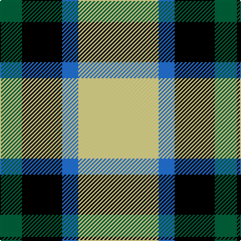

**Bands:** [GKBY](/stripes/gkby/) · **Stripes:** [G K B LY](/stripes/stripes4/) G K B LY

This was sourced from register-of-tartans.  It is a [4 band tartan](/bands/bands4/).

Original link https://www.tartanregister.gov.uk/tartanDetails.aspx?ref=11528

## Register references

External register numbers recorded for this tartan.

- Scottish Register of Tartans: [11528](https://www.tartanregister.gov.uk/tartanDetails.aspx?ref=11528)

## Thread count
G/22 K40 B16 LY/80

## Palette
Each colour and its ΔE from the base-6 reference it is a variant of.

| Colour | Shade | Base | ΔE (OKLab) |
|---|---|---|---|
| B | <code style="background-color:#2474E8;">#2474E8</code> `#2474E8` | B <code style="background-color:#2A418A;">#2A418A</code> | 0.19 |
| G | <code style="background-color:#00643C;">#00643C</code> `#00643C` | G <code style="background-color:#006100;">#006100</code> | 0.05 |
| K | <code style="background-color:#000000;">#000000</code> `#000000` | K <code style="background-color:#000000;">#000000</code> | 0.00 |
| LY | <code style="background-color:#F8E38C;">#F8E38C</code> `#F8E38C` | Y <code style="background-color:#F2BF00;">#F2BF00</code> | 0.11 |

# Sample pattern

## Nearest tartans

The nearest existing variants by ΔTartan distance.

1. [Louisburg Canadian District Tartan Tartan Number: 5500. Earliest known date: 1994 Louisburg is a tiny seaside town in Nova Scotia about 20 miles southeast of Sydney and site of the 1758 Battle of Louisburgh. It was designed by Edith MacIntyre of Louisbourg with the assistance of Jean Kyte and Jean composed the following poem about the colours. CIDD count slightly different - RB/20 W8 Y20 LN/34 (John Fitzpatrick's July 2008 review of Canadian tartans). Gray fog and sea and rocks. The yellow sun. white spindrift on the harbour restless beneath an azure sky. Curent owners (2008): The Louisbourg Heritage Society P.O. Box 396 Louisbourg, B0A 1M0 Nova Scotia, Canada See products available Copyright © Blair Urquhart, Comrie, 2015](/setts/s4/o22ly10w3k8~x2/) — ΔT 0.83
1. [City of London](/setts/s4/k5n24w24k5~x2/) — ΔT 1.34
1. [Bonhill Primary School](/setts/s4/r4k25ly25w4~x2/) — ΔT 1.40
1. [Delroeux, John Michael (Personal)](/setts/s4/db3dg6ly1r3~x10/) — ΔT 1.47
1. [Loch Lomond #3](/setts/s4/g22w14r7ly2~x2/) — ΔT 1.52
1. [Thistle and Kudzu Scottish Socie Corporate Tartan Tartan Number: 10655. Earliest known date: 01/09/2010 The Thistle and Kudzu Scottish Society of Athens is an informal group that organizes and supports Scottish activities in Athens, Georgia, USA. Activities include Royal Scottish Country Dance lessons and demonstrations, annual Robert Burns Dinners, a Scottish Festival, and the Thistle & Kudzu Pipes and Drums band and piping lessons. In 2010 a tartan design contest was organized to create a unique tartan that represented the Thistle and Kudzu Scottish Society. Members used an online tartan design programme (http://www.houseoftartan.co.uk/interactive/weaver/index.html) to create and submit various tartan designs that were then voted on by the Scottish dance class. The design that received the most votes was selected as the official tartan of the group. The overall design was submitted by Stephanie Bohan and the thread count established for weaving by Dorothy Harnish. Colours: dark green represents the kudzu vine which grows abundantly throughout Georgia and is well known in that state; light green, purple and white represent the thistle plant and flower in bloom. See products available Copyright © Blair Urquhart, Comrie, 2015](/setts/s4/p6lg15g15k2~x2/) — ΔT 1.54
1. [Burberry (Genuine)](/setts/s5/k3w3k3ly10r1~x6/) — ΔT 1.54
1. [City of London (Corporate)](/setts/s4/k5n24w24r5~x2/) — ΔT 1.55
1. [Louisburg](/setts/s4/o22ly10w3db8~x2/) — ΔT 1.55
1. [Ardalansish Tweed (Fashion)](/setts/s6/do1lo1do2w4n1w1~x8/) — ΔT 1.56

## Neighbour map

Every grey dot is one of 14313 variants placed by the first two principal components of the ΔTartan feature space (44% of its variance). Red is this tartan; blue dots are its nearest — click one to open its page.

<svg viewBox="0 0 640 380" role="img" style="max-width:100%;height:auto;border:1px solid #e0e0e0;border-radius:4px;display:block" xmlns="http://www.w3.org/2000/svg"><image href="/nn/cloud.v1.png" width="640" height="380"/><a href="/setts/s4/o22ly10w3k8~x2/"><circle cx="201.1" cy="227.9" r="4" fill="#3465a4"><title>Louisburg Canadian District Tartan Tartan Number: 5500. Earliest known date: 1994 Louisburg is a tiny seaside town in Nova Scotia about 20 miles southeast of Sydney and site of the 1758 Battle of Louisburgh. It was designed by Edith MacIntyre of Louisbourg with the assistance of Jean Kyte and Jean composed the following poem about the colours. CIDD count slightly different - RB/20 W8 Y20 LN/34 (John Fitzpatrick's July 2008 review of Canadian tartans). Gray fog and sea and rocks. The yellow sun. white spindrift on the harbour restless beneath an azure sky. Curent owners (2008): The Louisbourg Heritage Society P.O. Box 396 Louisbourg, B0A 1M0 Nova Scotia, Canada See products available Copyright © Blair Urquhart, Comrie, 2015</title></circle></a><a href="/setts/s4/k5n24w24k5~x2/"><circle cx="147.1" cy="236.7" r="4" fill="#3465a4"><title>City of London</title></circle></a><a href="/setts/s4/r4k25ly25w4~x2/"><circle cx="185.8" cy="224.6" r="4" fill="#3465a4"><title>Bonhill Primary School</title></circle></a><a href="/setts/s4/db3dg6ly1r3~x10/"><circle cx="170.9" cy="256.8" r="4" fill="#3465a4"><title>Delroeux, John Michael (Personal)</title></circle></a><a href="/setts/s4/g22w14r7ly2~x2/"><circle cx="215.1" cy="213.3" r="4" fill="#3465a4"><title>Loch Lomond #3</title></circle></a><a href="/setts/s4/p6lg15g15k2~x2/"><circle cx="158.1" cy="245.4" r="4" fill="#3465a4"><title>Thistle and Kudzu Scottish Socie Corporate Tartan Tartan Number: 10655. Earliest known date: 01/09/2010 The Thistle and Kudzu Scottish Society of Athens is an informal group that organizes and supports Scottish activities in Athens, Georgia, USA. Activities include Royal Scottish Country Dance lessons and demonstrations, annual Robert Burns Dinners, a Scottish Festival, and the Thistle &amp; Kudzu Pipes and Drums band and piping lessons. In 2010 a tartan design contest was organized to create a unique tartan that represented the Thistle and Kudzu Scottish Society. Members used an online tartan design programme (http://www.houseoftartan.co.uk/interactive/weaver/index.html) to create and submit various tartan designs that were then voted on by the Scottish dance class. The design that received the most votes was selected as the official tartan of the group. The overall design was submitted by Stephanie Bohan and the thread count established for weaving by Dorothy Harnish. Colours: dark green represents the kudzu vine which grows abundantly throughout Georgia and is well known in that state; light green, purple and white represent the thistle plant and flower in bloom. See products available Copyright © Blair Urquhart, Comrie, 2015</title></circle></a><a href="/setts/s5/k3w3k3ly10r1~x6/"><circle cx="223.8" cy="195.0" r="4" fill="#3465a4"><title>Burberry (Genuine)</title></circle></a><a href="/setts/s4/k5n24w24r5~x2/"><circle cx="156.0" cy="236.2" r="4" fill="#3465a4"><title>City of London (Corporate)</title></circle></a><a href="/setts/s4/o22ly10w3db8~x2/"><circle cx="219.8" cy="235.8" r="4" fill="#3465a4"><title>Louisburg</title></circle></a><a href="/setts/s6/do1lo1do2w4n1w1~x8/"><circle cx="177.1" cy="226.1" r="4" fill="#3465a4"><title>Ardalansish Tweed (Fashion)</title></circle></a><circle cx="168.0" cy="239.8" r="5" fill="#c00000"/></svg>

ID: /setts/s4/ly40b8k20g11~x2/
