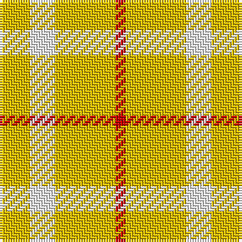

In pattern [RYWY](/stripes/rywy/).

This was sourced from tartans-authority.  It is a [4 stripe tartan](/stripes/stripes4/).

Original link http://www.tartansauthority.com/tartan-ferret/display/3912/

## Thread count
Y/12 W10 Y24 R/4

## Palette
Each colour and the base-6 reference it is a variant of.

| Colour | Shade | Base |
|---|---|---|
| R | <code style="background-color:#C80000;">#C80000</code> `oklch(52.3% 0.215 29.2)` <small>#C80000</small> | R <code style="background-color:#CC0000;">#CC0000</code> |
| W | <code style="background-color:#FCFCFC;">#FCFCFC</code> `oklch(99.1% 0.000 89.9)` <small>#FCFCFC</small> | W <code style="background-color:#F7F7F7;">#F7F7F7</code> |
| Y | <code style="background-color:#E8C000;">#E8C000</code> `oklch(81.9% 0.168 93.7)` <small>#E8C000</small> | Y <code style="background-color:#F2BF00;">#F2BF00</code> |

# Sample pattern

## Nearest tartans

The nearest existing variants by ΔTartan distance, with this tartan at the top so the swatches line up against it.

ΔTartan

Tartan

Sett

—

<a href="/ttd/edit/#slug=ly6w5ly12r2~x2">One Account (Corporate)</a> <a class="nn-out" href="/setts/s4/ly6w5ly12r2~x2/" title="open its dictionary page">↗</a>

0.97

<a href="/ttd/edit/#slug=ly12w5ly6w5ly12r2~x2">One Account</a> <a class="nn-out" href="/setts/s6/ly12w5ly6w5ly12r2~x2/" title="open its dictionary page">↗</a>

1.34

<a href="/ttd/edit/#slug=lo7w6lo11r2~x2">Virgin One (Corporate)</a> <a class="nn-out" href="/setts/s4/lo7w6lo11r2~x2/" title="open its dictionary page">↗</a>

1.65

<a href="/ttd/edit/#slug=lo11r2lo11w6lo7w6~x2">Virgin One</a> <a class="nn-out" href="/setts/s6/lo11r2lo11w6lo7w6~x2/" title="open its dictionary page">↗</a>

2.11

<a href="/ttd/edit/#slug=ly8r2ly8g1r6ly3g4ly2~x4">Glufree</a> <a class="nn-out" href="/setts/s8/ly8r2ly8g1r6ly3g4ly2~x4/" title="open its dictionary page">↗</a>

2.46

<a href="/ttd/edit/#slug=lo40g13lo6db13lo22~x2">Burt's Highlanders (Fashion)</a> <a class="nn-out" href="/setts/s5/lo40g13lo6db13lo22~x2/" title="open its dictionary page">↗</a>

2.58

<a href="/ttd/edit/#slug=o3w17o11w2o11w2~x4">Fallow Deer, The</a> <a class="nn-out" href="/setts/s6/o3w17o11w2o11w2~x4/" title="open its dictionary page">↗</a>

2.96

<a href="/ttd/edit/#slug=g9lo20g40w5~x2">O'Neill</a> <a class="nn-out" href="/setts/s4/g9lo20g40w5~x2/" title="open its dictionary page">↗</a>

3.00

<a href="/ttd/edit/#slug=ly6r1ly4r4db2~x5">Sands-Pingot Family, Alabama (Personal)</a> <a class="nn-out" href="/setts/s5/ly6r1ly4r4db2~x5/" title="open its dictionary page">↗</a>

3.02

<a href="/ttd/edit/#slug=g10w7ly41k7~x2">Hogan (2014)</a> <a class="nn-out" href="/setts/s4/g10w7ly41k7~x2/" title="open its dictionary page">↗</a>

3.02

<a href="/ttd/edit/#slug=ly49r16k11~x2">Quenouille (2011)</a> <a class="nn-out" href="/setts/s3/ly49r16k11~x2/" title="open its dictionary page">↗</a>

## Neighbour map

Every grey dot is one of 14299 variants placed by the first two principal components of the ΔTartan feature space (44% of its variance). Red is this tartan; blue dots are its nearest — click one to open its page.

<svg viewBox="0 0 640 380" role="img" style="max-width:100%;height:auto;border:1px solid #e0e0e0;border-radius:4px;display:block" xmlns="http://www.w3.org/2000/svg"><image href="/nn/cloud.v1.png" width="640" height="380"/><a href="/setts/s6/ly12w5ly6w5ly12r2~x2/"><circle cx="414.9" cy="276.4" r="4" fill="#3465a4"><title>One Account</title></circle></a><a href="/setts/s4/lo7w6lo11r2~x2/"><circle cx="400.6" cy="305.1" r="4" fill="#3465a4"><title>Virgin One (Corporate)</title></circle></a><a href="/setts/s6/lo11r2lo11w6lo7w6~x2/"><circle cx="376.2" cy="295.1" r="4" fill="#3465a4"><title>Virgin One</title></circle></a><a href="/setts/s8/ly8r2ly8g1r6ly3g4ly2~x4/"><circle cx="347.9" cy="239.8" r="4" fill="#3465a4"><title>Glufree</title></circle></a><a href="/setts/s5/lo40g13lo6db13lo22~x2/"><circle cx="374.5" cy="244.7" r="4" fill="#3465a4"><title>Burt's Highlanders (Fashion)</title></circle></a><a href="/setts/s6/o3w17o11w2o11w2~x4/"><circle cx="343.9" cy="239.8" r="4" fill="#3465a4"><title>Fallow Deer, The</title></circle></a><a href="/setts/s4/g9lo20g40w5~x2/"><circle cx="405.5" cy="281.2" r="4" fill="#3465a4"><title>O'Neill</title></circle></a><a href="/setts/s5/ly6r1ly4r4db2~x5/"><circle cx="257.0" cy="242.3" r="4" fill="#3465a4"><title>Sands-Pingot Family, Alabama (Personal)</title></circle></a><a href="/setts/s4/g10w7ly41k7~x2/"><circle cx="292.6" cy="213.0" r="4" fill="#3465a4"><title>Hogan (2014)</title></circle></a><a href="/setts/s3/ly49r16k11~x2/"><circle cx="301.2" cy="261.2" r="4" fill="#3465a4"><title>Quenouille (2011)</title></circle></a><circle cx="418.4" cy="281.7" r="5" fill="#c00000"/></svg>

ID: /setts/s4/ly6w5ly12r2~x2/
