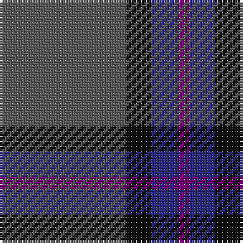

This page is one **sett** — a single exact thread-count. It belongs to the [tartan](/tartans/n10k2db2p1/)
(the same proportion at any scale), whose colour order is pattern [BBKB](/stripes/bbkb/).

Sourced from tartans-authority.  It is a [4 stripe tartan](/stripes/stripes4/).

Original link http://www.tartansauthority.com/tartan-ferret/display/10342/

## Thread count
N/50 K10 DB10 P/5

## Palette
Each colour and the base-6 reference it is a variant of.

| Colour | Shade | Base |
|---|---|---|
| DB | <code style="background-color:#2C2C80;">#2C2C80</code> `oklch(35.0% 0.138 276.6)` <small>#2C2C80</small> | B <code style="background-color:#2A418A;">#2A418A</code> |
| K | <code style="background-color:#101010;">#101010</code> `oklch(17.3% 0.000 89.9)` <small>#101010</small> | K <code style="background-color:#000000;">#000000</code> |
| N | <code style="background-color:#5C5C5C;">#5C5C5C</code> `oklch(47.5% 0.000 89.9)` <small>#5C5C5C</small> | B <code style="background-color:#2A418A;">#2A418A</code> |
| P | <code style="background-color:#780078;">#780078</code> `oklch(40.2% 0.185 328.4)` <small>#780078</small> | B <code style="background-color:#2A418A;">#2A418A</code> |

# Sample pattern

## Nearest tartans

The nearest existing variants by ΔTartan distance, with this tartan at the top so the swatches line up against it.

ΔTartan

Tartan

Sett

—

<a href="/ttd/edit/#slug=n10k2db2dp1~x5">Lord Willy's (Corporate)</a> <a class="nn-out" href="/setts/s4/n10k2db2dp1~x5/" title="open its dictionary page">↗</a>

1.32

<a href="/ttd/edit/#slug=dt62r24lo5dg3~x2">Meaux (Personal)</a> <a class="nn-out" href="/setts/s4/dt62r24lo5dg3~x2/" title="open its dictionary page">↗</a>

1.53

<a href="/ttd/edit/#slug=db50do4db12do23ly4do4~x2">Sligo, County</a> <a class="nn-out" href="/setts/s6/db50do4db12do23ly4do4~x2/" title="open its dictionary page">↗</a>

1.54

<a href="/ttd/edit/#slug=n25k5b5p3~x2">Lord Willy's (New York)</a> <a class="nn-out" href="/setts/s4/n25k5b5p3~x2/" title="open its dictionary page">↗</a>

1.57

<a href="/ttd/edit/#slug=dg1db2db5db11ly1~x4">Open Championship, The</a> <a class="nn-out" href="/setts/s5/dg1db2db5db11ly1~x4/" title="open its dictionary page">↗</a>

1.58

<a href="/ttd/edit/#slug=dy11db1dy3db1db9r1~x4">Dege of Saville Row</a> <a class="nn-out" href="/setts/s6/dy11db1dy3db1db9r1~x4/" title="open its dictionary page">↗</a>

1.61

<a href="/ttd/edit/#slug=g8w3n6db11n30db5~x2">Devlin, Craig (Personal)</a> <a class="nn-out" href="/setts/s6/g8w3n6db11n30db5~x2/" title="open its dictionary page">↗</a>

1.61

<a href="/ttd/edit/#slug=o15r5o30db32o4ly3~x2">Cameron, hunting</a> <a class="nn-out" href="/setts/s6/o15r5o30db32o4ly3~x2/" title="open its dictionary page">↗</a>

1.68

<a href="/ttd/edit/#slug=db4r1db18n18lr1~x4">Ardee (Corporate)</a> <a class="nn-out" href="/setts/s5/db4r1db18n18lr1~x4/" title="open its dictionary page">↗</a>

1.74

<a href="/ttd/edit/#slug=do3db3do3db27do40ly3">Keeper of the Quaich Corporate Tartan Tartan Number: 1731. Earliest known date: 1988 Restricted. Sample in STS collection. See products available Copyright © Blair Urquhart, Comrie, 2015</a> <a class="nn-out" href="/setts/s6/do3db3do3db27do40ly3/" title="open its dictionary page">↗</a>

1.74

<a href="/ttd/edit/#slug=dy3db3dy3db27dy40y3">Keeper of the Quaich</a> <a class="nn-out" href="/setts/s6/dy3db3dy3db27dy40y3/" title="open its dictionary page">↗</a>

## Neighbour map

Every grey dot is one of 14299 variants placed by the first two principal components of the ΔTartan feature space (44% of its variance). Red is this tartan; blue dots are its nearest — click one to open its page.

<svg viewBox="0 0 640 380" role="img" style="max-width:100%;height:auto;border:1px solid #e0e0e0;border-radius:4px;display:block" xmlns="http://www.w3.org/2000/svg"><image href="/nn/cloud.v1.png" width="640" height="380"/><a href="/setts/s4/dt62r24lo5dg3~x2/"><circle cx="471.6" cy="226.0" r="4" fill="#3465a4"><title>Meaux (Personal)</title></circle></a><a href="/setts/s6/db50do4db12do23ly4do4~x2/"><circle cx="472.3" cy="247.8" r="4" fill="#3465a4"><title>Sligo, County</title></circle></a><a href="/setts/s4/n25k5b5p3~x2/"><circle cx="394.0" cy="247.5" r="4" fill="#3465a4"><title>Lord Willy's (New York)</title></circle></a><a href="/setts/s5/dg1db2db5db11ly1~x4/"><circle cx="424.4" cy="248.8" r="4" fill="#3465a4"><title>Open Championship, The</title></circle></a><a href="/setts/s6/dy11db1dy3db1db9r1~x4/"><circle cx="399.7" cy="245.0" r="4" fill="#3465a4"><title>Dege of Saville Row</title></circle></a><a href="/setts/s6/g8w3n6db11n30db5~x2/"><circle cx="357.6" cy="242.2" r="4" fill="#3465a4"><title>Devlin, Craig (Personal)</title></circle></a><a href="/setts/s6/o15r5o30db32o4ly3~x2/"><circle cx="378.9" cy="245.0" r="4" fill="#3465a4"><title>Cameron, hunting</title></circle></a><a href="/setts/s5/db4r1db18n18lr1~x4/"><circle cx="400.1" cy="227.8" r="4" fill="#3465a4"><title>Ardee (Corporate)</title></circle></a><a href="/setts/s6/do3db3do3db27do40ly3/"><circle cx="457.7" cy="238.6" r="4" fill="#3465a4"><title>Keeper of the Quaich Corporate Tartan Tartan Number: 1731. Earliest known date: 1988 Restricted. Sample in STS collection. See products available Copyright © Blair Urquhart, Comrie, 2015</title></circle></a><a href="/setts/s6/dy3db3dy3db27dy40y3/"><circle cx="472.2" cy="247.6" r="4" fill="#3465a4"><title>Keeper of the Quaich</title></circle></a><circle cx="451.9" cy="259.7" r="5" fill="#c00000"/></svg>

ID: /setts/s4/n10k2db2dp1~x5/
