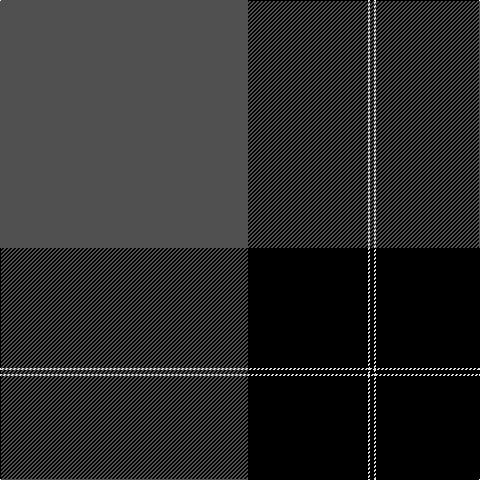

In pattern [BKWK](/stripes/bkwk/).

This was sourced from weddslist.  It is a [4 stripe tartan](/stripes/stripes4/).

Original link http://www.weddslist.com/cgi-bin/tartans/pg.pl?source=sts

## Thread count
N/248 K120 LN2 K/4

## Palette
Each colour and the base-6 reference it is a variant of.

| Colour | Shade | Base |
|---|---|---|
| K | <code style="background-color:#000000;">#000000</code> `oklch(0.0% 0.000 0.0)` <small>#000000</small> | K <code style="background-color:#000000;">#000000</code> |
| LN | <code style="background-color:#E0E0E0;">#E0E0E0</code> `oklch(90.7% 0.000 89.9)` <small>#E0E0E0</small> | W <code style="background-color:#F7F7F7;">#F7F7F7</code> |
| N | <code style="background-color:#505050;">#505050</code> `oklch(43.1% 0.000 89.9)` <small>#505050</small> | B <code style="background-color:#2A418A;">#2A418A</code> |

# Sample pattern

## Nearest tartans

The nearest existing variants by ΔTartan distance.

1. [Perry Ancient (Personal)](/setts/s5/k75y26y3k4ly6~x2/) — ΔT 1.25
1. [Westwater (Edinburgh, 2012)](/setts/s3/k62t33ly1~x2/) — ΔT 1.36
1. [Westwater (Personal)](/setts/s3/k62b33ly1~x2/) — ΔT 1.46
1. [Pride of New Zealand](/setts/s4/n62k30w1k1~x2/) — ΔT 1.48
1. [Perry Hunting (Green) (Personal)](/setts/s5/k75g26lr2g4lo5~x2/) — ΔT 1.56
1. [Black Isle](/setts/s6/k53o22k10o10k2o4~x2/) — ΔT 1.58
1. [Perry Dress (Personal)](/setts/s5/k65r27w2k4ly5~x2/) — ΔT 1.60
1. [Norwich University](/setts/s4/db39lo8r3w1~x4/) — ΔT 1.61
1. [Perry / Pirrie (Personal)](/setts/s5/k75r26w2k4ly5~x2/) — ΔT 1.66
1. [Dobelman (Personal)](/setts/s4/r1k20lb5r1~x4/) — ΔT 1.68

## Neighbour map

Every grey dot is one of 14299 variants placed by the first two principal components of the ΔTartan feature space (44% of its variance). Red is this tartan; blue dots are its nearest — click one to open its page.

<svg viewBox="0 0 640 380" role="img" style="max-width:100%;height:auto;border:1px solid #e0e0e0;border-radius:4px;display:block" xmlns="http://www.w3.org/2000/svg"><image href="/nn/cloud.v1.png" width="640" height="380"/><a href="/setts/s5/k75y26y3k4ly6~x2/"><circle cx="462.9" cy="182.4" r="4" fill="#3465a4"><title>Perry Ancient (Personal)</title></circle></a><a href="/setts/s3/k62t33ly1~x2/"><circle cx="470.7" cy="220.2" r="4" fill="#3465a4"><title>Westwater (Edinburgh, 2012)</title></circle></a><a href="/setts/s3/k62b33ly1~x2/"><circle cx="459.6" cy="220.7" r="4" fill="#3465a4"><title>Westwater (Personal)</title></circle></a><a href="/setts/s4/n62k30w1k1~x2/"><circle cx="512.8" cy="193.0" r="4" fill="#3465a4"><title>Pride of New Zealand</title></circle></a><a href="/setts/s5/k75g26lr2g4lo5~x2/"><circle cx="466.4" cy="166.7" r="4" fill="#3465a4"><title>Perry Hunting (Green) (Personal)</title></circle></a><a href="/setts/s6/k53o22k10o10k2o4~x2/"><circle cx="450.5" cy="198.3" r="4" fill="#3465a4"><title>Black Isle</title></circle></a><a href="/setts/s5/k65r27w2k4ly5~x2/"><circle cx="457.3" cy="164.2" r="4" fill="#3465a4"><title>Perry Dress (Personal)</title></circle></a><a href="/setts/s4/db39lo8r3w1~x4/"><circle cx="520.1" cy="164.2" r="4" fill="#3465a4"><title>Norwich University</title></circle></a><a href="/setts/s5/k75r26w2k4ly5~x2/"><circle cx="473.6" cy="145.1" r="4" fill="#3465a4"><title>Perry / Pirrie (Personal)</title></circle></a><a href="/setts/s4/r1k20lb5r1~x4/"><circle cx="479.4" cy="198.4" r="4" fill="#3465a4"><title>Dobelman (Personal)</title></circle></a><circle cx="484.0" cy="179.8" r="5" fill="#c00000"/></svg>

ID: /setts/s4/n124k60w1k2~x2/
