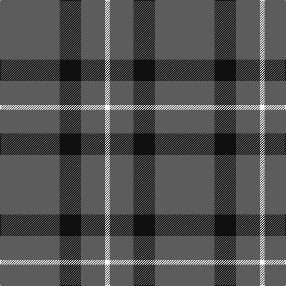

In pattern [BKBW](/stripes/bkbw/).

This was sourced from tartans-authority.  It is a [4 stripe tartan](/stripes/stripes4/).

Original link http://www.tartansauthority.com/tartan-ferret/display/8858/

## Thread count
N/100 K36 N40 W/8

## Palette
Each colour and the base-6 reference it is a variant of.

| Colour | Shade | Base |
|---|---|---|
| K | <code style="background-color:#101010;">#101010</code> `oklch(17.3% 0.000 89.9)` <small>#101010</small> | K <code style="background-color:#000000;">#000000</code> |
| N | <code style="background-color:#5C5C5C;">#5C5C5C</code> `oklch(47.5% 0.000 89.9)` <small>#5C5C5C</small> | B <code style="background-color:#2A418A;">#2A418A</code> |
| W | <code style="background-color:#FCFCFC;">#FCFCFC</code> `oklch(99.1% 0.000 89.9)` <small>#FCFCFC</small> | W <code style="background-color:#F7F7F7;">#F7F7F7</code> |

# Sample pattern

## Nearest tartans

The nearest existing variants by ΔTartan distance.

1. [Peterhead (Personal)](/setts/s5/g9n1g2k4g2~x4/) — ΔT 1.66
1. [Coinean Dubh](/setts/s4/dt50k12dt21w5~x2/) — ΔT 1.79
1. [Elphinstone Clan Tartan Tartan Number: 115. Earliest known date: 1842 The village of Elphinstone is next to Tranent near Edinburgh in East Lothian. Sir Henry Elphinstone of Pittendriech in Midlothian was created Baron Elphinstone in 1509 and fell at Flodden Field. The Elphinstone tartan first appeared in the text of the Vestiarium Scoticum (1842). It is similar to some extent with the Montgomerie tartan and to the Montgomerie Hunting sett, suggesting a link to an early provenance. D.W. Stewart (1893) maintained that he could date the Montgomerie of Eglinton to 1707. See products available Copyright © Blair Urquhart, Comrie, 2015](/setts/s4/g28dp10g3~x2/) — ΔT 1.81
1. [Welsh National District Tartan Tartan Number: 1523. Earliest known date: 1968 The Welsh Tartan owes its origin to a Society formed in Cardiff in 1967. Its aims were cultural and political - to strengthen Celtic ties and give visible signs of being an individual nation in culture, language and dress. The colours are those of the Welsh flag. It is said that the design was based on the Lord of the Isles tartan because the present Lord is also Prince of Wales. However comparison reveals similarity only to MacDonald, MacDonald of the Isles, or perhaps Applecross district. See products available Copyright © Blair Urquhart, Comrie, 2015](/setts/s5/m2g1m1g10w1~x4/) — ΔT 1.87
1. [Elphinstone](/setts/s4/g12p3g1~x2/) — ΔT 1.88
1. [Special Saffron (Fashion)](/setts/s4/dg21lo44dg86t10/) — ΔT 1.92
1. [Highland Spring (1997) (Corporate)](/setts/s4/dp7g23r3g7~x2/) — ΔT 1.99
1. [Westgate Fashion Tartan Tartan Number: 6019. Earliest known date: pre 2003 A fashion tartan See products available Copyright © Blair Urquhart, Comrie, 2015](/setts/s4/y14k80y14ly5~x2/) — ΔT 2.00
1. [Gyle (Corporate)](/setts/s3/t8dg1r2~x20/) — ΔT 2.01
1. [Brooks Brothers Tattersall Camel](/setts/s5/db1lo9db2lo9r1~x4/) — ΔT 2.03

## Neighbour map

Every grey dot is one of 14299 variants placed by the first two principal components of the ΔTartan feature space (44% of its variance). Red is this tartan; blue dots are its nearest — click one to open its page.

<svg viewBox="0 0 640 380" role="img" style="max-width:100%;height:auto;border:1px solid #e0e0e0;border-radius:4px;display:block" xmlns="http://www.w3.org/2000/svg"><image href="/nn/cloud.v1.png" width="640" height="380"/><a href="/setts/s5/g9n1g2k4g2~x4/"><circle cx="461.6" cy="274.4" r="4" fill="#3465a4"><title>Peterhead (Personal)</title></circle></a><a href="/setts/s4/dt50k12dt21w5~x2/"><circle cx="508.5" cy="276.5" r="4" fill="#3465a4"><title>Coinean Dubh</title></circle></a><a href="/setts/s4/g28dp10g3~x2/"><circle cx="408.4" cy="287.6" r="4" fill="#3465a4"><title>Elphinstone Clan Tartan Tartan Number: 115. Earliest known date: 1842 The village of Elphinstone is next to Tranent near Edinburgh in East Lothian. Sir Henry Elphinstone of Pittendriech in Midlothian was created Baron Elphinstone in 1509 and fell at Flodden Field. The Elphinstone tartan first appeared in the text of the Vestiarium Scoticum (1842). It is similar to some extent with the Montgomerie tartan and to the Montgomerie Hunting sett, suggesting a link to an early provenance. D.W. Stewart (1893) maintained that he could date the Montgomerie of Eglinton to 1707. See products available Copyright © Blair Urquhart, Comrie, 2015</title></circle></a><a href="/setts/s5/m2g1m1g10w1~x4/"><circle cx="479.5" cy="228.3" r="4" fill="#3465a4"><title>Welsh National District Tartan Tartan Number: 1523. Earliest known date: 1968 The Welsh Tartan owes its origin to a Society formed in Cardiff in 1967. Its aims were cultural and political - to strengthen Celtic ties and give visible signs of being an individual nation in culture, language and dress. The colours are those of the Welsh flag. It is said that the design was based on the Lord of the Isles tartan because the present Lord is also Prince of Wales. However comparison reveals similarity only to MacDonald, MacDonald of the Isles, or perhaps Applecross district. See products available Copyright © Blair Urquhart, Comrie, 2015</title></circle></a><a href="/setts/s4/g12p3g1~x2/"><circle cx="452.3" cy="257.5" r="4" fill="#3465a4"><title>Elphinstone</title></circle></a><a href="/setts/s4/dg21lo44dg86t10/"><circle cx="372.7" cy="262.0" r="4" fill="#3465a4"><title>Special Saffron (Fashion)</title></circle></a><a href="/setts/s4/dp7g23r3g7~x2/"><circle cx="471.7" cy="289.2" r="4" fill="#3465a4"><title>Highland Spring (1997) (Corporate)</title></circle></a><a href="/setts/s4/y14k80y14ly5~x2/"><circle cx="475.7" cy="229.6" r="4" fill="#3465a4"><title>Westgate Fashion Tartan Tartan Number: 6019. Earliest known date: pre 2003 A fashion tartan See products available Copyright © Blair Urquhart, Comrie, 2015</title></circle></a><a href="/setts/s3/t8dg1r2~x20/"><circle cx="453.2" cy="280.6" r="4" fill="#3465a4"><title>Gyle (Corporate)</title></circle></a><a href="/setts/s5/db1lo9db2lo9r1~x4/"><circle cx="534.7" cy="248.8" r="4" fill="#3465a4"><title>Brooks Brothers Tattersall Camel</title></circle></a><circle cx="481.1" cy="260.5" r="5" fill="#c00000"/></svg>

ID: /setts/s4/n25k9n10w2~x4/
