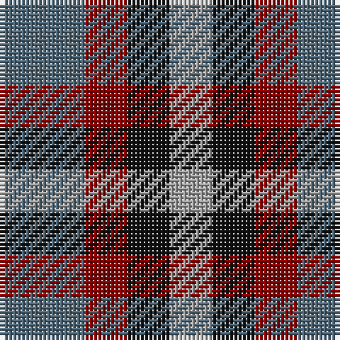

This page is one **sett** — a single exact thread-count. It belongs to the [tartan](/tartans/n2r1k1lr1/)
(the same proportion at any scale), whose colour order is pattern [BRKY](/stripes/brky/).

Sourced from tartans-authority.  It is a [4 stripe tartan](/stripes/stripes4/).

Original link http://www.tartansauthority.com/tartan-ferret/display/10086/

## Thread count
Na/20 DR10 K10 N/10

## Palette

Palette: <strong>Tartan Register</strong> <small style="color:#888">(3 of 4 colours)</small>
<table><thead><tr><th>Colour</th><th>Threads</th><th>Shade</th><th>Base</th><th>OKLCh</th></tr></thead><tbody><tr><td>Na/</td><td style="text-align:right;font-variant-numeric:tabular-nums">20</td><td><code style="background-color:#506878;">#506878</code> <small style="color:#888">#506878</small></td><td>B <code style="background-color:#2A418A;">#2A418A</code></td><td><small style="color:#888">oklch(50.4% 0.038 237.7)</small></td></tr><tr><td>DR</td><td style="text-align:right;font-variant-numeric:tabular-nums">10</td><td><code style="background-color:#880000;">#880000</code> <small style="color:#888">#880000</small></td><td>R <code style="background-color:#CC0000;">#CC0000</code></td><td><small style="color:#888">oklch(39.4% 0.162 29.2)</small></td></tr><tr><td>K</td><td style="text-align:right;font-variant-numeric:tabular-nums">10</td><td><code style="background-color:#101010;">#101010</code> <small style="color:#888">#101010</small></td><td>K <code style="background-color:#000000;">#000000</code></td><td><small style="color:#888">oklch(17.3% 0.000 89.9)</small></td></tr><tr><td>N/</td><td style="text-align:right;font-variant-numeric:tabular-nums">10</td><td><code style="background-color:#A0A0A0;">#A0A0A0</code> <small style="color:#888">#A0A0A0</small></td><td>Y <code style="background-color:#F2BF00;">#F2BF00</code></td><td><small style="color:#888">oklch(70.6% 0.000 89.9)</small></td></tr></tbody></table>

# Sample pattern

## Nearest tartans

The nearest existing variants by ΔTartan distance, with this tartan at the top so the swatches line up against it.

ΔTartan

Tartan

Sett

—

<a href="/ttd/edit/#slug=n2r1k1lr1~x10">Kucher, Gregory (Personal)</a> <a class="nn-out" href="/setts/s4/n2r1k1lr1~x10/" title="open its dictionary page">↗</a>

0.92

<a href="/ttd/edit/#slug=db18b18lo28n13~x2">Gold Country (District)</a> <a class="nn-out" href="/setts/s4/db18b18lo28n13~x2/" title="open its dictionary page">↗</a>

1.16

<a href="/ttd/edit/#slug=db18t18lo28dt13~x2">Gold Country (California)</a> <a class="nn-out" href="/setts/s4/db18t18lo28dt13~x2/" title="open its dictionary page">↗</a>

1.36

<a href="/ttd/edit/#slug=dp3k3dp3dg6r2~x2">Austin (Wilson's No 137)</a> <a class="nn-out" href="/setts/s5/dp3k3dp3dg6r2~x2/" title="open its dictionary page">↗</a>

1.37

<a href="/ttd/edit/#slug=lo28r24dg55dp19~x2">Hirstwood (Name)</a> <a class="nn-out" href="/setts/s4/lo28r24dg55dp19~x2/" title="open its dictionary page">↗</a>

1.38

<a href="/ttd/edit/#slug=dp3k3dp3dg6ly2~x2">Austin (Wilson's No 173)</a> <a class="nn-out" href="/setts/s5/dp3k3dp3dg6ly2~x2/" title="open its dictionary page">↗</a>

1.38

<a href="/ttd/edit/#slug=r2k1db2k1g2k1~x28">Burnicle (2015)</a> <a class="nn-out" href="/setts/s6/r2k1db2k1g2k1~x28/" title="open its dictionary page">↗</a>

1.43

<a href="/ttd/edit/#slug=r10t5lb5dt4~x8">Haggis Hostels</a> <a class="nn-out" href="/setts/s4/r10t5lb5dt4~x8/" title="open its dictionary page">↗</a>

1.49

<a href="/ttd/edit/#slug=t1g3r1p3t1~x4">Wilson's, No 95</a> <a class="nn-out" href="/setts/s5/t1g3r1p3t1~x4/" title="open its dictionary page">↗</a>

1.54

<a href="/setts/s4/dp3o1g2~x10/">Coleman, Sarah-Louise (Personal)</a>

1.56

<a href="/ttd/edit/#slug=r5g6ly2g6r5b6r2~x2">Gleneagles Group</a> <a class="nn-out" href="/setts/s7/r5g6ly2g6r5b6r2~x2/" title="open its dictionary page">↗</a>

## Neighbour map

Every grey dot is one of 14299 variants placed by the first two principal components of the ΔTartan feature space (44% of its variance). Red is this tartan; blue dots are its nearest — click one to open its page.

<svg viewBox="0 0 640 380" role="img" style="max-width:100%;height:auto;border:1px solid #e0e0e0;border-radius:4px;display:block" xmlns="http://www.w3.org/2000/svg"><image href="/nn/cloud.v1.png" width="640" height="380"/><a href="/setts/s4/db18b18lo28n13~x2/"><circle cx="78.5" cy="346.9" r="4" fill="#3465a4"><title>Gold Country (District)</title></circle></a><a href="/setts/s4/db18t18lo28dt13~x2/"><circle cx="54.8" cy="329.7" r="4" fill="#3465a4"><title>Gold Country (California)</title></circle></a><a href="/setts/s5/dp3k3dp3dg6r2~x2/"><circle cx="122.6" cy="315.6" r="4" fill="#3465a4"><title>Austin (Wilson's No 137)</title></circle></a><a href="/setts/s4/lo28r24dg55dp19~x2/"><circle cx="163.0" cy="320.7" r="4" fill="#3465a4"><title>Hirstwood (Name)</title></circle></a><a href="/setts/s5/dp3k3dp3dg6ly2~x2/"><circle cx="93.6" cy="304.0" r="4" fill="#3465a4"><title>Austin (Wilson's No 173)</title></circle></a><a href="/setts/s6/r2k1db2k1g2k1~x28/"><circle cx="59.5" cy="322.7" r="4" fill="#3465a4"><title>Burnicle (2015)</title></circle></a><a href="/setts/s4/r10t5lb5dt4~x8/"><circle cx="113.2" cy="304.5" r="4" fill="#3465a4"><title>Haggis Hostels</title></circle></a><a href="/setts/s5/t1g3r1p3t1~x4/"><circle cx="124.1" cy="287.8" r="4" fill="#3465a4"><title>Wilson's, No 95</title></circle></a><a href="/setts/s4/dp3o1g2~x10/"><circle cx="195.5" cy="324.5" r="4" fill="#3465a4"><title>Coleman, Sarah-Louise (Personal)</title></circle></a><a href="/setts/s7/r5g6ly2g6r5b6r2~x2/"><circle cx="138.3" cy="310.0" r="4" fill="#3465a4"><title>Gleneagles Group</title></circle></a><circle cx="104.8" cy="338.8" r="5" fill="#c00000"/></svg>

ID: /setts/s4/n2r1k1lr1~x10/
