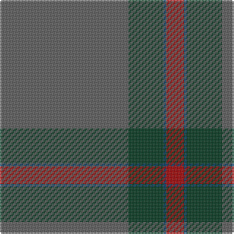

**Bands:** [RBGB](/stripes/rbgb/) · **Stripes:** [R DT DG N](/stripes/stripes4/) R DT DG N

This was sourced from tartans-authority.  It is a [4 band tartan](/bands/bands4/).

Original link http://www.tartansauthority.com/tartan-ferret/display/10331/

## Thread count
N/88 DG24 DB2 DR/12

## Palette
Each colour and its ΔE from the base-6 reference it is a variant of.

| Colour | Shade | Base | ΔE (OKLab) |
|---|---|---|---|
| DB | <code style="background-color:#003C64;">#003C64</code> `#003C64` | B <code style="background-color:#2A418A;">#2A418A</code> | 0.08 |
| DG | <code style="background-color:#003820;">#003820</code> `#003820` | G <code style="background-color:#006100;">#006100</code> | 0.15 |
| DR | <code style="background-color:#A00000;">#A00000</code> `#A00000` | R <code style="background-color:#CC0000;">#CC0000</code> | 0.09 |
| N | <code style="background-color:#5C5C5C;">#5C5C5C</code> `#5C5C5C` | B <code style="background-color:#2A418A;">#2A418A</code> | 0.15 |

# Sample pattern

## Nearest tartans

The nearest existing variants by ΔTartan distance.

1. [Heslop Lurdenlaw by Kelso](/setts/s4/dt44dg12g1o6~x2/) — ΔT 1.56
1. [MacAndrew Hunting (Name)](/setts/s6/y72k8y4dy16y7o2~x2/) — ΔT 1.96
1. [Unidentified #44](/setts/s7/db13k3db20dy70db20dy30w3~x2/) — ΔT 2.02
1. [Norsemen (Corporate)](/setts/s6/n65k2n4lr2n10r24~x2/) — ΔT 2.06
1. [Highland Greenford (Personal)](/setts/s4/y50dy25ly2dp6~x2/) — ΔT 2.16
1. [Orkney Slate (Fashion)](/setts/s8/n8o74lb8n42o11dp2o16n4/) — ΔT 2.16
1. [Miramichi](/setts/s5/dg31lo1dg18db18r1~x2/) — ΔT 2.31
1. [Lloyd (Welsh Name)](/setts/s5/dt40o2dt20g19db2/) — ΔT 2.34
1. [McGovern (2016)](/setts/s5/dt62o4dy10dy3dg21~x2/) — ΔT 2.42
1. [Haddrell (2013)](/setts/s7/r2b4y18n2y2n41w2~x2/) — ΔT 2.43

## Neighbour map

Every grey dot is one of 14299 variants placed by the first two principal components of the ΔTartan feature space (44% of its variance). Red is this tartan; blue dots are its nearest — click one to open its page.

<svg viewBox="0 0 640 380" role="img" style="max-width:100%;height:auto;border:1px solid #e0e0e0;border-radius:4px;display:block" xmlns="http://www.w3.org/2000/svg"><image href="/nn/cloud.v1.png" width="640" height="380"/><a href="/setts/s4/dt44dg12g1o6~x2/"><circle cx="596.1" cy="241.1" r="4" fill="#3465a4"><title>Heslop Lurdenlaw by Kelso</title></circle></a><a href="/setts/s6/y72k8y4dy16y7o2~x2/"><circle cx="626.0" cy="208.7" r="4" fill="#3465a4"><title>MacAndrew Hunting (Name)</title></circle></a><a href="/setts/s7/db13k3db20dy70db20dy30w3~x2/"><circle cx="481.8" cy="221.0" r="4" fill="#3465a4"><title>Unidentified #44</title></circle></a><a href="/setts/s6/n65k2n4lr2n10r24~x2/"><circle cx="579.5" cy="186.5" r="4" fill="#3465a4"><title>Norsemen (Corporate)</title></circle></a><a href="/setts/s4/y50dy25ly2dp6~x2/"><circle cx="505.7" cy="261.9" r="4" fill="#3465a4"><title>Highland Greenford (Personal)</title></circle></a><a href="/setts/s8/n8o74lb8n42o11dp2o16n4/"><circle cx="524.6" cy="194.5" r="4" fill="#3465a4"><title>Orkney Slate (Fashion)</title></circle></a><a href="/setts/s5/dg31lo1dg18db18r1~x2/"><circle cx="537.5" cy="244.9" r="4" fill="#3465a4"><title>Miramichi</title></circle></a><a href="/setts/s5/dt40o2dt20g19db2/"><circle cx="542.6" cy="267.5" r="4" fill="#3465a4"><title>Lloyd (Welsh Name)</title></circle></a><a href="/setts/s5/dt62o4dy10dy3dg21~x2/"><circle cx="471.9" cy="233.2" r="4" fill="#3465a4"><title>McGovern (2016)</title></circle></a><a href="/setts/s7/r2b4y18n2y2n41w2~x2/"><circle cx="459.9" cy="181.1" r="4" fill="#3465a4"><title>Haddrell (2013)</title></circle></a><circle cx="586.0" cy="226.3" r="5" fill="#c00000"/></svg>

ID: /setts/s4/n44dg12dt1r6~x2/
