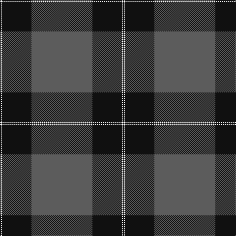

**Bands:** [BKWK](/stripes/bkwk/) · **Stripes:** [N K W K](/stripes/stripes4/) N K W K

This was sourced from register-of-tartans.  It is a [4 band tartan](/bands/bands4/).

Original link https://www.tartanregister.gov.uk/tartanDetails.aspx?ref=3373

## Attestations

This cloth appears in 2 source records; the oldest owns this page.

- 01/01/1989 — Pride of New Zealand (register-of-tartans, [record](https://www.tartanregister.gov.uk/tartanDetails.aspx?ref=3373))
- August 1999 — Pride of New Zealand (District?) (tartans-authority, [record](http://www.tartansauthority.com/tartan-ferret/display/2632/))

## Register references

External register numbers recorded for this tartan.

- Scottish Register of Tartans: [3373](https://www.tartanregister.gov.uk/tartanDetails.aspx?ref=3373)
- Scottish Tartans Authority (ITI): 2632
- Scottish Tartans World Register: 2632

## Variants

Other setts woven to the same stripe pattern.

- [Pride of New Zealand, The](/setts/s4/n124k60w1k2/)

## Thread count
K/2 W2 K60 N/124

## Palette
Each colour and its ΔE from the base-6 reference it is a variant of.

| Colour | Shade | Base | ΔE (OKLab) |
|---|---|---|---|
| K | <code style="background-color:#101010;">#101010</code> `#101010` | K <code style="background-color:#000000;">#000000</code> | 0.17 |
| N | <code style="background-color:#5C5C5C;">#5C5C5C</code> `#5C5C5C` | B <code style="background-color:#2A418A;">#2A418A</code> | 0.15 |
| W | <code style="background-color:#FCFCFC;">#FCFCFC</code> `#FCFCFC` | W <code style="background-color:#F7F7F7;">#F7F7F7</code> | 0.01 |

# Sample pattern

## Nearest tartans

The nearest existing variants by ΔTartan distance.

1. [Westwater (Edinburgh, 2012)](/setts/s3/k62t33ly1~x2/) — ΔT 1.39
1. [Silver Mist](/setts/s5/n2k13n31k1n1~x4/) — ΔT 1.46
1. [Pride of New Zealand, The](/setts/s4/n124k60w1k2/) — ΔT 1.48
1. [Silver Mist (Corporate)](/setts/s6/k13n2k13n31k1n1~x4/) — ΔT 1.68
1. [Perry Hunting (Green) (Personal)](/setts/s5/k75g26lr2g4lo5~x2/) — ΔT 1.80
1. [Westwater (Personal)](/setts/s3/k62b33ly1~x2/) — ΔT 1.84
1. [Orkney Slate](/setts/s8/dt8y74k8dt42y11k2y16dt4/) — ΔT 1.86
1. [MacGregor, Black (Personal)](/setts/s6/k72g23k7g8r1w3~x2/) — ΔT 1.90
1. [Wilson](/setts/s6/db48g14r3g2r3g2~x2/) — ΔT 1.91
1. [Lion Brand Sportswear](/setts/s7/lr4dt1r15dt42r6dt4lo1~x2/) — ΔT 1.96

## Neighbour map

Every grey dot is one of 14313 variants placed by the first two principal components of the ΔTartan feature space (44% of its variance). Red is this tartan; blue dots are its nearest — click one to open its page.

<svg viewBox="0 0 640 380" role="img" style="max-width:100%;height:auto;border:1px solid #e0e0e0;border-radius:4px;display:block" xmlns="http://www.w3.org/2000/svg"><image href="/nn/cloud.v1.png" width="640" height="380"/><a href="/setts/s3/k62t33ly1~x2/"><circle cx="470.7" cy="220.5" r="4" fill="#3465a4"><title>Westwater (Edinburgh, 2012)</title></circle></a><a href="/setts/s5/n2k13n31k1n1~x4/"><circle cx="563.0" cy="215.7" r="4" fill="#3465a4"><title>Silver Mist</title></circle></a><a href="/setts/s4/n124k60w1k2/"><circle cx="484.1" cy="180.1" r="4" fill="#3465a4"><title>Pride of New Zealand, The</title></circle></a><a href="/setts/s6/k13n2k13n31k1n1~x4/"><circle cx="463.2" cy="213.7" r="4" fill="#3465a4"><title>Silver Mist (Corporate)</title></circle></a><a href="/setts/s5/k75g26lr2g4lo5~x2/"><circle cx="466.5" cy="166.9" r="4" fill="#3465a4"><title>Perry Hunting (Green) (Personal)</title></circle></a><a href="/setts/s3/k62b33ly1~x2/"><circle cx="459.5" cy="221.1" r="4" fill="#3465a4"><title>Westwater (Personal)</title></circle></a><a href="/setts/s8/dt8y74k8dt42y11k2y16dt4/"><circle cx="432.4" cy="150.9" r="4" fill="#3465a4"><title>Orkney Slate</title></circle></a><a href="/setts/s6/k72g23k7g8r1w3~x2/"><circle cx="500.5" cy="149.5" r="4" fill="#3465a4"><title>MacGregor, Black (Personal)</title></circle></a><a href="/setts/s6/db48g14r3g2r3g2~x2/"><circle cx="490.5" cy="188.5" r="4" fill="#3465a4"><title>Wilson</title></circle></a><a href="/setts/s7/lr4dt1r15dt42r6dt4lo1~x2/"><circle cx="496.0" cy="156.1" r="4" fill="#3465a4"><title>Lion Brand Sportswear</title></circle></a><circle cx="513.0" cy="193.2" r="5" fill="#c00000"/></svg>

ID: /setts/s4/n62k30w1k1~x2/
