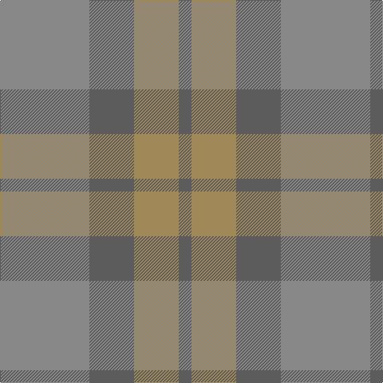

In pattern [BYBR](/stripes/bybr/).

This was sourced from tartans-authority.  It is a [4 stripe tartan](/stripes/stripes4/).

Original link http://www.tartansauthority.com/tartan-ferret/display/11115/

## Thread count
Na/112 N56 LT56 N/16

## Palette
Each colour and its ΔE from the base-6 reference it is a variant of.

| Colour | Shade | Base | ΔE (OKLab) |
|---|---|---|---|
| LT | <code style="background-color:#A08858;">#A08858</code> `#A08858` | Y <code style="background-color:#F2BF00;">#F2BF00</code> | 0.21 |
| N | <code style="background-color:#5C5C5C;">#5C5C5C</code> `#5C5C5C` | B <code style="background-color:#2A418A;">#2A418A</code> | 0.15 |
| Na | <code style="background-color:#888888;">#888888</code> `#888888` | R <code style="background-color:#CC0000;">#CC0000</code> | 0.24 |

# Sample pattern

## Nearest tartans

The nearest existing variants by ΔTartan distance.

1. [Outlander #3](/setts/s4/y14n7lo6n2~x8/) — ΔT 0.72
1. [Glen Burns (WCWM-2)](/setts/s6/n6o6n1o1~x4/) — ΔT 1.67
1. [London Regiment (Military)](/setts/s6/y34n27r3n27y34w3~x2/) — ΔT 2.00
1. [Callum (Buchan)](/setts/s5/n7o1n6o8o1~x8/) — ΔT 2.13
1. [Daks, (Muted Skye)](/setts/s8/db5y15o4y4o24y4o4db5/) — ΔT 2.17
1. [Outlander #5](/setts/s3/n13do15n2~x4/) — ΔT 2.34
1. [Brown Heather (Fashion)](/setts/s6/do1dy6do6dy1n6dy1~x8/) — ΔT 2.45
1. [Baker City (District)](/setts/s4/dg4t10y10t1~x4/) — ΔT 2.50
1. [McWilliams (2014)](/setts/s4/y22dp1y22r4~x4/) — ΔT 2.58
1. [McKerrell of Hillhouse Dress (Clan)](/setts/s4/w4o28t48ly3~x2/) — ΔT 2.61

## Neighbour map

Every grey dot is one of 14299 variants placed by the first two principal components of the ΔTartan feature space (44% of its variance). Red is this tartan; blue dots are its nearest — click one to open its page.

<svg viewBox="0 0 640 380" role="img" style="max-width:100%;height:auto;border:1px solid #e0e0e0;border-radius:4px;display:block" xmlns="http://www.w3.org/2000/svg"><image href="/nn/cloud.v1.png" width="640" height="380"/><a href="/setts/s4/y14n7lo6n2~x8/"><circle cx="436.9" cy="366.0" r="4" fill="#3465a4"><title>Outlander #3</title></circle></a><a href="/setts/s6/n6o6n1o1~x4/"><circle cx="351.0" cy="326.5" r="4" fill="#3465a4"><title>Glen Burns (WCWM-2)</title></circle></a><a href="/setts/s6/y34n27r3n27y34w3~x2/"><circle cx="468.2" cy="328.3" r="4" fill="#3465a4"><title>London Regiment (Military)</title></circle></a><a href="/setts/s5/n7o1n6o8o1~x8/"><circle cx="375.2" cy="338.0" r="4" fill="#3465a4"><title>Callum (Buchan)</title></circle></a><a href="/setts/s8/db5y15o4y4o24y4o4db5/"><circle cx="414.8" cy="309.3" r="4" fill="#3465a4"><title>Daks, (Muted Skye)</title></circle></a><a href="/setts/s3/n13do15n2~x4/"><circle cx="522.3" cy="366.0" r="4" fill="#3465a4"><title>Outlander #5</title></circle></a><a href="/setts/s6/do1dy6do6dy1n6dy1~x8/"><circle cx="365.3" cy="340.5" r="4" fill="#3465a4"><title>Brown Heather (Fashion)</title></circle></a><a href="/setts/s4/dg4t10y10t1~x4/"><circle cx="375.0" cy="339.1" r="4" fill="#3465a4"><title>Baker City (District)</title></circle></a><a href="/setts/s4/y22dp1y22r4~x4/"><circle cx="468.9" cy="293.4" r="4" fill="#3465a4"><title>McWilliams (2014)</title></circle></a><a href="/setts/s4/w4o28t48ly3~x2/"><circle cx="501.6" cy="294.2" r="4" fill="#3465a4"><title>McKerrell of Hillhouse Dress (Clan)</title></circle></a><circle cx="407.0" cy="366.0" r="5" fill="#c00000"/></svg>

ID: /setts/s4/o14n7lo7n2~x8/
