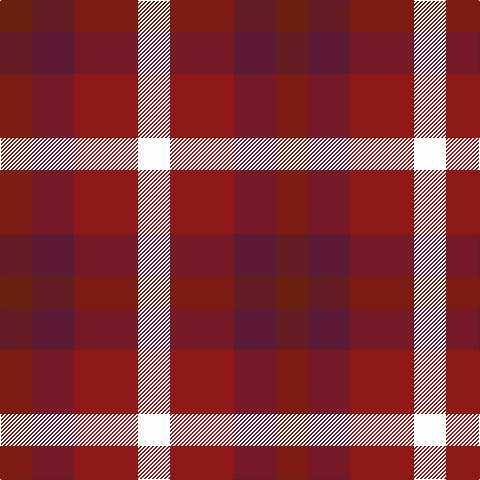

This page is one **sett** — a single exact thread-count. It belongs to the [tartan](/tartans/o16dr21r32w16/)
(the same proportion at any scale), whose colour order is pattern [RBRW](/stripes/rbrw/).

Sourced from register-of-tartans.  It is a [4 stripe tartan](/stripes/stripes4/).

Original link https://www.tartanregister.gov.uk/tartanDetails.aspx?ref=10480

## Register references

External register numbers recorded for this tartan.

- Scottish Register of Tartans: [10480](https://www.tartanregister.gov.uk/tartanDetails.aspx?ref=10480)

## Thread count
T/32 DR42 DRa64 W/32

## Palette

Palette: <strong>Tartan Register</strong> <small style="color:#888">(1 of 4 colours)</small>
<table><thead><tr><th>Colour</th><th>Threads</th><th>Shade</th><th>Base</th><th>OKLCh</th></tr></thead><tbody><tr><td>T/</td><td style="text-align:right;font-variant-numeric:tabular-nums">32</td><td><code style="background-color:#6C2012;">#6C2012</code> <small style="color:#888">#6C2012</small></td><td>R <code style="background-color:#CC0000;">#CC0000</code></td><td><small style="color:#888">oklch(36.2% 0.111 32.6)</small></td></tr><tr><td>DR</td><td style="text-align:right;font-variant-numeric:tabular-nums">42</td><td><code style="background-color:#5D1B36;">#5D1B36</code> <small style="color:#888">#5D1B36</small></td><td>B <code style="background-color:#2A418A;">#2A418A</code></td><td><small style="color:#888">oklch(33.6% 0.100 358.8)</small></td></tr><tr><td>DRa</td><td style="text-align:right;font-variant-numeric:tabular-nums">64</td><td><code style="background-color:#8E1818;">#8E1818</code> <small style="color:#888">#8E1818</small></td><td>R <code style="background-color:#CC0000;">#CC0000</code></td><td><small style="color:#888">oklch(42.0% 0.153 26.9)</small></td></tr><tr><td>W/</td><td style="text-align:right;font-variant-numeric:tabular-nums">32</td><td><code style="background-color:#FFFFFF;">#FFFFFF</code> <small style="color:#888">#FFFFFF</small></td><td>W <code style="background-color:#F7F7F7;">#F7F7F7</code></td><td><small style="color:#888">oklch(100.0% 0.000 89.9)</small></td></tr></tbody></table>

# Sample pattern

## Nearest tartans

The nearest existing variants by ΔTartan distance, with this tartan at the top so the swatches line up against it.

ΔTartan

Tartan

Sett

—

<a href="/ttd/edit/#slug=o16dr21r32w16~x2">Bloomer-Alexander (Personal)</a> <a class="nn-out" href="/setts/s4/o16dr21r32w16~x2/" title="open its dictionary page">↗</a>

1.18

<a href="/ttd/edit/#slug=r10t5lb5dt4~x8">Haggis Hostels</a> <a class="nn-out" href="/setts/s4/r10t5lb5dt4~x8/" title="open its dictionary page">↗</a>

1.81

<a href="/ttd/edit/#slug=r3g1k3w1~x20">SAL Glindrande Stiernan</a> <a class="nn-out" href="/setts/s4/r3g1k3w1~x20/" title="open its dictionary page">↗</a>

1.88

<a href="/ttd/edit/#slug=r10db6k8dg10r6dg3r6~x2">MacDuff #3</a> <a class="nn-out" href="/setts/s7/r10db6k8dg10r6dg3r6~x2/" title="open its dictionary page">↗</a>

1.89

<a href="/ttd/edit/#slug=k7r5w3db2~x4">Thomas Newcomen's Combustion Engine</a> <a class="nn-out" href="/setts/s4/k7r5w3db2~x4/" title="open its dictionary page">↗</a>

1.91

<a href="/ttd/edit/#slug=db18t18lo28dt13~x2">Gold Country (California)</a> <a class="nn-out" href="/setts/s4/db18t18lo28dt13~x2/" title="open its dictionary page">↗</a>

1.98

<a href="/ttd/edit/#slug=lo11m6k10lo10k10dy10m4~x2">Duffus Hose, Lord</a> <a class="nn-out" href="/setts/s7/lo11m6k10lo10k10dy10m4~x2/" title="open its dictionary page">↗</a>

2.00

<a href="/ttd/edit/#slug=r21k21w10k10w21~x2">Havel</a> <a class="nn-out" href="/setts/s5/r21k21w10k10w21~x2/" title="open its dictionary page">↗</a>

2.01

<a href="/ttd/edit/#slug=n2r1k1lr1~x10">Kucher, Gregory (Personal)</a> <a class="nn-out" href="/setts/s4/n2r1k1lr1~x10/" title="open its dictionary page">↗</a>

2.02

<a href="/ttd/edit/#slug=r1g3p3w1~x4">Wilson's, No 113</a> <a class="nn-out" href="/setts/s4/r1g3p3w1~x4/" title="open its dictionary page">↗</a>

2.04

<a href="/ttd/edit/#slug=g12r11dp12ri3dp8g8dp8~x2">Fiddes (Corrected)</a> <a class="nn-out" href="/setts/s7/g12r11dp12ri3dp8g8dp8~x2/" title="open its dictionary page">↗</a>

## Neighbour map

Every grey dot is one of 14359 variants placed by the first two principal components of the ΔTartan feature space (44% of its variance). Red is this tartan; blue dots are its nearest — click one to open its page.

<svg viewBox="0 0 640 380" role="img" style="max-width:100%;height:auto;border:1px solid #e0e0e0;border-radius:4px;display:block" xmlns="http://www.w3.org/2000/svg"><image href="/nn/cloud.v1.png" width="640" height="380"/><a href="/setts/s4/r10t5lb5dt4~x8/"><circle cx="112.7" cy="306.4" r="4" fill="#3465a4"><title>Haggis Hostels</title></circle></a><a href="/setts/s4/r3g1k3w1~x20/"><circle cx="102.5" cy="271.2" r="4" fill="#3465a4"><title>SAL Glindrande Stiernan</title></circle></a><a href="/setts/s7/r10db6k8dg10r6dg3r6~x2/"><circle cx="135.7" cy="291.0" r="4" fill="#3465a4"><title>MacDuff #3</title></circle></a><a href="/setts/s4/k7r5w3db2~x4/"><circle cx="104.2" cy="273.2" r="4" fill="#3465a4"><title>Thomas Newcomen's Combustion Engine</title></circle></a><a href="/setts/s4/db18t18lo28dt13~x2/"><circle cx="54.5" cy="331.8" r="4" fill="#3465a4"><title>Gold Country (California)</title></circle></a><a href="/setts/s7/lo11m6k10lo10k10dy10m4~x2/"><circle cx="62.0" cy="304.5" r="4" fill="#3465a4"><title>Duffus Hose, Lord</title></circle></a><a href="/setts/s5/r21k21w10k10w21~x2/"><circle cx="74.9" cy="308.0" r="4" fill="#3465a4"><title>Havel</title></circle></a><a href="/setts/s4/n2r1k1lr1~x10/"><circle cx="104.7" cy="340.8" r="4" fill="#3465a4"><title>Kucher, Gregory (Personal)</title></circle></a><a href="/setts/s4/r1g3p3w1~x4/"><circle cx="119.1" cy="286.5" r="4" fill="#3465a4"><title>Wilson's, No 113</title></circle></a><a href="/setts/s7/g12r11dp12ri3dp8g8dp8~x2/"><circle cx="149.6" cy="282.6" r="4" fill="#3465a4"><title>Fiddes (Corrected)</title></circle></a><circle cx="72.1" cy="322.2" r="5" fill="#c00000"/></svg>

ID: /setts/s4/o16dr21r32w16~x2/
