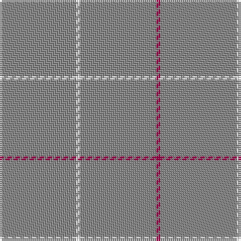

This page is one **sett** — a single exact thread-count. It belongs to the [tartan](/tartans/o19w1o19m1/)
(the same proportion at any scale), whose colour order is pattern [RRWR](/stripes/rrwr/).

Sourced from register-of-tartans.  It is a [4 stripe tartan](/stripes/stripes4/).

Original link https://www.tartanregister.gov.uk/tartanDetails.aspx?ref=1018

## Register references

External register numbers recorded for this tartan.

- Scottish Register of Tartans: [1018](https://www.tartanregister.gov.uk/tartanDetails.aspx?ref=1018)
- Scottish Tartans Authority (ITI): 1634
- Scottish Tartans World Register: 1634

## Thread count
N/38 W2 N38 R/2

## Palette

Palette: <strong>Tartan Register</strong>
<table><thead><tr><th>Colour</th><th>Threads</th><th>Shade</th><th>Base</th><th>OKLCh</th></tr></thead><tbody><tr><td>N/</td><td style="text-align:right;font-variant-numeric:tabular-nums">38</td><td><code style="background-color:#888888;">#888888</code> <small style="color:#888">#888888</small></td><td>R <code style="background-color:#CC0000;">#CC0000</code></td><td><small style="color:#888">oklch(62.7% 0.000 89.9)</small></td></tr><tr><td>W</td><td style="text-align:right;font-variant-numeric:tabular-nums">2</td><td><code style="background-color:#FCFCFC;">#FCFCFC</code> <small style="color:#888">#FCFCFC</small></td><td>W <code style="background-color:#F7F7F7;">#F7F7F7</code></td><td><small style="color:#888">oklch(99.1% 0.000 89.9)</small></td></tr><tr><td>N</td><td style="text-align:right;font-variant-numeric:tabular-nums">38</td><td><code style="background-color:#888888;">#888888</code> <small style="color:#888">#888888</small></td><td>R <code style="background-color:#CC0000;">#CC0000</code></td><td><small style="color:#888">oklch(62.7% 0.000 89.9)</small></td></tr><tr><td>R/</td><td style="text-align:right;font-variant-numeric:tabular-nums">2</td><td><code style="background-color:#A00048;">#A00048</code> <small style="color:#888">#A00048</small></td><td>R <code style="background-color:#CC0000;">#CC0000</code></td><td><small style="color:#888">oklch(45.4% 0.182 5.3)</small></td></tr></tbody></table>

# Sample pattern

## Nearest tartans

The nearest existing variants by ΔTartan distance, with this tartan at the top so the swatches line up against it.

ΔTartan

Tartan

Sett

—

<a href="/ttd/edit/#slug=o19w1o19m1~x2">Dunbar of Pitgaveny</a> <a class="nn-out" href="/setts/s4/o19w1o19m1~x2/" title="open its dictionary page">↗</a>

1.65

<a href="/ttd/edit/#slug=r1y19w1~x2">Dunbar of Pitgaveny</a> <a class="nn-out" href="/setts/s3/r1y19w1~x2/" title="open its dictionary page">↗</a>

1.94

<a href="/ttd/edit/#slug=m1o19w1~x2">Dunbar of Pitgaveny (Clan)</a> <a class="nn-out" href="/setts/s3/m1o19w1~x2/" title="open its dictionary page">↗</a>

2.30

<a href="/ttd/edit/#slug=lo60do3lo4r3~x2">Rabbie's Dram (Fashion)</a> <a class="nn-out" href="/setts/s4/lo60do3lo4r3~x2/" title="open its dictionary page">↗</a>

2.82

<a href="/ttd/edit/#slug=n4db1n6m1n14lr1~x8">Torridon Tweed</a> <a class="nn-out" href="/setts/s6/n4db1n6m1n14lr1~x8/" title="open its dictionary page">↗</a>

3.04

<a href="/ttd/edit/#slug=dy10ly1dy30y3~x4">Pasteur</a> <a class="nn-out" href="/setts/s4/dy10ly1dy30y3~x4/" title="open its dictionary page">↗</a>

3.36

<a href="/ttd/edit/#slug=o30r1o15db4~x2">Kincardine Tweed</a> <a class="nn-out" href="/setts/s4/o30r1o15db4~x2/" title="open its dictionary page">↗</a>

3.51

<a href="/ttd/edit/#slug=dg62r7k4r4dg62~x2">MacNab, Ancient</a> <a class="nn-out" href="/setts/s5/dg62r7k4r4dg62~x2/" title="open its dictionary page">↗</a>

3.55

<a href="/ttd/edit/#slug=db3r1db35r1db16t1db2~x4">Lochaber Old</a> <a class="nn-out" href="/setts/s7/db3r1db35r1db16t1db2~x4/" title="open its dictionary page">↗</a>

3.59

<a href="/ttd/edit/#slug=dg20r1dg4~x3">Castle Fraser Check</a> <a class="nn-out" href="/setts/s3/dg20r1dg4~x3/" title="open its dictionary page">↗</a>

3.63

<a href="/ttd/edit/#slug=lo24r1w1dt1~x11">Dutch Football (Corporate)</a> <a class="nn-out" href="/setts/s4/lo24r1w1dt1~x11/" title="open its dictionary page">↗</a>

## Neighbour map

Every grey dot is one of 14299 variants placed by the first two principal components of the ΔTartan feature space (44% of its variance). Red is this tartan; blue dots are its nearest — click one to open its page.

<svg viewBox="0 0 640 380" role="img" style="max-width:100%;height:auto;border:1px solid #e0e0e0;border-radius:4px;display:block" xmlns="http://www.w3.org/2000/svg"><image href="/nn/cloud.v1.png" width="640" height="380"/><a href="/setts/s3/r1y19w1~x2/"><circle cx="626.0" cy="258.2" r="4" fill="#3465a4"><title>Dunbar of Pitgaveny</title></circle></a><a href="/setts/s3/m1o19w1~x2/"><circle cx="626.0" cy="247.0" r="4" fill="#3465a4"><title>Dunbar of Pitgaveny (Clan)</title></circle></a><a href="/setts/s4/lo60do3lo4r3~x2/"><circle cx="626.0" cy="227.0" r="4" fill="#3465a4"><title>Rabbie's Dram (Fashion)</title></circle></a><a href="/setts/s6/n4db1n6m1n14lr1~x8/"><circle cx="626.0" cy="270.0" r="4" fill="#3465a4"><title>Torridon Tweed</title></circle></a><a href="/setts/s4/dy10ly1dy30y3~x4/"><circle cx="626.0" cy="239.0" r="4" fill="#3465a4"><title>Pasteur</title></circle></a><a href="/setts/s4/o30r1o15db4~x2/"><circle cx="626.0" cy="223.2" r="4" fill="#3465a4"><title>Kincardine Tweed</title></circle></a><a href="/setts/s5/dg62r7k4r4dg62~x2/"><circle cx="626.0" cy="264.4" r="4" fill="#3465a4"><title>MacNab, Ancient</title></circle></a><a href="/setts/s7/db3r1db35r1db16t1db2~x4/"><circle cx="626.0" cy="221.0" r="4" fill="#3465a4"><title>Lochaber Old</title></circle></a><a href="/setts/s3/dg20r1dg4~x3/"><circle cx="626.0" cy="326.5" r="4" fill="#3465a4"><title>Castle Fraser Check</title></circle></a><a href="/setts/s4/lo24r1w1dt1~x11/"><circle cx="626.0" cy="188.3" r="4" fill="#3465a4"><title>Dutch Football (Corporate)</title></circle></a><circle cx="626.0" cy="275.8" r="5" fill="#c00000"/></svg>

ID: /setts/s4/o19w1o19m1~x2/
