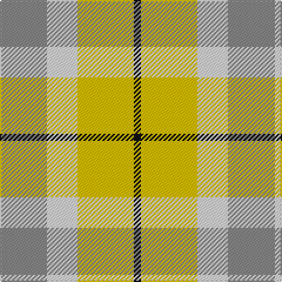

In pattern [KYWR](/stripes/kywr/).

This was sourced from tartans-authority.  It is a [4 stripe tartan](/stripes/stripes4/).

Original link http://www.tartansauthority.com/tartan-ferret/display/7871/

## Thread count
N/40 LN26 Y48 Ka/6

## Palette
Each colour and its ΔE from the base-6 reference it is a variant of.

| Colour | Shade | Base | ΔE (OKLab) |
|---|---|---|---|
| G | <code style="background-color:#006818;">#006818</code> `#006818` | G <code style="background-color:#006100;">#006100</code> | 0.02 |
| K | <code style="background-color:#000000;">#000000</code> `#000000` | K <code style="background-color:#000000;">#000000</code> | 0.00 |
| Ka | <code style="background-color:#101010;">#101010</code> `#101010` | K <code style="background-color:#000000;">#000000</code> | 0.17 |
| LN | <code style="background-color:#E0E0E0;">#E0E0E0</code> `#E0E0E0` | W <code style="background-color:#F7F7F7;">#F7F7F7</code> | 0.07 |
| N | <code style="background-color:#888888;">#888888</code> `#888888` | R <code style="background-color:#CC0000;">#CC0000</code> | 0.24 |
| Y | <code style="background-color:#E8C000;">#E8C000</code> `#E8C000` | Y <code style="background-color:#F2BF00;">#F2BF00</code> | 0.02 |

# Sample pattern

## Nearest tartans

The nearest existing variants by ΔTartan distance.

1. [Spirit of Riverside](/setts/s4/lb20w13ly24k3~x2/) — ΔT 1.19
1. [Trinity Bicycles (Corporate)](/setts/s5/r4lb30y14lb11y4~x2/) — ΔT 1.53
1. [Wild Mustard Dreams](/setts/s5/lo17ly17lo17g26db5~x2/) — ΔT 1.60
1. [MacKinnon, dress](/setts/s4/g9o7w7r1~x4/) — ΔT 1.67
1. [Barbie's Plaid](/setts/s6/n2ly4b22ly20g19ly2~x2/) — ΔT 1.75
1. [Dunoon](/setts/s4/w2g13lo13w2~x6/) — ΔT 1.89
1. [Samye #2](/setts/s5/ly28r11g11db11w2~x2/) — ΔT 1.90
1. [Farooq in Livingston (Personal)](/setts/s4/n8y8w4o1~x5/) — ΔT 1.92
1. [Wild Mustard Dreams](/setts/s5/lo17ly17o17g26b5~x2/) — ΔT 1.93
1. [Eastern Townshippers (Corporate)](/setts/s5/g1w5g5w5ly1~x8/) — ΔT 1.95

## Neighbour map

Every grey dot is one of 14299 variants placed by the first two principal components of the ΔTartan feature space (44% of its variance). Red is this tartan; blue dots are its nearest — click one to open its page.

<svg viewBox="0 0 640 380" role="img" style="max-width:100%;height:auto;border:1px solid #e0e0e0;border-radius:4px;display:block" xmlns="http://www.w3.org/2000/svg"><image href="/nn/cloud.v1.png" width="640" height="380"/><a href="/setts/s4/lb20w13ly24k3~x2/"><circle cx="183.4" cy="246.5" r="4" fill="#3465a4"><title>Spirit of Riverside</title></circle></a><a href="/setts/s5/r4lb30y14lb11y4~x2/"><circle cx="234.6" cy="220.7" r="4" fill="#3465a4"><title>Trinity Bicycles (Corporate)</title></circle></a><a href="/setts/s5/lo17ly17lo17g26db5~x2/"><circle cx="145.9" cy="273.0" r="4" fill="#3465a4"><title>Wild Mustard Dreams</title></circle></a><a href="/setts/s4/g9o7w7r1~x4/"><circle cx="149.5" cy="246.7" r="4" fill="#3465a4"><title>MacKinnon, dress</title></circle></a><a href="/setts/s6/n2ly4b22ly20g19ly2~x2/"><circle cx="185.8" cy="194.7" r="4" fill="#3465a4"><title>Barbie's Plaid</title></circle></a><a href="/setts/s4/w2g13lo13w2~x6/"><circle cx="250.7" cy="254.7" r="4" fill="#3465a4"><title>Dunoon</title></circle></a><a href="/setts/s5/ly28r11g11db11w2~x2/"><circle cx="183.6" cy="180.3" r="4" fill="#3465a4"><title>Samye #2</title></circle></a><a href="/setts/s4/n8y8w4o1~x5/"><circle cx="180.3" cy="255.8" r="4" fill="#3465a4"><title>Farooq in Livingston (Personal)</title></circle></a><a href="/setts/s5/lo17ly17o17g26b5~x2/"><circle cx="66.7" cy="253.4" r="4" fill="#3465a4"><title>Wild Mustard Dreams</title></circle></a><a href="/setts/s5/g1w5g5w5ly1~x8/"><circle cx="71.2" cy="231.4" r="4" fill="#3465a4"><title>Eastern Townshippers (Corporate)</title></circle></a><circle cx="183.1" cy="249.8" r="5" fill="#c00000"/></svg>

ID: /setts/s4/o20w13ly24k3~x2/
