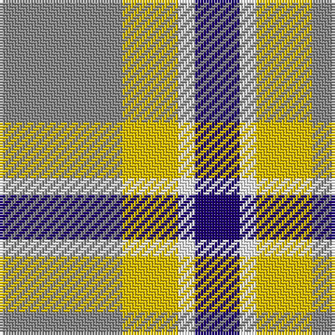

This page is one **sett** — a single exact thread-count. It belongs to the [tartan](/tartans/n22y10w3db8/)
(the same proportion at any scale), whose colour order is pattern [BWYR](/stripes/bwyr/).

Sourced from register-of-tartans.  It is a [4 stripe tartan](/stripes/stripes4/).

Original link https://www.tartanregister.gov.uk/tartanDetails.aspx?ref=2229

2 attestations — the source records this cloth was collapsed from (oldest owns this page)

<ul>
<li>01/01/1994 — Louisburg (register-of-tartans, <a href="https://www.tartanregister.gov.uk/tartanDetails.aspx?ref=2229">record</a>)</li>
<li>1994 — Louisburg (District) (tartans-authority, <a href="http://www.tartansauthority.com/tartan-ferret/display/5500/">record</a>)</li>
</ul>

## Register references

External register numbers recorded for this tartan.

- Scottish Register of Tartans: [2229](https://www.tartanregister.gov.uk/tartanDetails.aspx?ref=2229)
- Scottish Tartans Authority (ITI): 5500

## Thread count
N/44 Y20 W6 DB/16

## Palette
Each colour and the base-6 reference it is a variant of.

| Colour | Shade | Base |
|---|---|---|
| DB | <code style="background-color:#1C0070;">#1C0070</code> `oklch(26.3% 0.162 277.1)` <small>#1C0070</small> | B <code style="background-color:#2A418A;">#2A418A</code> |
| N | <code style="background-color:#888888;">#888888</code> `oklch(62.7% 0.000 89.9)` <small>#888888</small> | R <code style="background-color:#CC0000;">#CC0000</code> |
| W | <code style="background-color:#F8F8F8;">#F8F8F8</code> `oklch(97.9% 0.000 89.9)` <small>#F8F8F8</small> | W <code style="background-color:#F7F7F7;">#F7F7F7</code> |
| Y | <code style="background-color:#E8C000;">#E8C000</code> `oklch(81.9% 0.168 93.7)` <small>#E8C000</small> | Y <code style="background-color:#F2BF00;">#F2BF00</code> |

# Sample pattern

## Nearest tartans

The nearest existing variants by ΔTartan distance, with this tartan at the top so the swatches line up against it.

ΔTartan

Tartan

Sett

—

<a href="/ttd/edit/#slug=o22ly10w3db8~x2">Louisburg</a> <a class="nn-out" href="/setts/s4/o22ly10w3db8~x2/" title="open its dictionary page">↗</a>

1.04

<a href="/ttd/edit/#slug=o22ly10w3k8~x2">Louisburg Canadian District Tartan Tartan Number: 5500. Earliest known date: 1994 Louisburg is a tiny seaside town in Nova Scotia about 20 miles southeast of Sydney and site of the 1758 Battle of Louisburgh. It was designed by Edith MacIntyre of Louisbourg with the assistance of Jean Kyte and Jean composed the following poem about the colours. CIDD count slightly different - RB/20 W8 Y20 LN/34 (John Fitzpatrick's July 2008 review of Canadian tartans). Gray fog and sea and rocks. The yellow sun. white spindrift on the harbour restless beneath an azure sky. Curent owners (2008): The Louisbourg Heritage Society P.O. Box 396 Louisbourg, B0A 1M0 Nova Scotia, Canada See products available Copyright © Blair Urquhart, Comrie, 2015</a> <a class="nn-out" href="/setts/s4/o22ly10w3k8~x2/" title="open its dictionary page">↗</a>

1.20

<a href="/ttd/edit/#slug=b10w3b12ly14r4~x2">MacLeod of Argentina</a> <a class="nn-out" href="/setts/s5/b10w3b12ly14r4~x2/" title="open its dictionary page">↗</a>

1.24

<a href="/ttd/edit/#slug=db10w3db12ly14r4~x2">MacLeod, of Argentina</a> <a class="nn-out" href="/setts/s5/db10w3db12ly14r4~x2/" title="open its dictionary page">↗</a>

1.27

<a href="/ttd/edit/#slug=k4lb4k4o15r2~x4">Oban Grey (Fashion)</a> <a class="nn-out" href="/setts/s5/k4lb4k4o15r2~x4/" title="open its dictionary page">↗</a>

1.28

<a href="/ttd/edit/#slug=k5n24w24r5~x2">City of London (Corporate)</a> <a class="nn-out" href="/setts/s4/k5n24w24r5~x2/" title="open its dictionary page">↗</a>

1.31

<a href="/ttd/edit/#slug=k3w3k3ly10r1~x6">Burberry (Genuine)</a> <a class="nn-out" href="/setts/s5/k3w3k3ly10r1~x6/" title="open its dictionary page">↗</a>

1.35

<a href="/ttd/edit/#slug=r1w8dt8ly1~x4">MacRae of Conchra</a> <a class="nn-out" href="/setts/s4/r1w8dt8ly1~x4/" title="open its dictionary page">↗</a>

1.35

<a href="/ttd/edit/#slug=db3dg6ly1r3~x10">Delroeux, John Michael (Personal)</a> <a class="nn-out" href="/setts/s4/db3dg6ly1r3~x10/" title="open its dictionary page">↗</a>

1.37

<a href="/ttd/edit/#slug=k5n24w24k5~x2">City of London</a> <a class="nn-out" href="/setts/s4/k5n24w24k5~x2/" title="open its dictionary page">↗</a>

1.38

<a href="/ttd/edit/#slug=o25k4w8r16~x4">Buckeye</a> <a class="nn-out" href="/setts/s4/o25k4w8r16~x4/" title="open its dictionary page">↗</a>

## Neighbour map

Every grey dot is one of 14299 variants placed by the first two principal components of the ΔTartan feature space (44% of its variance). Red is this tartan; blue dots are its nearest — click one to open its page.

<svg viewBox="0 0 640 380" role="img" style="max-width:100%;height:auto;border:1px solid #e0e0e0;border-radius:4px;display:block" xmlns="http://www.w3.org/2000/svg"><image href="/nn/cloud.v1.png" width="640" height="380"/><a href="/setts/s4/o22ly10w3k8~x2/"><circle cx="201.0" cy="227.7" r="4" fill="#3465a4"><title>Louisburg Canadian District Tartan Tartan Number: 5500. Earliest known date: 1994 Louisburg is a tiny seaside town in Nova Scotia about 20 miles southeast of Sydney and site of the 1758 Battle of Louisburgh. It was designed by Edith MacIntyre of Louisbourg with the assistance of Jean Kyte and Jean composed the following poem about the colours. CIDD count slightly different - RB/20 W8 Y20 LN/34 (John Fitzpatrick's July 2008 review of Canadian tartans). Gray fog and sea and rocks. The yellow sun. white spindrift on the harbour restless beneath an azure sky. Curent owners (2008): The Louisbourg Heritage Society P.O. Box 396 Louisbourg, B0A 1M0 Nova Scotia, Canada See products available Copyright © Blair Urquhart, Comrie, 2015</title></circle></a><a href="/setts/s5/b10w3b12ly14r4~x2/"><circle cx="201.4" cy="265.4" r="4" fill="#3465a4"><title>MacLeod of Argentina</title></circle></a><a href="/setts/s5/db10w3db12ly14r4~x2/"><circle cx="187.0" cy="255.1" r="4" fill="#3465a4"><title>MacLeod, of Argentina</title></circle></a><a href="/setts/s5/k4lb4k4o15r2~x4/"><circle cx="242.6" cy="217.8" r="4" fill="#3465a4"><title>Oban Grey (Fashion)</title></circle></a><a href="/setts/s4/k5n24w24r5~x2/"><circle cx="155.8" cy="236.0" r="4" fill="#3465a4"><title>City of London (Corporate)</title></circle></a><a href="/setts/s5/k3w3k3ly10r1~x6/"><circle cx="223.6" cy="194.8" r="4" fill="#3465a4"><title>Burberry (Genuine)</title></circle></a><a href="/setts/s4/r1w8dt8ly1~x4/"><circle cx="208.1" cy="212.4" r="4" fill="#3465a4"><title>MacRae of Conchra</title></circle></a><a href="/setts/s4/db3dg6ly1r3~x10/"><circle cx="171.0" cy="256.6" r="4" fill="#3465a4"><title>Delroeux, John Michael (Personal)</title></circle></a><a href="/setts/s4/k5n24w24k5~x2/"><circle cx="147.0" cy="236.5" r="4" fill="#3465a4"><title>City of London</title></circle></a><a href="/setts/s4/o25k4w8r16~x4/"><circle cx="205.3" cy="240.9" r="4" fill="#3465a4"><title>Buckeye</title></circle></a><circle cx="219.6" cy="235.6" r="5" fill="#c00000"/></svg>

ID: /setts/s4/o22ly10w3db8~x2/
