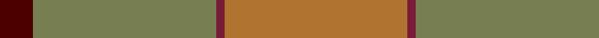
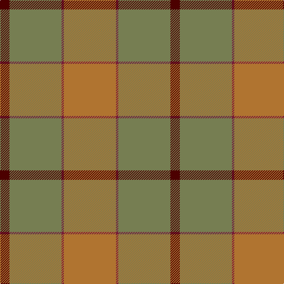

This page is one **sett** — a single exact thread-count. It belongs to the [tartan](/tartans/o22m1y22dr4/)
(the same proportion at any scale), whose colour order is pattern [BGRR](/stripes/bgrr/).

Sourced from register-of-tartans.  It is a [4 stripe tartan](/stripes/stripes4/).

Original link https://www.tartanregister.gov.uk/tartanDetails.aspx?ref=11134

## Register references

External register numbers recorded for this tartan.

- Scottish Register of Tartans: [11134](https://www.tartanregister.gov.uk/tartanDetails.aspx?ref=11134)

## Thread count
LT/88 DRa4 G88 DR/16

## Palette

Palette: <strong>Tartan Register</strong>
<table><thead><tr><th>Colour</th><th>Threads</th><th>Shade</th><th>Base</th><th>OKLCh</th></tr></thead><tbody><tr><td>LT/</td><td style="text-align:right;font-variant-numeric:tabular-nums">88</td><td><code style="background-color:#B07430;">#B07430</code> <small style="color:#888">#B07430</small></td><td>R <code style="background-color:#CC0000;">#CC0000</code></td><td><small style="color:#888">oklch(61.0% 0.112 66.0)</small></td></tr><tr><td>DRa</td><td style="text-align:right;font-variant-numeric:tabular-nums">4</td><td><code style="background-color:#781C38;">#781C38</code> <small style="color:#888">#781C38</small></td><td>R <code style="background-color:#CC0000;">#CC0000</code></td><td><small style="color:#888">oklch(38.7% 0.127 7.4)</small></td></tr><tr><td>G</td><td style="text-align:right;font-variant-numeric:tabular-nums">88</td><td><code style="background-color:#767E52;">#767E52</code> <small style="color:#888">#767E52</small></td><td>G <code style="background-color:#006100;">#006100</code></td><td><small style="color:#888">oklch(57.5% 0.064 116.8)</small></td></tr><tr><td>DR/</td><td style="text-align:right;font-variant-numeric:tabular-nums">16</td><td><code style="background-color:#4C0000;">#4C0000</code> <small style="color:#888">#4C0000</small></td><td>B <code style="background-color:#2A418A;">#2A418A</code></td><td><small style="color:#888">oklch(26.2% 0.107 29.2)</small></td></tr></tbody></table>

# Sample pattern

## Nearest tartans

The nearest existing variants by ΔTartan distance, with this tartan at the top so the swatches line up against it.

ΔTartan

Tartan

Sett

—

<a href="/ttd/edit/#slug=o22m1y22dr4~x4">McWilliams Hunting (2014)</a> <a class="nn-out" href="/setts/s4/o22m1y22dr4~x4/" title="open its dictionary page">↗</a>

1.42

<a href="/ttd/edit/#slug=n70lo16b3o45">Klymson (Personal)</a> <a class="nn-out" href="/setts/s4/n70lo16b3o45/" title="open its dictionary page">↗</a>

1.83

<a href="/ttd/edit/#slug=y50dy25ly2dp6~x2">Highland Greenford (Personal)</a> <a class="nn-out" href="/setts/s4/y50dy25ly2dp6~x2/" title="open its dictionary page">↗</a>

2.23

<a href="/ttd/edit/#slug=db2o22dy11ly2dy11db2~x2">Cetoloni Family Tartan Tartan Number: 2049. Earliest known date: November 1991 The Cetoloni tartan was designed with the colours of the Border Hills, 'the sky at its best, the rooftop skyline of Siena and the golden sun of Tuscany'. Franco Cetoloni of Liddlevale was born in Badia Roti Bucine in Arezzo, Italy. Jayne was a designer at Pringle's knitwear in Hawick. Red is Sienna red. See products available Copyright © Blair Urquhart, Comrie, 2015</a> <a class="nn-out" href="/setts/s6/db2o22dy11ly2dy11db2~x2/" title="open its dictionary page">↗</a>

2.24

<a href="/ttd/edit/#slug=o52ly2n24r3lo26n4~x2">Outlander #1</a> <a class="nn-out" href="/setts/s6/o52ly2n24r3lo26n4~x2/" title="open its dictionary page">↗</a>

2.25

<a href="/ttd/edit/#slug=y10lo5y54lo2lb32lo54b4lo10">Cladish</a> <a class="nn-out" href="/setts/s8/y10lo5y54lo2lb32lo54b4lo10/" title="open its dictionary page">↗</a>

2.29

<a href="/ttd/edit/#slug=y22dp1y22r4~x4">McWilliams (2014)</a> <a class="nn-out" href="/setts/s4/y22dp1y22r4~x4/" title="open its dictionary page">↗</a>

2.32

<a href="/ttd/edit/#slug=g22dy40n8k9o1~x2">Holehouse, Dag (Personal)</a> <a class="nn-out" href="/setts/s5/g22dy40n8k9o1~x2/" title="open its dictionary page">↗</a>

2.35

<a href="/ttd/edit/#slug=o9o9y9o1t1o9t1o1~x4">Jardine of Castlemilk Family Tartan Tartan Number: 1432. Earliest known date: c.1978 The chiefly house is Jardine of Applegirth, a baronetcy created in 1672. The Jardines of Castlemilk in Dumfriesshire settled there in the early fourteenth century. The tartan is approved by Col Jardine. The darker brown is recorded as &quot;J.Br&quot;, and the lighter as &quot;Olive Br&quot; in the Lyon Books. See products available Copyright © Blair Urquhart, Comrie, 2015</a> <a class="nn-out" href="/setts/s8/o9o9y9o1t1o9t1o1~x4/" title="open its dictionary page">↗</a>

2.37

<a href="/ttd/edit/#slug=dy4lg11dy14o30r4~x2">Trinity Bicycles</a> <a class="nn-out" href="/setts/s5/dy4lg11dy14o30r4~x2/" title="open its dictionary page">↗</a>

2.38

<a href="/ttd/edit/#slug=o80o8o4dy4lr4dy45n8">Isaia (Fashion)</a> <a class="nn-out" href="/setts/s7/o80o8o4dy4lr4dy45n8/" title="open its dictionary page">↗</a>

## Neighbour map

Every grey dot is one of 14299 variants placed by the first two principal components of the ΔTartan feature space (44% of its variance). Red is this tartan; blue dots are its nearest — click one to open its page.

<svg viewBox="0 0 640 380" role="img" style="max-width:100%;height:auto;border:1px solid #e0e0e0;border-radius:4px;display:block" xmlns="http://www.w3.org/2000/svg"><image href="/nn/cloud.v1.png" width="640" height="380"/><a href="/setts/s4/n70lo16b3o45/"><circle cx="420.5" cy="246.0" r="4" fill="#3465a4"><title>Klymson (Personal)</title></circle></a><a href="/setts/s4/y50dy25ly2dp6~x2/"><circle cx="505.7" cy="261.9" r="4" fill="#3465a4"><title>Highland Greenford (Personal)</title></circle></a><a href="/setts/s6/db2o22dy11ly2dy11db2~x2/"><circle cx="357.6" cy="242.8" r="4" fill="#3465a4"><title>Cetoloni Family Tartan Tartan Number: 2049. Earliest known date: November 1991 The Cetoloni tartan was designed with the colours of the Border Hills, 'the sky at its best, the rooftop skyline of Siena and the golden sun of Tuscany'. Franco Cetoloni of Liddlevale was born in Badia Roti Bucine in Arezzo, Italy. Jayne was a designer at Pringle's knitwear in Hawick. Red is Sienna red. See products available Copyright © Blair Urquhart, Comrie, 2015</title></circle></a><a href="/setts/s6/o52ly2n24r3lo26n4~x2/"><circle cx="409.2" cy="221.1" r="4" fill="#3465a4"><title>Outlander #1</title></circle></a><a href="/setts/s8/y10lo5y54lo2lb32lo54b4lo10/"><circle cx="321.6" cy="175.8" r="4" fill="#3465a4"><title>Cladish</title></circle></a><a href="/setts/s4/y22dp1y22r4~x4/"><circle cx="468.9" cy="293.4" r="4" fill="#3465a4"><title>McWilliams (2014)</title></circle></a><a href="/setts/s5/g22dy40n8k9o1~x2/"><circle cx="397.9" cy="211.9" r="4" fill="#3465a4"><title>Holehouse, Dag (Personal)</title></circle></a><a href="/setts/s8/o9o9y9o1t1o9t1o1~x4/"><circle cx="315.6" cy="241.0" r="4" fill="#3465a4"><title>Jardine of Castlemilk Family Tartan Tartan Number: 1432. Earliest known date: c.1978 The chiefly house is Jardine of Applegirth, a baronetcy created in 1672. The Jardines of Castlemilk in Dumfriesshire settled there in the early fourteenth century. The tartan is approved by Col Jardine. The darker brown is recorded as &quot;J.Br&quot;, and the lighter as &quot;Olive Br&quot; in the Lyon Books. See products available Copyright © Blair Urquhart, Comrie, 2015</title></circle></a><a href="/setts/s5/dy4lg11dy14o30r4~x2/"><circle cx="317.4" cy="270.2" r="4" fill="#3465a4"><title>Trinity Bicycles</title></circle></a><a href="/setts/s7/o80o8o4dy4lr4dy45n8/"><circle cx="442.2" cy="184.4" r="4" fill="#3465a4"><title>Isaia (Fashion)</title></circle></a><circle cx="409.2" cy="256.2" r="5" fill="#c00000"/></svg>

ID: /setts/s4/o22m1y22dr4~x4/
