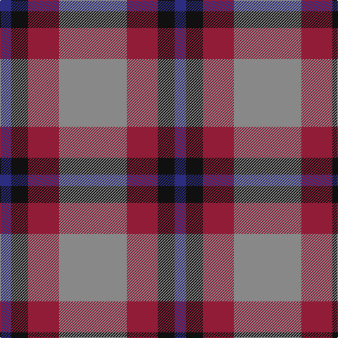

**Bands:** [BKRR](/stripes/bkrr/) · **Stripes:** [DB K R O](/stripes/stripes4/) DB K R O

This was sourced from tartans-authority.  It is a [4 band tartan](/bands/bands4/).

Original link http://www.tartansauthority.com/tartan-ferret/display/8517/

## Thread count
DB/16 K24 DR44 N/96

## Palette
Each colour and its ΔE from the base-6 reference it is a variant of.

| Colour | Shade | Base | ΔE (OKLab) |
|---|---|---|---|
| DB | <code style="background-color:#2C2C80;">#2C2C80</code> `#2C2C80` | B <code style="background-color:#2A418A;">#2A418A</code> | 0.06 |
| DR | <code style="background-color:#901C38;">#901C38</code> `#901C38` | R <code style="background-color:#CC0000;">#CC0000</code> | 0.13 |
| K | <code style="background-color:#101010;">#101010</code> `#101010` | K <code style="background-color:#000000;">#000000</code> | 0.17 |
| N | <code style="background-color:#888888;">#888888</code> `#888888` | R <code style="background-color:#CC0000;">#CC0000</code> | 0.24 |

# Sample pattern

## Nearest tartans

The nearest existing variants by ΔTartan distance.

1. [MacNab 7](/setts/s4/g15r3p11t2~x2/) — ΔT 1.03
1. [MacNab WI2](/setts/s4/dg15r3dp11lb2/) — ΔT 1.18
1. [Unidentified #17](/setts/s4/db8k3r4ly1~x2/) — ΔT 1.22
1. [Drumfintley (Fashion)](/setts/s5/m30k7o20ly4k4~x2/) — ΔT 1.27
1. [Bronte House Check](/setts/s6/m10dy60dt13lo24dt24dy8/) — ΔT 1.30
1. [Oban Grey (Fashion)](/setts/s5/k4lb4k4o15r2~x4/) — ΔT 1.40
1. [Snowbird (Corporate)](/setts/s5/r8lg15b12r29w4~x2/) — ΔT 1.41
1. [International Highland Games Fed.](/setts/s4/db13r5g5w3~x8/) — ΔT 1.41
1. [Bronte House Check (Fashion)](/setts/s6/r10dy60dt13lb24dt24dy8/) — ΔT 1.45
1. [New York State Police Pipe Band](/setts/s5/o5dp3o18k16ly3~x4/) — ΔT 1.47

## Neighbour map

Every grey dot is one of 14313 variants placed by the first two principal components of the ΔTartan feature space (44% of its variance). Red is this tartan; blue dots are its nearest — click one to open its page.

<svg viewBox="0 0 640 380" role="img" style="max-width:100%;height:auto;border:1px solid #e0e0e0;border-radius:4px;display:block" xmlns="http://www.w3.org/2000/svg"><image href="/nn/cloud.v1.png" width="640" height="380"/><a href="/setts/s4/g15r3p11t2~x2/"><circle cx="252.2" cy="248.8" r="4" fill="#3465a4"><title>MacNab 7</title></circle></a><a href="/setts/s4/dg15r3dp11lb2/"><circle cx="253.3" cy="254.8" r="4" fill="#3465a4"><title>MacNab WI2</title></circle></a><a href="/setts/s4/db8k3r4ly1~x2/"><circle cx="237.9" cy="245.9" r="4" fill="#3465a4"><title>Unidentified #17</title></circle></a><a href="/setts/s5/m30k7o20ly4k4~x2/"><circle cx="234.3" cy="219.5" r="4" fill="#3465a4"><title>Drumfintley (Fashion)</title></circle></a><a href="/setts/s6/m10dy60dt13lo24dt24dy8/"><circle cx="248.9" cy="222.5" r="4" fill="#3465a4"><title>Bronte House Check</title></circle></a><a href="/setts/s5/k4lb4k4o15r2~x4/"><circle cx="242.7" cy="218.0" r="4" fill="#3465a4"><title>Oban Grey (Fashion)</title></circle></a><a href="/setts/s5/r8lg15b12r29w4~x2/"><circle cx="268.8" cy="235.2" r="4" fill="#3465a4"><title>Snowbird (Corporate)</title></circle></a><a href="/setts/s4/db13r5g5w3~x8/"><circle cx="194.3" cy="270.1" r="4" fill="#3465a4"><title>International Highland Games Fed.</title></circle></a><a href="/setts/s6/r10dy60dt13lb24dt24dy8/"><circle cx="232.3" cy="220.4" r="4" fill="#3465a4"><title>Bronte House Check (Fashion)</title></circle></a><a href="/setts/s5/o5dp3o18k16ly3~x4/"><circle cx="235.6" cy="234.1" r="4" fill="#3465a4"><title>New York State Police Pipe Band</title></circle></a><circle cx="268.6" cy="258.5" r="5" fill="#c00000"/></svg>

ID: /setts/s4/o24r11k6db4~x4/
