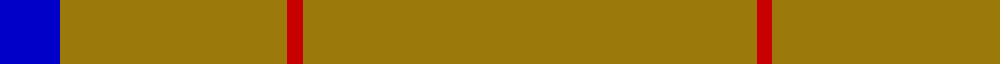

**Bands:** [BRRR](/stripes/brrr/) · **Stripes:** [DB O R O](/stripes/stripes4/) DB O R O

This was sourced from weddslist.  It is a [4 band tartan](/bands/bands4/).

Original link http://www.weddslist.com/cgi-bin/tartans/pg.pl?source=rb

## Register references

External register numbers recorded for this tartan.

- Scottish Register of Tartans: [2540](https://www.tartanregister.gov.uk/tartanDetails.aspx?ref=2540)
- Scottish Register of Tartans: [2666](https://www.tartanregister.gov.uk/tartanDetails.aspx?ref=2666)
- Scottish Register of Tartans: [3808](https://www.tartanregister.gov.uk/tartanDetails.aspx?ref=3808)
- Scottish Tartans Authority (ITI): 218
- Scottish Tartans World Register: 1010
- Scottish Tartans World Register: 1585
- Scottish Tartans World Register: 218

## Thread count
B/4 LG15 R1 LG/30

## Palette
Each colour and its ΔE from the base-6 reference it is a variant of.

| Colour | Shade | Base | ΔE (OKLab) |
|---|---|---|---|
| B | <code style="background-color:#0000C8;">#0000C8</code> `#0000C8` | B <code style="background-color:#2A418A;">#2A418A</code> | 0.14 |
| G | <code style="background-color:#00C800;">#00C800</code> `#00C800` | Y <code style="background-color:#F2BF00;">#F2BF00</code> | 0.22 |
| LG | <code style="background-color:#9B7A0B;">#9B7A0B</code> `#9B7A0B` | R <code style="background-color:#CC0000;">#CC0000</code> | 0.20 |
| R | <code style="background-color:#C80000;">#C80000</code> `#C80000` | R <code style="background-color:#CC0000;">#CC0000</code> | 0.01 |
| T | <code style="background-color:#8B4513;">#8B4513</code> `#8B4513` | R <code style="background-color:#CC0000;">#CC0000</code> | 0.13 |

# Sample pattern

## Nearest tartans

The nearest existing variants by ΔTartan distance.

1. [Pasteur](/setts/s4/dy10ly1dy30y3~x4/) — ΔT 2.15
1. [Rabbie's Dram (Fashion)](/setts/s4/lo60do3lo4r3~x2/) — ΔT 2.19
1. [Dutch Football (Corporate)](/setts/s4/lo24r1w1dt1~x11/) — ΔT 2.23
1. [S3](/setts/s3/y30w2r5~x4/) — ΔT 2.24
1. [Pasteur Fancy Tartan Tartan Number: 7094. Earliest known date: 1836 The pattern is taken from a shawl or cloak which appears in a portrait of Louie Pasteur's mother. The portrait was drawn in pastels when Pasteur was just 13 years old. The information came Marie-Claude Fortier researching the life of Pasteur. See products available Copyright © Blair Urquhart, Comrie, 2015](/setts/s4/do10ly1do30y3~x4/) — ΔT 2.53
1. [Dunbar of Pitgaveny (Clan)](/setts/s3/m1o19w1~x2/) — ΔT 2.54
1. [Brooks Brothers Tattersall Camel](/setts/s5/db1lo9db2lo9r1~x4/) — ΔT 2.57
1. [Oman RAF, Sultanate of (Military)](/setts/s6/dy9t3dy6t3dy20ly2~x2/) — ΔT 2.68
1. [MacNab, Ancient](/setts/s5/dg62r7k4r4dg62~x2/) — ΔT 2.70
1. [Connacht (1993)](/setts/s10/o64dg6o2dg3o2dg6o64dy2o2dy6~x2/) — ΔT 2.75

## Neighbour map

Every grey dot is one of 14313 variants placed by the first two principal components of the ΔTartan feature space (44% of its variance). Red is this tartan; blue dots are its nearest — click one to open its page.

<svg viewBox="0 0 640 380" role="img" style="max-width:100%;height:auto;border:1px solid #e0e0e0;border-radius:4px;display:block" xmlns="http://www.w3.org/2000/svg"><image href="/nn/cloud.v1.png" width="640" height="380"/><a href="/setts/s4/dy10ly1dy30y3~x4/"><circle cx="626.0" cy="239.5" r="4" fill="#3465a4"><title>Pasteur</title></circle></a><a href="/setts/s4/lo60do3lo4r3~x2/"><circle cx="626.0" cy="227.4" r="4" fill="#3465a4"><title>Rabbie's Dram (Fashion)</title></circle></a><a href="/setts/s4/lo24r1w1dt1~x11/"><circle cx="626.0" cy="188.7" r="4" fill="#3465a4"><title>Dutch Football (Corporate)</title></circle></a><a href="/setts/s3/y30w2r5~x4/"><circle cx="583.1" cy="255.3" r="4" fill="#3465a4"><title>S3</title></circle></a><a href="/setts/s4/do10ly1do30y3~x4/"><circle cx="626.0" cy="232.4" r="4" fill="#3465a4"><title>Pasteur Fancy Tartan Tartan Number: 7094. Earliest known date: 1836 The pattern is taken from a shawl or cloak which appears in a portrait of Louie Pasteur's mother. The portrait was drawn in pastels when Pasteur was just 13 years old. The information came Marie-Claude Fortier researching the life of Pasteur. See products available Copyright © Blair Urquhart, Comrie, 2015</title></circle></a><a href="/setts/s3/m1o19w1~x2/"><circle cx="626.0" cy="247.5" r="4" fill="#3465a4"><title>Dunbar of Pitgaveny (Clan)</title></circle></a><a href="/setts/s5/db1lo9db2lo9r1~x4/"><circle cx="535.2" cy="249.2" r="4" fill="#3465a4"><title>Brooks Brothers Tattersall Camel</title></circle></a><a href="/setts/s6/dy9t3dy6t3dy20ly2~x2/"><circle cx="559.4" cy="256.5" r="4" fill="#3465a4"><title>Oman RAF, Sultanate of (Military)</title></circle></a><a href="/setts/s5/dg62r7k4r4dg62~x2/"><circle cx="626.0" cy="264.8" r="4" fill="#3465a4"><title>MacNab, Ancient</title></circle></a><a href="/setts/s10/o64dg6o2dg3o2dg6o64dy2o2dy6~x2/"><circle cx="626.0" cy="138.1" r="4" fill="#3465a4"><title>Connacht (1993)</title></circle></a><circle cx="626.0" cy="223.7" r="5" fill="#c00000"/></svg>

ID: /setts/s4/o30r1o15db4/
