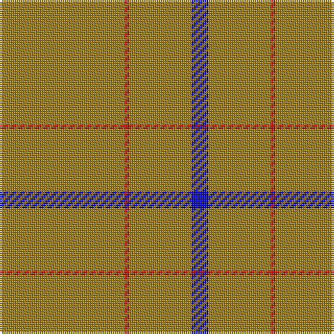

This page is one **sett** — a single exact thread-count. It belongs to the [tartan](/tartans/o30r1o15db4/)
(the same proportion at any scale), whose colour order is pattern [BRRR](/stripes/brrr/).

Sourced from weddslist.  It is a [4 stripe tartan](/stripes/stripes4/).

Original link http://www.weddslist.com/cgi-bin/tartans/pg.pl?source=rb

## Thread count
LG/60 R2 LG30 B/8

## Palette

Palette: <strong>Tartan Register</strong> <small style="color:#888">(1 of 5 colours)</small>
<table><thead><tr><th>Colour</th><th>Threads</th><th>Shade</th><th>Base</th><th>OKLCh</th></tr></thead><tbody><tr><td>LG/</td><td style="text-align:right;font-variant-numeric:tabular-nums">60</td><td><code style="background-color:#9B7A0B;">#9B7A0B</code> <small style="color:#888">#9B7A0B</small></td><td>R <code style="background-color:#CC0000;">#CC0000</code></td><td><small style="color:#888">oklch(59.5% 0.119 89.1)</small></td></tr><tr><td>R</td><td style="text-align:right;font-variant-numeric:tabular-nums">2</td><td><code style="background-color:#C80000;">#C80000</code> <small style="color:#888">#C80000</small></td><td>R <code style="background-color:#CC0000;">#CC0000</code></td><td><small style="color:#888">oklch(52.3% 0.215 29.2)</small></td></tr><tr><td>LG</td><td style="text-align:right;font-variant-numeric:tabular-nums">30</td><td><code style="background-color:#9B7A0B;">#9B7A0B</code> <small style="color:#888">#9B7A0B</small></td><td>R <code style="background-color:#CC0000;">#CC0000</code></td><td><small style="color:#888">oklch(59.5% 0.119 89.1)</small></td></tr><tr><td>B/</td><td style="text-align:right;font-variant-numeric:tabular-nums">8</td><td><code style="background-color:#0000C8;">#0000C8</code> <small style="color:#888">#0000C8</small></td><td>B <code style="background-color:#2A418A;">#2A418A</code></td><td><small style="color:#888">oklch(37.6% 0.261 264.1)</small></td></tr></tbody></table>

# Sample pattern

## Nearest tartans

The nearest existing variants by ΔTartan distance, with this tartan at the top so the swatches line up against it.

ΔTartan

Tartan

Sett

—

<a href="/ttd/edit/#slug=o30r1o15db4~x2">Kincardine Tweed</a> <a class="nn-out" href="/setts/s4/o30r1o15db4~x2/" title="open its dictionary page">↗</a>

2.15

<a href="/ttd/edit/#slug=dy10ly1dy30y3~x4">Pasteur</a> <a class="nn-out" href="/setts/s4/dy10ly1dy30y3~x4/" title="open its dictionary page">↗</a>

2.19

<a href="/ttd/edit/#slug=lo60do3lo4r3~x2">Rabbie's Dram (Fashion)</a> <a class="nn-out" href="/setts/s4/lo60do3lo4r3~x2/" title="open its dictionary page">↗</a>

2.23

<a href="/ttd/edit/#slug=lo24r1w1dt1~x11">Dutch Football (Corporate)</a> <a class="nn-out" href="/setts/s4/lo24r1w1dt1~x11/" title="open its dictionary page">↗</a>

2.24

<a href="/ttd/edit/#slug=y30w2r5~x4">S3</a> <a class="nn-out" href="/setts/s3/y30w2r5~x4/" title="open its dictionary page">↗</a>

2.53

<a href="/ttd/edit/#slug=do10ly1do30y3~x4">Pasteur Fancy Tartan Tartan Number: 7094. Earliest known date: 1836 The pattern is taken from a shawl or cloak which appears in a portrait of Louie Pasteur's mother. The portrait was drawn in pastels when Pasteur was just 13 years old. The information came Marie-Claude Fortier researching the life of Pasteur. See products available Copyright © Blair Urquhart, Comrie, 2015</a> <a class="nn-out" href="/setts/s4/do10ly1do30y3~x4/" title="open its dictionary page">↗</a>

2.54

<a href="/ttd/edit/#slug=m1o19w1~x2">Dunbar of Pitgaveny (Clan)</a> <a class="nn-out" href="/setts/s3/m1o19w1~x2/" title="open its dictionary page">↗</a>

2.57

<a href="/ttd/edit/#slug=db1lo9db2lo9r1~x4">Brooks Brothers Tattersall Camel</a> <a class="nn-out" href="/setts/s5/db1lo9db2lo9r1~x4/" title="open its dictionary page">↗</a>

2.68

<a href="/ttd/edit/#slug=dy9t3dy6t3dy20ly2~x2">Oman RAF, Sultanate of (Military)</a> <a class="nn-out" href="/setts/s6/dy9t3dy6t3dy20ly2~x2/" title="open its dictionary page">↗</a>

2.70

<a href="/ttd/edit/#slug=dg62r7k4r4dg62~x2">MacNab, Ancient</a> <a class="nn-out" href="/setts/s5/dg62r7k4r4dg62~x2/" title="open its dictionary page">↗</a>

2.75

<a href="/ttd/edit/#slug=o64dg6o2dg3o2dg6o64dy2o2dy6~x2">Connacht (1993)</a> <a class="nn-out" href="/setts/s10/o64dg6o2dg3o2dg6o64dy2o2dy6~x2/" title="open its dictionary page">↗</a>

## Neighbour map

Every grey dot is one of 14299 variants placed by the first two principal components of the ΔTartan feature space (44% of its variance). Red is this tartan; blue dots are its nearest — click one to open its page.

<svg viewBox="0 0 640 380" role="img" style="max-width:100%;height:auto;border:1px solid #e0e0e0;border-radius:4px;display:block" xmlns="http://www.w3.org/2000/svg"><image href="/nn/cloud.v1.png" width="640" height="380"/><a href="/setts/s4/dy10ly1dy30y3~x4/"><circle cx="626.0" cy="239.0" r="4" fill="#3465a4"><title>Pasteur</title></circle></a><a href="/setts/s4/lo60do3lo4r3~x2/"><circle cx="626.0" cy="227.0" r="4" fill="#3465a4"><title>Rabbie's Dram (Fashion)</title></circle></a><a href="/setts/s4/lo24r1w1dt1~x11/"><circle cx="626.0" cy="188.3" r="4" fill="#3465a4"><title>Dutch Football (Corporate)</title></circle></a><a href="/setts/s3/y30w2r5~x4/"><circle cx="582.7" cy="254.9" r="4" fill="#3465a4"><title>S3</title></circle></a><a href="/setts/s4/do10ly1do30y3~x4/"><circle cx="626.0" cy="231.9" r="4" fill="#3465a4"><title>Pasteur Fancy Tartan Tartan Number: 7094. Earliest known date: 1836 The pattern is taken from a shawl or cloak which appears in a portrait of Louie Pasteur's mother. The portrait was drawn in pastels when Pasteur was just 13 years old. The information came Marie-Claude Fortier researching the life of Pasteur. See products available Copyright © Blair Urquhart, Comrie, 2015</title></circle></a><a href="/setts/s3/m1o19w1~x2/"><circle cx="626.0" cy="247.0" r="4" fill="#3465a4"><title>Dunbar of Pitgaveny (Clan)</title></circle></a><a href="/setts/s5/db1lo9db2lo9r1~x4/"><circle cx="534.7" cy="248.8" r="4" fill="#3465a4"><title>Brooks Brothers Tattersall Camel</title></circle></a><a href="/setts/s6/dy9t3dy6t3dy20ly2~x2/"><circle cx="559.0" cy="256.1" r="4" fill="#3465a4"><title>Oman RAF, Sultanate of (Military)</title></circle></a><a href="/setts/s5/dg62r7k4r4dg62~x2/"><circle cx="626.0" cy="264.4" r="4" fill="#3465a4"><title>MacNab, Ancient</title></circle></a><a href="/setts/s10/o64dg6o2dg3o2dg6o64dy2o2dy6~x2/"><circle cx="626.0" cy="137.7" r="4" fill="#3465a4"><title>Connacht (1993)</title></circle></a><circle cx="626.0" cy="223.2" r="5" fill="#c00000"/></svg>

ID: /setts/s4/o30r1o15db4~x2/
