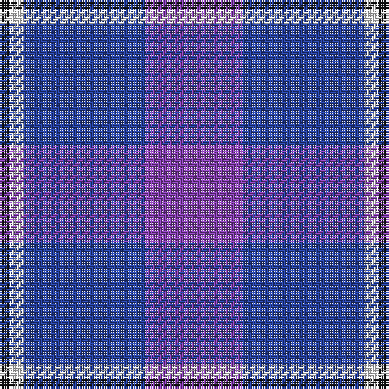

**Bands:** [BBWK](/stripes/bbwk/) · **Stripes:** [P DB W K](/stripes/stripes4/) P DB W K

This was sourced from register-of-tartans.  It is a [4 band tartan](/bands/bands4/).

Original link https://www.tartanregister.gov.uk/tartanDetails.aspx?ref=5368

## Register references

External register numbers recorded for this tartan.

- Scottish Register of Tartans: [5368](https://www.tartanregister.gov.uk/tartanDetails.aspx?ref=5368)
- Scottish Tartans World Register: 3013

## Thread count
K/4 W6 B50 LP/40

## Palette
Each colour and its ΔE from the base-6 reference it is a variant of.

| Colour | Shade | Base | ΔE (OKLab) |
|---|---|---|---|
| B | <code style="background-color:#28429F;">#28429F</code> `#28429F` | B <code style="background-color:#2A418A;">#2A418A</code> | 0.03 |
| K | <code style="background-color:#101010;">#101010</code> `#101010` | K <code style="background-color:#000000;">#000000</code> | 0.17 |
| LP | <code style="background-color:#8642AF;">#8642AF</code> `#8642AF` | B <code style="background-color:#2A418A;">#2A418A</code> | 0.16 |
| W | <code style="background-color:#FFFFFF;">#FFFFFF</code> `#FFFFFF` | W <code style="background-color:#F7F7F7;">#F7F7F7</code> | 0.02 |

# Sample pattern

## Nearest tartans

The nearest existing variants by ΔTartan distance.

1. [Murdoch, Ellis (Personal)](/setts/s4/dp20db25w3k2~x2/) — ΔT 0.87
1. [Cathro (Name)](/setts/s5/p9b6w1g4p2~x8/) — ΔT 1.46
1. [Cathro](/setts/s5/dp9db6w1dg4dp2~x4/) — ΔT 1.49
1. [Joker, The](/setts/s6/b18k2b4k6dp12lo1~x2/) — ΔT 1.73
1. [Fong (Personal)](/setts/s4/r21db43dt86lb10/) — ΔT 1.82
1. [MacNeil - 1994 (Personal)](/setts/s5/b30k12dt12k2w3~x2/) — ΔT 1.85
1. [McIntosh, Georgina (Personal)](/setts/s6/p9lb1g2lb1db4r1~x12/) — ΔT 1.88
1. [Joker Fancy Tartan Tartan Number: 6769. Earliest known date: 2005 I have a photo of a fabric swatch that I am trying to match as close as possible. I have been commissioned to make a life size mannequin of Jack Nicholson as the Joker and he wore plaid/tartan pants. I could send you some photos through email and possibly you could help me. Thanks, Andy Garringer USA, January 2008. (96 threads @ 40 epi heavyweight = 2.5 inch repeat) See products available Copyright © Blair Urquhart, Comrie, 2015](/setts/s6/b11k1b3k5dp9lo1~x2/) — ΔT 1.90
1. [Ewell Castle School](/setts/s6/b4w1b18db18r1db4~x4/) — ΔT 1.91
1. [Cheadle (Personal)](/setts/s6/dp10ly3dp8db42g5o5~x2/) — ΔT 1.92

## Neighbour map

Every grey dot is one of 14313 variants placed by the first two principal components of the ΔTartan feature space (44% of its variance). Red is this tartan; blue dots are its nearest — click one to open its page.

<svg viewBox="0 0 640 380" role="img" style="max-width:100%;height:auto;border:1px solid #e0e0e0;border-radius:4px;display:block" xmlns="http://www.w3.org/2000/svg"><image href="/nn/cloud.v1.png" width="640" height="380"/><a href="/setts/s4/dp20db25w3k2~x2/"><circle cx="342.1" cy="242.4" r="4" fill="#3465a4"><title>Murdoch, Ellis (Personal)</title></circle></a><a href="/setts/s5/p9b6w1g4p2~x8/"><circle cx="270.7" cy="250.9" r="4" fill="#3465a4"><title>Cathro (Name)</title></circle></a><a href="/setts/s5/dp9db6w1dg4dp2~x4/"><circle cx="288.0" cy="263.6" r="4" fill="#3465a4"><title>Cathro</title></circle></a><a href="/setts/s6/b18k2b4k6dp12lo1~x2/"><circle cx="306.7" cy="199.3" r="4" fill="#3465a4"><title>Joker, The</title></circle></a><a href="/setts/s4/r21db43dt86lb10/"><circle cx="291.9" cy="257.7" r="4" fill="#3465a4"><title>Fong (Personal)</title></circle></a><a href="/setts/s5/b30k12dt12k2w3~x2/"><circle cx="280.2" cy="211.1" r="4" fill="#3465a4"><title>MacNeil - 1994 (Personal)</title></circle></a><a href="/setts/s6/p9lb1g2lb1db4r1~x12/"><circle cx="249.0" cy="186.3" r="4" fill="#3465a4"><title>McIntosh, Georgina (Personal)</title></circle></a><a href="/setts/s6/b11k1b3k5dp9lo1~x2/"><circle cx="263.7" cy="228.4" r="4" fill="#3465a4"><title>Joker Fancy Tartan Tartan Number: 6769. Earliest known date: 2005 I have a photo of a fabric swatch that I am trying to match as close as possible. I have been commissioned to make a life size mannequin of Jack Nicholson as the Joker and he wore plaid/tartan pants. I could send you some photos through email and possibly you could help me. Thanks, Andy Garringer USA, January 2008. (96 threads @ 40 epi heavyweight = 2.5 inch repeat) See products available Copyright © Blair Urquhart, Comrie, 2015</title></circle></a><a href="/setts/s6/b4w1b18db18r1db4~x4/"><circle cx="345.7" cy="204.5" r="4" fill="#3465a4"><title>Ewell Castle School</title></circle></a><a href="/setts/s6/dp10ly3dp8db42g5o5~x2/"><circle cx="356.7" cy="185.9" r="4" fill="#3465a4"><title>Cheadle (Personal)</title></circle></a><circle cx="326.5" cy="238.3" r="5" fill="#c00000"/></svg>

ID: /setts/s4/p20db25w3k2~x2/
