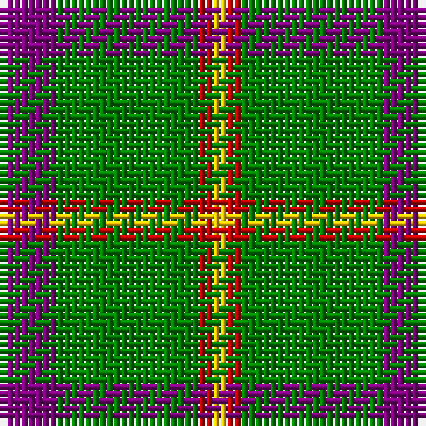

In pattern [BGRY](/stripes/bgry/).

This was sourced from weddslist.  It is a [4 stripe tartan](/stripes/stripes4/).

Original link http://www.weddslist.com/cgi-bin/tartans/pg.pl?source=sts

## Thread count
P/8 G20 R2 Y/2

## Palette
Each colour and the base-6 reference it is a variant of.

| Colour | Shade | Base |
|---|---|---|
| G | <code style="background-color:#008000;">#008000</code> `oklch(52.0% 0.177 142.5)` <small>#008000</small> | G <code style="background-color:#006100;">#006100</code> |
| P | <code style="background-color:#800080;">#800080</code> `oklch(42.1% 0.193 328.4)` <small>#800080</small> | B <code style="background-color:#2A418A;">#2A418A</code> |
| R | <code style="background-color:#C00000;">#C00000</code> `oklch(50.7% 0.208 29.2)` <small>#C00000</small> | R <code style="background-color:#CC0000;">#CC0000</code> |
| Y | <code style="background-color:#F0C000;">#F0C000</code> `oklch(82.7% 0.169 90.5)` <small>#F0C000</small> | Y <code style="background-color:#F2BF00;">#F2BF00</code> |

# Sample pattern

## Nearest tartans

The nearest existing variants by ΔTartan distance, with this tartan at the top so the swatches line up against it.

ΔTartan

Tartan

Sett

—

<a href="/ttd/edit/#slug=p4g10r1ly1~x2">Wilson's, No 192</a> <a class="nn-out" href="/setts/s4/p4g10r1ly1~x2/" title="open its dictionary page">↗</a>

0.27

<a href="/ttd/edit/#slug=p4g10w1r1~x2">Wilson's, No 189</a> <a class="nn-out" href="/setts/s4/p4g10w1r1~x2/" title="open its dictionary page">↗</a>

0.73

<a href="/ttd/edit/#slug=dp4g10r1ly1~x2">Wilson's No.192</a> <a class="nn-out" href="/setts/s4/dp4g10r1ly1~x2/" title="open its dictionary page">↗</a>

0.74

<a href="/ttd/edit/#slug=dp4g10r1w1~x2">Wilson's No.189</a> <a class="nn-out" href="/setts/s4/dp4g10r1w1~x2/" title="open its dictionary page">↗</a>

0.94

<a href="/ttd/edit/#slug=g72r25ly8w5">Sugell (Name?)</a> <a class="nn-out" href="/setts/s4/g72r25ly8w5/" title="open its dictionary page">↗</a>

1.09

<a href="/ttd/edit/#slug=g14k3r3lr2~x2">Bacon, Green (Fashion)</a> <a class="nn-out" href="/setts/s4/g14k3r3lr2~x2/" title="open its dictionary page">↗</a>

1.23

<a href="/ttd/edit/#slug=k2ly1g7t1~x2">Wilson's No.140</a> <a class="nn-out" href="/setts/s4/k2ly1g7t1~x2/" title="open its dictionary page">↗</a>

1.30

<a href="/ttd/edit/#slug=g56dy13ly13w5~x2">Colonial Marine (Aliens Legacy)</a> <a class="nn-out" href="/setts/s4/g56dy13ly13w5~x2/" title="open its dictionary page">↗</a>

1.31

<a href="/ttd/edit/#slug=r8g12w5k11g42k3~x2">Sir Billi (Corporate)</a> <a class="nn-out" href="/setts/s6/r8g12w5k11g42k3~x2/" title="open its dictionary page">↗</a>

1.36

<a href="/ttd/edit/#slug=r17db7lo8g58k6~x2">St Johns County Sheriff Office (Cor)</a> <a class="nn-out" href="/setts/s5/r17db7lo8g58k6~x2/" title="open its dictionary page">↗</a>

1.37

<a href="/ttd/edit/#slug=t1db4g10ly1~x2">Wilson's No.174</a> <a class="nn-out" href="/setts/s4/t1db4g10ly1~x2/" title="open its dictionary page">↗</a>

## Neighbour map

Every grey dot is one of 14299 variants placed by the first two principal components of the ΔTartan feature space (44% of its variance). Red is this tartan; blue dots are its nearest — click one to open its page.

<svg viewBox="0 0 640 380" role="img" style="max-width:100%;height:auto;border:1px solid #e0e0e0;border-radius:4px;display:block" xmlns="http://www.w3.org/2000/svg"><image href="/nn/cloud.v1.png" width="640" height="380"/><a href="/setts/s4/p4g10w1r1~x2/"><circle cx="343.3" cy="220.0" r="4" fill="#3465a4"><title>Wilson's, No 189</title></circle></a><a href="/setts/s4/dp4g10r1ly1~x2/"><circle cx="357.4" cy="230.6" r="4" fill="#3465a4"><title>Wilson's No.192</title></circle></a><a href="/setts/s4/dp4g10r1w1~x2/"><circle cx="343.3" cy="223.6" r="4" fill="#3465a4"><title>Wilson's No.189</title></circle></a><a href="/setts/s4/g72r25ly8w5/"><circle cx="392.4" cy="208.0" r="4" fill="#3465a4"><title>Sugell (Name?)</title></circle></a><a href="/setts/s4/g14k3r3lr2~x2/"><circle cx="347.5" cy="250.5" r="4" fill="#3465a4"><title>Bacon, Green (Fashion)</title></circle></a><a href="/setts/s4/k2ly1g7t1~x2/"><circle cx="337.4" cy="247.7" r="4" fill="#3465a4"><title>Wilson's No.140</title></circle></a><a href="/setts/s4/g56dy13ly13w5~x2/"><circle cx="364.7" cy="224.6" r="4" fill="#3465a4"><title>Colonial Marine (Aliens Legacy)</title></circle></a><a href="/setts/s6/r8g12w5k11g42k3~x2/"><circle cx="373.7" cy="191.9" r="4" fill="#3465a4"><title>Sir Billi (Corporate)</title></circle></a><a href="/setts/s5/r17db7lo8g58k6~x2/"><circle cx="325.7" cy="200.2" r="4" fill="#3465a4"><title>St Johns County Sheriff Office (Cor)</title></circle></a><a href="/setts/s4/t1db4g10ly1~x2/"><circle cx="362.6" cy="241.7" r="4" fill="#3465a4"><title>Wilson's No.174</title></circle></a><circle cx="348.1" cy="222.1" r="5" fill="#c00000"/></svg>

ID: /setts/s4/p4g10r1ly1~x2/
