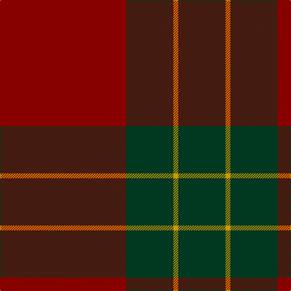

This page is one **sett** — a single exact thread-count. It belongs to the [tartan](/tartans/r104dg39lo4/)
(the same proportion at any scale), whose colour order is pattern [GYGR](/stripes/gygr/).

Sourced from register-of-tartans.  It is a [4 stripe tartan](/stripes/stripes4/).

Original link https://www.tartanregister.gov.uk/tartanDetails.aspx?ref=3749

## Register references

External register numbers recorded for this tartan.

- Scottish Register of Tartans: [3749](https://www.tartanregister.gov.uk/tartanDetails.aspx?ref=3749)
- Scottish Tartans Authority (ITI): 1561
- Scottish Tartans World Register: 1561

## Thread count
DR/208 DG78 DY8 DG/78

## Palette

Palette: <strong>Tartan Register</strong> <small style="color:#888">(2 of 3 colours)</small>
<table><thead><tr><th>Colour</th><th>Threads</th><th>Shade</th><th>Base</th><th>OKLCh</th></tr></thead><tbody><tr><td>DR/</td><td style="text-align:right;font-variant-numeric:tabular-nums">208</td><td><code style="background-color:#880000;">#880000</code> <small style="color:#888">#880000</small></td><td>R <code style="background-color:#CC0000;">#CC0000</code></td><td><small style="color:#888">oklch(39.4% 0.162 29.2)</small></td></tr><tr><td>DG</td><td style="text-align:right;font-variant-numeric:tabular-nums">78</td><td><code style="background-color:#003820;">#003820</code> <small style="color:#888">#003820</small></td><td>G <code style="background-color:#006100;">#006100</code></td><td><small style="color:#888">oklch(30.0% 0.070 158.3)</small></td></tr><tr><td>DY</td><td style="text-align:right;font-variant-numeric:tabular-nums">8</td><td><code style="background-color:#D09800;">#D09800</code> <small style="color:#888">#D09800</small></td><td>Y <code style="background-color:#F2BF00;">#F2BF00</code></td><td><small style="color:#888">oklch(71.4% 0.147 82.1)</small></td></tr><tr><td>DG/</td><td style="text-align:right;font-variant-numeric:tabular-nums">78</td><td><code style="background-color:#003820;">#003820</code> <small style="color:#888">#003820</small></td><td>G <code style="background-color:#006100;">#006100</code></td><td><small style="color:#888">oklch(30.0% 0.070 158.3)</small></td></tr></tbody></table>

# Sample pattern

## Nearest tartans

The nearest existing variants by ΔTartan distance, with this tartan at the top so the swatches line up against it.

ΔTartan

Tartan

Sett

—

<a href="/ttd/edit/#slug=r104dg39lo4~x2">Scottish Watch</a> <a class="nn-out" href="/setts/s4/r104dg39lo4~x2/" title="open its dictionary page">↗</a>

1.72

<a href="/ttd/edit/#slug=r104dg39lo4~x2">Scottish Watch (Corporate)</a> <a class="nn-out" href="/setts/s3/r104dg39lo4~x2/" title="open its dictionary page">↗</a>

1.74

<a href="/ttd/edit/#slug=do40n19k2n2lb2~x4">National Ballet of Canada</a> <a class="nn-out" href="/setts/s5/do40n19k2n2lb2~x4/" title="open its dictionary page">↗</a>

1.77

<a href="/ttd/edit/#slug=dt6r1dt24r28dt1r4~x2">Mary Erskine School, The</a> <a class="nn-out" href="/setts/s6/dt6r1dt24r28dt1r4~x2/" title="open its dictionary page">↗</a>

1.91

<a href="/ttd/edit/#slug=r30y3db5y21r3y21db2~x2">Scottish Piping Soc. of London (Corp</a> <a class="nn-out" href="/setts/s7/r30y3db5y21r3y21db2~x2/" title="open its dictionary page">↗</a>

1.94

<a href="/ttd/edit/#slug=do12y6do2lo1~x4">Loch Garth</a> <a class="nn-out" href="/setts/s4/do12y6do2lo1~x4/" title="open its dictionary page">↗</a>

1.98

<a href="/ttd/edit/#slug=r24db6r3dg12r4db1~x2">MacKintosh</a> <a class="nn-out" href="/setts/s6/r24db6r3dg12r4db1~x2/" title="open its dictionary page">↗</a>

2.00

<a href="/ttd/edit/#slug=k12r7k1r9~x4">Lendrum (Black &amp; Red) or MacFarlane</a> <a class="nn-out" href="/setts/s4/k12r7k1r9~x4/" title="open its dictionary page">↗</a>

2.02

<a href="/ttd/edit/#slug=r22db5r2dg11r3db1~x2">MacKintosh D</a> <a class="nn-out" href="/setts/s6/r22db5r2dg11r3db1~x2/" title="open its dictionary page">↗</a>

2.03

<a href="/ttd/edit/#slug=dr6lr2dr30dg12dr3dg12dr3~x2">Crawford</a> <a class="nn-out" href="/setts/s7/dr6lr2dr30dg12dr3dg12dr3~x2/" title="open its dictionary page">↗</a>

2.03

<a href="/ttd/edit/#slug=dr6lr2dr30dg12dr3dg12dr3">Crawford</a> <a class="nn-out" href="/setts/s7/dr6lr2dr30dg12dr3dg12dr3/" title="open its dictionary page">↗</a>

## Neighbour map

Every grey dot is one of 14299 variants placed by the first two principal components of the ΔTartan feature space (44% of its variance). Red is this tartan; blue dots are its nearest — click one to open its page.

<svg viewBox="0 0 640 380" role="img" style="max-width:100%;height:auto;border:1px solid #e0e0e0;border-radius:4px;display:block" xmlns="http://www.w3.org/2000/svg"><image href="/nn/cloud.v1.png" width="640" height="380"/><a href="/setts/s3/r104dg39lo4~x2/"><circle cx="562.3" cy="256.5" r="4" fill="#3465a4"><title>Scottish Watch (Corporate)</title></circle></a><a href="/setts/s5/do40n19k2n2lb2~x4/"><circle cx="464.2" cy="207.5" r="4" fill="#3465a4"><title>National Ballet of Canada</title></circle></a><a href="/setts/s6/dt6r1dt24r28dt1r4~x2/"><circle cx="494.9" cy="232.6" r="4" fill="#3465a4"><title>Mary Erskine School, The</title></circle></a><a href="/setts/s7/r30y3db5y21r3y21db2~x2/"><circle cx="390.2" cy="219.0" r="4" fill="#3465a4"><title>Scottish Piping Soc. of London (Corp</title></circle></a><a href="/setts/s4/do12y6do2lo1~x4/"><circle cx="449.3" cy="255.6" r="4" fill="#3465a4"><title>Loch Garth</title></circle></a><a href="/setts/s6/r24db6r3dg12r4db1~x2/"><circle cx="430.6" cy="192.7" r="4" fill="#3465a4"><title>MacKintosh</title></circle></a><a href="/setts/s4/k12r7k1r9~x4/"><circle cx="420.4" cy="307.3" r="4" fill="#3465a4"><title>Lendrum (Black &amp; Red) or MacFarlane</title></circle></a><a href="/setts/s6/r22db5r2dg11r3db1~x2/"><circle cx="428.4" cy="191.6" r="4" fill="#3465a4"><title>MacKintosh D</title></circle></a><a href="/setts/s7/dr6lr2dr30dg12dr3dg12dr3~x2/"><circle cx="492.5" cy="253.1" r="4" fill="#3465a4"><title>Crawford</title></circle></a><a href="/setts/s7/dr6lr2dr30dg12dr3dg12dr3/"><circle cx="492.5" cy="253.1" r="4" fill="#3465a4"><title>Crawford</title></circle></a><circle cx="459.3" cy="248.7" r="5" fill="#c00000"/></svg>

ID: /setts/s4/r104dg39lo4~x2/
