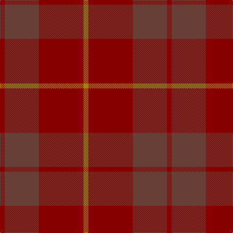

In pattern [RBRY](/patterns/rbry/).

This was sourced from tartans-authority.  It is a [4 stripes tartan](/stripes/stripes4/).

Original link http://www.tartansauthority.com/tartan-ferret/display/1537/

## Thread count
DR/10 N70 DR92 DY/10

## Palette
Each colour and its ΔE from the base-6 reference it is a variant of.

| Colour | Shade | Base | ΔE (OKLab) |
|---|---|---|---|
| DR | <code style="background-color:#880000;">#880000</code> `#880000` | R <code style="background-color:#C80000;">#C80000</code> | 0.14 |
| DY | <code style="background-color:#A88000;">#A88000</code> `#A88000` | Y <code style="background-color:#E8C000;">#E8C000</code> | 0.20 |
| N | <code style="background-color:#684038;">#684038</code> `#684038` | B <code style="background-color:#2C4084;">#2C4084</code> | 0.16 |

# Sample pattern

ID: /setts/s4/r10b70r92y10-b684038-r880000-ya88000/
