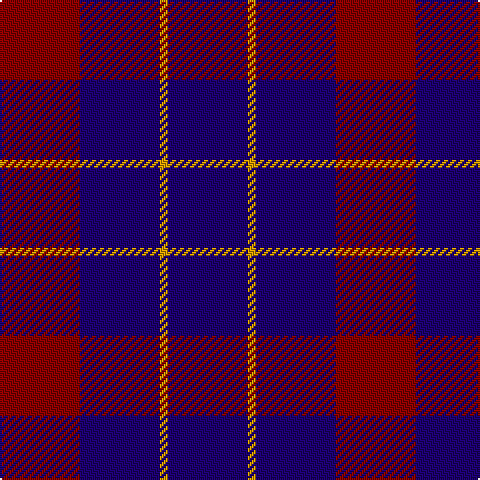

In pattern [BYBR](/stripes/bybr/).

This was sourced from register-of-tartans.  It is a [4 stripe tartan](/stripes/stripes4/).

Original link https://www.tartanregister.gov.uk/tartanDetails.aspx?ref=3025

## Register references

External register numbers recorded for this tartan.

- Scottish Register of Tartans: [3025](https://www.tartanregister.gov.uk/tartanDetails.aspx?ref=3025)
- Scottish Tartans Authority (ITI): 2312
- Scottish Tartans World Register: 2312

## Thread count
DR/40 DB40 DY4 DB/40

## Palette
Each colour and the base-6 reference it is a variant of.

| Colour | Shade | Base |
|---|---|---|
| DB | <code style="background-color:#1C0070;">#1C0070</code> `oklch(26.3% 0.162 277.1)` <small>#1C0070</small> | B <code style="background-color:#2A418A;">#2A418A</code> |
| DR | <code style="background-color:#880000;">#880000</code> `oklch(39.4% 0.162 29.2)` <small>#880000</small> | R <code style="background-color:#CC0000;">#CC0000</code> |
| DY | <code style="background-color:#D09800;">#D09800</code> `oklch(71.4% 0.147 82.1)` <small>#D09800</small> | Y <code style="background-color:#F2BF00;">#F2BF00</code> |
| LN | <code style="background-color:#E0E0E0;">#E0E0E0</code> `oklch(90.7% 0.000 89.9)` <small>#E0E0E0</small> | W <code style="background-color:#F7F7F7;">#F7F7F7</code> |

# Sample pattern

## Nearest tartans

The nearest existing variants by ΔTartan distance.

1. [Highland Spirit (Fashion)](/setts/s5/dp15k5dp15k21w2~x2/) — ΔT 1.43
1. [Masai Shuka 22 (Artefact)](/setts/s4/db20w1r12db12~x4/) — ΔT 1.59
1. [Highland Spirit](/setts/s8/k21dp15k5dp15k5dp15k21w2~x2/) — ΔT 1.82
1. [Scottish Nuclear](/setts/s6/db9k4lb1k4db9r1~x4/) — ΔT 1.85
1. [Moorlands (Corporate)](/setts/s5/dp27k10dp27k35ly6/) — ΔT 1.89
1. [Baru](/setts/s5/dp23dg8dp23dg35w5~x2/) — ΔT 1.93
1. [Robbins](/setts/s6/db1r3db1r3db6g1~x8/) — ΔT 1.93
1. [Hamilton](/setts/s5/db6r1db6r9lr1~x2/) — ΔT 2.02
1. [Unidentified Plaid #10](/setts/s7/db27r5db27r3db3r30db23~x2/) — ΔT 2.14
1. [Scottish Nuclear (Corporate)](/setts/s4/r1db9k4lb1~x4/) — ΔT 2.14

## Neighbour map

Every grey dot is one of 14299 variants placed by the first two principal components of the ΔTartan feature space (44% of its variance). Red is this tartan; blue dots are its nearest — click one to open its page.

<svg viewBox="0 0 640 380" role="img" style="max-width:100%;height:auto;border:1px solid #e0e0e0;border-radius:4px;display:block" xmlns="http://www.w3.org/2000/svg"><image href="/nn/cloud.v1.png" width="640" height="380"/><a href="/setts/s5/dp15k5dp15k21w2~x2/"><circle cx="336.7" cy="267.1" r="4" fill="#3465a4"><title>Highland Spirit (Fashion)</title></circle></a><a href="/setts/s4/db20w1r12db12~x4/"><circle cx="460.5" cy="252.0" r="4" fill="#3465a4"><title>Masai Shuka 22 (Artefact)</title></circle></a><a href="/setts/s8/k21dp15k5dp15k5dp15k21w2~x2/"><circle cx="339.7" cy="261.2" r="4" fill="#3465a4"><title>Highland Spirit</title></circle></a><a href="/setts/s6/db9k4lb1k4db9r1~x4/"><circle cx="382.3" cy="257.2" r="4" fill="#3465a4"><title>Scottish Nuclear</title></circle></a><a href="/setts/s5/dp27k10dp27k35ly6/"><circle cx="286.3" cy="286.1" r="4" fill="#3465a4"><title>Moorlands (Corporate)</title></circle></a><a href="/setts/s5/dp23dg8dp23dg35w5~x2/"><circle cx="293.3" cy="277.7" r="4" fill="#3465a4"><title>Baru</title></circle></a><a href="/setts/s6/db1r3db1r3db6g1~x8/"><circle cx="332.3" cy="272.8" r="4" fill="#3465a4"><title>Robbins</title></circle></a><a href="/setts/s5/db6r1db6r9lr1~x2/"><circle cx="313.1" cy="249.9" r="4" fill="#3465a4"><title>Hamilton</title></circle></a><a href="/setts/s7/db27r5db27r3db3r30db23~x2/"><circle cx="437.3" cy="257.1" r="4" fill="#3465a4"><title>Unidentified Plaid #10</title></circle></a><a href="/setts/s4/r1db9k4lb1~x4/"><circle cx="346.7" cy="243.5" r="4" fill="#3465a4"><title>Scottish Nuclear (Corporate)</title></circle></a><circle cx="393.5" cy="296.6" r="5" fill="#c00000"/></svg>

ID: /setts/s4/r10db10lo1~x4/
