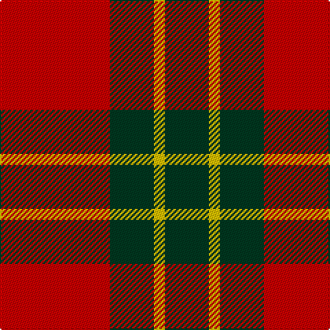

In pattern [GYGR](/stripes/gygr/).

This was sourced from tartans-authority.  It is a [4 stripe tartan](/stripes/stripes4/).

Original link http://www.tartansauthority.com/tartan-ferret/display/10946/

## Thread count
R/80 DG32 Y8 DG/32

## Palette
Each colour and its ΔE from the base-6 reference it is a variant of.

| Colour | Shade | Base | ΔE (OKLab) |
|---|---|---|---|
| DG | <code style="background-color:#003820;">#003820</code> `#003820` | G <code style="background-color:#006100;">#006100</code> | 0.15 |
| R | <code style="background-color:#C80000;">#C80000</code> `#C80000` | R <code style="background-color:#CC0000;">#CC0000</code> | 0.01 |
| Y | <code style="background-color:#E8C000;">#E8C000</code> `#E8C000` | Y <code style="background-color:#F2BF00;">#F2BF00</code> | 0.02 |

# Sample pattern

## Nearest tartans

The nearest existing variants by ΔTartan distance.

1. [MacDonald Lord of the Isles #2](/setts/s5/dg16r5dg2r18k2~x2/) — ΔT 0.73
1. [MacKinnon #6](/setts/s4/r3dg20r25w3~x4/) — ΔT 0.75
1. [MacDonald of Sleat](/setts/s5/dg7r3dg1r9k1~x2/) — ΔT 0.76
1. [Lugo (2013)](/setts/s4/r10dg4lo1~x8/) — ΔT 0.91
1. [Prince of Orange](/setts/s4/t6do28lo20t3~x2/) — ΔT 0.96
1. [Unidentified Plaid #3](/setts/s5/dg24r3dg16r33w4/) — ΔT 1.00
1. [MacGregor of Balquhidder](/setts/s5/dg8r2dg9r16w1~x2/) — ΔT 1.02
1. [MacDonald, Lord of The Isles (Artef)](/setts/s5/g16r5g2r18k2~x2/) — ΔT 1.06
1. [Murray, Lord George (Hose)](/setts/s5/k1r5g10r5g1~x4/) — ΔT 1.15
1. [Wallace](/setts/s4/k1r8k8ly1~x6/) — ΔT 1.18

## Neighbour map

Every grey dot is one of 14299 variants placed by the first two principal components of the ΔTartan feature space (44% of its variance). Red is this tartan; blue dots are its nearest — click one to open its page.

<svg viewBox="0 0 640 380" role="img" style="max-width:100%;height:auto;border:1px solid #e0e0e0;border-radius:4px;display:block" xmlns="http://www.w3.org/2000/svg"><image href="/nn/cloud.v1.png" width="640" height="380"/><a href="/setts/s5/dg16r5dg2r18k2~x2/"><circle cx="343.2" cy="232.8" r="4" fill="#3465a4"><title>MacDonald Lord of the Isles #2</title></circle></a><a href="/setts/s4/r3dg20r25w3~x4/"><circle cx="335.1" cy="239.8" r="4" fill="#3465a4"><title>MacKinnon #6</title></circle></a><a href="/setts/s5/dg7r3dg1r9k1~x2/"><circle cx="354.7" cy="237.0" r="4" fill="#3465a4"><title>MacDonald of Sleat</title></circle></a><a href="/setts/s4/r10dg4lo1~x8/"><circle cx="349.6" cy="263.4" r="4" fill="#3465a4"><title>Lugo (2013)</title></circle></a><a href="/setts/s4/t6do28lo20t3~x2/"><circle cx="283.0" cy="244.4" r="4" fill="#3465a4"><title>Prince of Orange</title></circle></a><a href="/setts/s5/dg24r3dg16r33w4/"><circle cx="308.3" cy="231.1" r="4" fill="#3465a4"><title>Unidentified Plaid #3</title></circle></a><a href="/setts/s5/dg8r2dg9r16w1~x2/"><circle cx="346.6" cy="217.1" r="4" fill="#3465a4"><title>MacGregor of Balquhidder</title></circle></a><a href="/setts/s5/g16r5g2r18k2~x2/"><circle cx="352.4" cy="240.2" r="4" fill="#3465a4"><title>MacDonald, Lord of The Isles (Artef)</title></circle></a><a href="/setts/s5/k1r5g10r5g1~x4/"><circle cx="324.0" cy="239.4" r="4" fill="#3465a4"><title>Murray, Lord George (Hose)</title></circle></a><a href="/setts/s4/k1r8k8ly1~x6/"><circle cx="305.8" cy="242.6" r="4" fill="#3465a4"><title>Wallace</title></circle></a><circle cx="331.2" cy="248.6" r="5" fill="#c00000"/></svg>

ID: /setts/s4/r10dg4ly1~x8/
