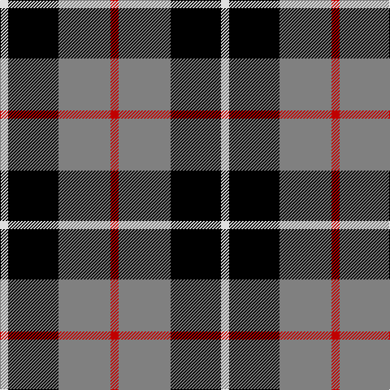

In pattern [RGKW](/patterns/rgkw/).

This was sourced from weddslist.  It is a [4 stripes tartan](/stripes/stripes4/).

Original link http://www.weddslist.com/cgi-bin/tartans/pg.pl?source=sts

## Thread count
LN/10 K62 N64 R/10

## Palette
Each colour and its ΔE from the base-6 reference it is a variant of.

| Colour | Shade | Base | ΔE (OKLab) |
|---|---|---|---|
| K | <code style="background-color:#000000;">#000000</code> `#000000` | K <code style="background-color:#000000;">#000000</code> | 0.00 |
| LN | <code style="background-color:#E0E0E0;">#E0E0E0</code> `#E0E0E0` | W <code style="background-color:#F4F4F0;">#F4F4F0</code> | 0.06 |
| N | <code style="background-color:#808080;">#808080</code> `#808080` | G <code style="background-color:#006400;">#006400</code> | 0.22 |
| R | <code style="background-color:#C00000;">#C00000</code> `#C00000` | R <code style="background-color:#C80000;">#C80000</code> | 0.02 |

# Sample pattern

## Nearest tartans

The nearest existing variants by ΔTartan distance.

1. [Mayer, Chris (Personal)](/setts/s4/b10g60k60r10-b0000ff-g808080-k000000-rff0000/) — ΔT 0.49
1. [Loganair](/setts/s4/r10ra64k62w10-k101010-r880000-ra888888-we0e0e0/) — ΔT 0.87
1. [Loganair Uniform Skirt Corporate Tartan Tartan Number: 1629. Earliest known date: c.1985 Half actual count for display. Used until 1988 See products available Copyright © Blair Urquhart, Comrie, 2015](/setts/s4/r5ra32k31w5-k101010-rc80000-ra888888-we0e0e0/) — ΔT 0.90
1. [Oban, Grey](/setts/s5/k16w12k16g36r4-g808080-k000000-rc00000-we0e0e0/) — ΔT 0.95
1. [Thompson, Dress (Clan)](/setts/s4/r12ra64k64w12-k101010-r880000-ra888888-wc0c0c0/) — ΔT 1.00
1. [Greystone (Burberry Grey)](/setts/s5/k18w18k18b60r6-b646464-k000000-r8c0000-wc8c8c8/) — ΔT 1.05
1. [Salt Spring Island](/setts/s4/r4g24b24w4-b000048-g285800-rdc0000-wffffff/) — ΔT 1.11
1. [Meg, Merrilees](/setts/s6/w46b12w12r10k70r20-b304080-k000000-rc00000-we0e0e0/) — ΔT 1.29
1. [MacArthur of Milton, hunting](/setts/s6/g28b4g4k16ba18k4-b304080-ba800080-g008000-k000000/) — ΔT 1.32
1. [Unidentified 27](/setts/s4/b16k6r8y2-b304080-k000000-rc00000-yf0c000/) — ΔT 1.33

## Neighbour map

Every grey dot is one of 15726 variants placed by the first two principal components of the ΔTartan feature space (44% of its variance). Red is this tartan; blue dots are its nearest — click one to open its page.

<svg viewBox="0 0 640 380" role="img" style="max-width:100%;height:auto;border:1px solid #e0e0e0;border-radius:4px;display:block" xmlns="http://www.w3.org/2000/svg"><image href="/nn/cloud.v1.png" width="640" height="380"/><a href="/setts/s4/b10g60k60r10-b0000ff-g808080-k000000-rff0000/"><circle cx="190.3" cy="245.3" r="4" fill="#3465a4"><title>Mayer, Chris (Personal)</title></circle></a><a href="/setts/s4/r10ra64k62w10-k101010-r880000-ra888888-we0e0e0/"><circle cx="209.3" cy="242.1" r="4" fill="#3465a4"><title>Loganair</title></circle></a><a href="/setts/s4/r5ra32k31w5-k101010-rc80000-ra888888-we0e0e0/"><circle cx="208.5" cy="240.8" r="4" fill="#3465a4"><title>Loganair Uniform Skirt Corporate Tartan Tartan Number: 1629. Earliest known date: c.1985 Half actual count for display. Used until 1988 See products available Copyright © Blair Urquhart, Comrie, 2015</title></circle></a><a href="/setts/s5/k16w12k16g36r4-g808080-k000000-rc00000-we0e0e0/"><circle cx="174.6" cy="223.3" r="4" fill="#3465a4"><title>Oban, Grey</title></circle></a><a href="/setts/s4/r12ra64k64w12-k101010-r880000-ra888888-wc0c0c0/"><circle cx="191.9" cy="253.9" r="4" fill="#3465a4"><title>Thompson, Dress (Clan)</title></circle></a><a href="/setts/s5/k18w18k18b60r6-b646464-k000000-r8c0000-wc8c8c8/"><circle cx="229.4" cy="210.4" r="4" fill="#3465a4"><title>Greystone (Burberry Grey)</title></circle></a><a href="/setts/s4/r4g24b24w4-b000048-g285800-rdc0000-wffffff/"><circle cx="197.8" cy="254.2" r="4" fill="#3465a4"><title>Salt Spring Island</title></circle></a><a href="/setts/s6/w46b12w12r10k70r20-b304080-k000000-rc00000-we0e0e0/"><circle cx="157.2" cy="202.0" r="4" fill="#3465a4"><title>Meg, Merrilees</title></circle></a><a href="/setts/s6/g28b4g4k16ba18k4-b304080-ba800080-g008000-k000000/"><circle cx="175.4" cy="224.5" r="4" fill="#3465a4"><title>MacArthur of Milton, hunting</title></circle></a><a href="/setts/s4/b16k6r8y2-b304080-k000000-rc00000-yf0c000/"><circle cx="226.0" cy="243.3" r="4" fill="#3465a4"><title>Unidentified 27</title></circle></a><circle cx="196.2" cy="239.5" r="5" fill="#c00000"/></svg>

ID: /setts/s4/r10g64k62w10-g808080-k000000-rc00000-we0e0e0/
