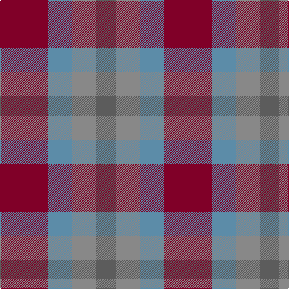

In pattern [BRBR](/stripes/brbr/).

This was sourced from tartans-authority.  It is a [4 stripe tartan](/stripes/stripes4/).

Original link http://www.tartansauthority.com/tartan-ferret/display/11035/

## Thread count
DR/80 B40 Na40 N/32

## Palette
Each colour and its ΔE from the base-6 reference it is a variant of.

| Colour | Shade | Base | ΔE (OKLab) |
|---|---|---|---|
| B | <code style="background-color:#5C8CA8;">#5C8CA8</code> `#5C8CA8` | B <code style="background-color:#2A418A;">#2A418A</code> | 0.23 |
| DR | <code style="background-color:#800028;">#800028</code> `#800028` | R <code style="background-color:#CC0000;">#CC0000</code> | 0.17 |
| N | <code style="background-color:#5C5C5C;">#5C5C5C</code> `#5C5C5C` | B <code style="background-color:#2A418A;">#2A418A</code> | 0.15 |
| Na | <code style="background-color:#888888;">#888888</code> `#888888` | R <code style="background-color:#CC0000;">#CC0000</code> | 0.24 |

# Sample pattern

## Nearest tartans

The nearest existing variants by ΔTartan distance.

1. [Clark Clerk(e)](/setts/s5/db3k1dg1k1m3~x16/) — ΔT 1.97
1. [Gleneagles Group](/setts/s7/r5g6ly2g6r5b6r2~x2/) — ΔT 1.98
1. [Kucher, Gregory (Personal)](/setts/s4/n2r1k1lr1~x10/) — ΔT 2.00
1. [Fraser Hunting](/setts/s6/r1o4g3o1db3o1~x2/) — ΔT 2.02
1. [Masai Shuka 19 (Artefact)](/setts/s3/b10r10r3~x2/) — ΔT 2.03
1. [Coleman, Sarah-Louise (Personal)](/setts/s4/dp3o1g2~x10/) — ΔT 2.08
1. [Hirstwood (Name)](/setts/s4/lo28r24dg55dp19~x2/) — ΔT 2.09
1. [Bristol Gramar School Check (School)](/setts/s6/r4n3n12db8n2r4/) — ΔT 2.13
1. [Wilson's, No 95](/setts/s5/t1g3r1p3t1~x4/) — ΔT 2.16
1. [Stewart, Fragment](/setts/s7/r3t4db11r11db11o3r3~x2/) — ΔT 2.19

## Neighbour map

Every grey dot is one of 14299 variants placed by the first two principal components of the ΔTartan feature space (44% of its variance). Red is this tartan; blue dots are its nearest — click one to open its page.

<svg viewBox="0 0 640 380" role="img" style="max-width:100%;height:auto;border:1px solid #e0e0e0;border-radius:4px;display:block" xmlns="http://www.w3.org/2000/svg"><image href="/nn/cloud.v1.png" width="640" height="380"/><a href="/setts/s5/db3k1dg1k1m3~x16/"><circle cx="182.6" cy="325.7" r="4" fill="#3465a4"><title>Clark Clerk(e)</title></circle></a><a href="/setts/s7/r5g6ly2g6r5b6r2~x2/"><circle cx="138.3" cy="310.0" r="4" fill="#3465a4"><title>Gleneagles Group</title></circle></a><a href="/setts/s4/n2r1k1lr1~x10/"><circle cx="104.8" cy="338.8" r="4" fill="#3465a4"><title>Kucher, Gregory (Personal)</title></circle></a><a href="/setts/s6/r1o4g3o1db3o1~x2/"><circle cx="242.6" cy="302.9" r="4" fill="#3465a4"><title>Fraser Hunting</title></circle></a><a href="/setts/s3/b10r10r3~x2/"><circle cx="237.7" cy="338.1" r="4" fill="#3465a4"><title>Masai Shuka 19 (Artefact)</title></circle></a><a href="/setts/s4/dp3o1g2~x10/"><circle cx="195.5" cy="324.5" r="4" fill="#3465a4"><title>Coleman, Sarah-Louise (Personal)</title></circle></a><a href="/setts/s4/lo28r24dg55dp19~x2/"><circle cx="163.0" cy="320.7" r="4" fill="#3465a4"><title>Hirstwood (Name)</title></circle></a><a href="/setts/s6/r4n3n12db8n2r4/"><circle cx="197.5" cy="265.4" r="4" fill="#3465a4"><title>Bristol Gramar School Check (School)</title></circle></a><a href="/setts/s5/t1g3r1p3t1~x4/"><circle cx="124.1" cy="287.8" r="4" fill="#3465a4"><title>Wilson's, No 95</title></circle></a><a href="/setts/s7/r3t4db11r11db11o3r3~x2/"><circle cx="244.4" cy="276.6" r="4" fill="#3465a4"><title>Stewart, Fragment</title></circle></a><circle cx="178.3" cy="344.1" r="5" fill="#c00000"/></svg>

ID: /setts/s4/r10t5o5n4~x8/
