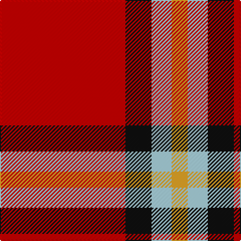

In pattern [RKWY](/stripes/rkwy/).

This was sourced from tartans-authority.  It is a [4 stripe tartan](/stripes/stripes4/).

Original link http://www.tartansauthority.com/tartan-ferret/display/10188/

## Thread count
R/125 K26 LB20 Y/16

## Palette
Each colour and its ΔE from the base-6 reference it is a variant of.

| Colour | Shade | Base | ΔE (OKLab) |
|---|---|---|---|
| K | <code style="background-color:#101010;">#101010</code> `#101010` | K <code style="background-color:#000000;">#000000</code> | 0.17 |
| LB | <code style="background-color:#A8D0EC;">#A8D0EC</code> `#A8D0EC` | W <code style="background-color:#F7F7F7;">#F7F7F7</code> | 0.15 |
| R | <code style="background-color:#C80000;">#C80000</code> `#C80000` | R <code style="background-color:#CC0000;">#CC0000</code> | 0.01 |
| Y | <code style="background-color:#FCA428;">#FCA428</code> `#FCA428` | Y <code style="background-color:#F2BF00;">#F2BF00</code> | 0.07 |

# Sample pattern

## Nearest tartans

The nearest existing variants by ΔTartan distance.

1. [Masai Shuka 26 (Artefact)](/setts/s4/ly3k2r10k1~x4/) — ΔT 1.17
1. [Loch Morar](/setts/s5/r38w9r3dr9w3~x2/) — ΔT 1.24
1. [Loch Morar Trade Tartan Tartan Number: 1701. Earliest known date: pre 2003 Nothing See products available Copyright © Blair Urquhart, Comrie, 2015](/setts/s5/r38w9r3do9w3~x2/) — ΔT 1.26
1. [Ploysongsang, Edward Thiravej (Pers](/setts/s6/r34w4t7ly10t7r18~x2/) — ΔT 1.37
1. [Turner (Personal)](/setts/s5/r48k12o7k5w3~x2/) — ΔT 1.38
1. [Sinclair](/setts/s5/r30dg12k5lb8r30/) — ΔT 1.46
1. [Masai Shuka 20 (Artefact)](/setts/s3/r30k10ly3~x4/) — ΔT 1.50
1. [Sinclair Dress](/setts/s5/r28dg16k4lb7r28/) — ΔT 1.50
1. [Instakilt, Red (Fashion)](/setts/s7/r8w4r50k12r4k15g5~x2/) — ΔT 1.52
1. [Billy Apple® Red](/setts/s4/g1r13k8ly1~x6/) — ΔT 1.56

## Neighbour map

Every grey dot is one of 14299 variants placed by the first two principal components of the ΔTartan feature space (44% of its variance). Red is this tartan; blue dots are its nearest — click one to open its page.

<svg viewBox="0 0 640 380" role="img" style="max-width:100%;height:auto;border:1px solid #e0e0e0;border-radius:4px;display:block" xmlns="http://www.w3.org/2000/svg"><image href="/nn/cloud.v1.png" width="640" height="380"/><a href="/setts/s4/ly3k2r10k1~x4/"><circle cx="367.3" cy="212.0" r="4" fill="#3465a4"><title>Masai Shuka 26 (Artefact)</title></circle></a><a href="/setts/s5/r38w9r3dr9w3~x2/"><circle cx="412.6" cy="182.4" r="4" fill="#3465a4"><title>Loch Morar</title></circle></a><a href="/setts/s5/r38w9r3do9w3~x2/"><circle cx="414.5" cy="182.1" r="4" fill="#3465a4"><title>Loch Morar Trade Tartan Tartan Number: 1701. Earliest known date: pre 2003 Nothing See products available Copyright © Blair Urquhart, Comrie, 2015</title></circle></a><a href="/setts/s6/r34w4t7ly10t7r18~x2/"><circle cx="353.4" cy="200.3" r="4" fill="#3465a4"><title>Ploysongsang, Edward Thiravej (Pers</title></circle></a><a href="/setts/s5/r48k12o7k5w3~x2/"><circle cx="395.1" cy="161.0" r="4" fill="#3465a4"><title>Turner (Personal)</title></circle></a><a href="/setts/s5/r30dg12k5lb8r30/"><circle cx="364.7" cy="234.4" r="4" fill="#3465a4"><title>Sinclair</title></circle></a><a href="/setts/s3/r30k10ly3~x4/"><circle cx="434.4" cy="240.2" r="4" fill="#3465a4"><title>Masai Shuka 20 (Artefact)</title></circle></a><a href="/setts/s5/r28dg16k4lb7r28/"><circle cx="347.4" cy="233.8" r="4" fill="#3465a4"><title>Sinclair Dress</title></circle></a><a href="/setts/s7/r8w4r50k12r4k15g5~x2/"><circle cx="366.4" cy="150.1" r="4" fill="#3465a4"><title>Instakilt, Red (Fashion)</title></circle></a><a href="/setts/s4/g1r13k8ly1~x6/"><circle cx="330.1" cy="191.1" r="4" fill="#3465a4"><title>Billy Apple® Red</title></circle></a><circle cx="376.6" cy="200.7" r="5" fill="#c00000"/></svg>

ID: /setts/s4/r125k26lb20lo16/
