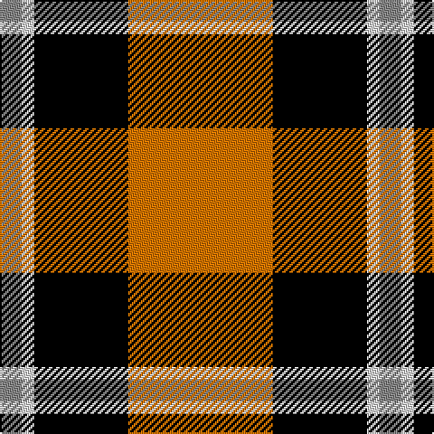

In pattern [RKWR](/patterns/rkwr/).

This was sourced from register-of-tartans.  It is a [4 stripes tartan](/stripes/stripes4/).

Original link https://www.tartanregister.gov.uk/tartanDetails.aspx?ref=5803

## Thread count
N/12 LN7 K52 O/80

## Palette
Each colour and its ΔE from the base-6 reference it is a variant of.

| Colour | Shade | Base | ΔE (OKLab) |
|---|---|---|---|
| K | <code style="background-color:#000000;">#000000</code> `#000000` | K <code style="background-color:#000000;">#000000</code> | 0.00 |
| LN | <code style="background-color:#E0E0E0;">#E0E0E0</code> `#E0E0E0` | W <code style="background-color:#F4F4F0;">#F4F4F0</code> | 0.06 |
| N | <code style="background-color:#888888;">#888888</code> `#888888` | R <code style="background-color:#C80000;">#C80000</code> | 0.24 |
| O | <code style="background-color:#DD7500;">#DD7500</code> `#DD7500` | R <code style="background-color:#C80000;">#C80000</code> | 0.18 |

# Sample pattern

ID: /setts/s4/r12w7k52ra80-k000000-r888888-radd7500-we0e0e0/
