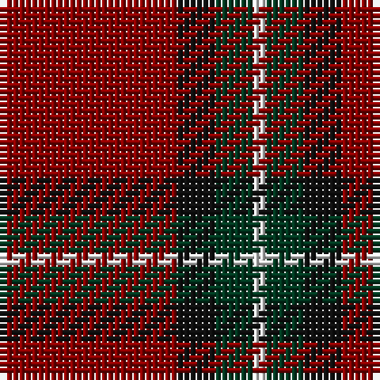

**Bands:** [RKGW](/stripes/rkgw/) · **Stripes:** [R K DG W](/stripes/stripes4/) R K DG W

This was sourced from tartans-authority.  It is a [4 band tartan](/bands/bands4/).

Original link http://www.tartansauthority.com/tartan-ferret/display/3627/

## Attestations

This cloth appears in 2 source records; the oldest owns this page.

- pre 2002 — Bacon, Red (Fashion) (tartans-authority, [record](http://www.tartansauthority.com/tartan-ferret/display/3627/))
- undated — Bacon, Red (register-of-tartans, [record](https://www.tartanregister.gov.uk/tartanDetails.aspx?ref=5148))

## Register references

External register numbers recorded for this tartan.

- Scottish Register of Tartans: [5148](https://www.tartanregister.gov.uk/tartanDetails.aspx?ref=5148)
- Scottish Tartans Authority (ITI): 3627

## Thread count
DR/28 K6 DG6 LN/2

## Palette
Each colour and its ΔE from the base-6 reference it is a variant of.

| Colour | Shade | Base | ΔE (OKLab) |
|---|---|---|---|
| DG | <code style="background-color:#003820;">#003820</code> `#003820` | G <code style="background-color:#006100;">#006100</code> | 0.15 |
| DR | <code style="background-color:#880000;">#880000</code> `#880000` | R <code style="background-color:#CC0000;">#CC0000</code> | 0.15 |
| K | <code style="background-color:#101010;">#101010</code> `#101010` | K <code style="background-color:#000000;">#000000</code> | 0.17 |
| LN | <code style="background-color:#E0E0E0;">#E0E0E0</code> `#E0E0E0` | W <code style="background-color:#F7F7F7;">#F7F7F7</code> | 0.07 |

# Sample pattern

## Nearest tartans

The nearest existing variants by ΔTartan distance.

1. [Broberg (Scania) (Personal)](/setts/s4/r80t40k5lo6/) — ΔT 1.22
1. [MacKintosh D](/setts/s6/r22db5r2dg11r3db1~x2/) — ΔT 1.47
1. [MacGregor of Cardney](/setts/s6/m18g9m2g3k1w1~x4/) — ΔT 1.48
1. [Dunbar (District)](/setts/s6/k8r49k8lb3k20lo3~x2/) — ΔT 1.48
1. [Highlands at Wyomissing, The](/setts/s5/r35w3r8ly2g11~x2/) — ΔT 1.50
1. [MacGregor Hunting Glengyle Clan Tartan Tartan Number: 1285. Earliest known date: 1960 This is the usual MacGregor sett but with a darker crimson background colour. The story goes that Alasdair MacGregor of Cardney wanted to make tartan from the wool of his own sheep. His initial dyeing attempt produced a shocking pink colour, so he dyed the wool a second time to get this dark crimson colour. He liked the result so much that he had a bolt of cloth woven and the Cardney MacGregors have worn it ever since. The addition of the term 'Hunting' to the name is, apparently a commercial attribution. Notes from the STA, quoting Sir Malcolm MacGregor of MacGregor (2006) See products available Copyright © Blair Urquhart, Comrie, 2015](/setts/s6/m96g42m16g17k4lb6/) — ΔT 1.52
1. [MacKintosh](/setts/s6/r24db6r3dg12r4db1~x2/) — ΔT 1.52
1. [Loch Garth](/setts/s4/do12y6do2lo1~x4/) — ΔT 1.53
1. [Auld Reekie](/setts/s6/db4r3db3r22dg8r2~x2/) — ΔT 1.53
1. [MacGregor, Glengyle](/setts/s6/r96g42r16g17k4y6/) — ΔT 1.56

## Neighbour map

Every grey dot is one of 14299 variants placed by the first two principal components of the ΔTartan feature space (44% of its variance). Red is this tartan; blue dots are its nearest — click one to open its page.

<svg viewBox="0 0 640 380" role="img" style="max-width:100%;height:auto;border:1px solid #e0e0e0;border-radius:4px;display:block" xmlns="http://www.w3.org/2000/svg"><image href="/nn/cloud.v1.png" width="640" height="380"/><a href="/setts/s4/r80t40k5lo6/"><circle cx="406.5" cy="203.6" r="4" fill="#3465a4"><title>Broberg (Scania) (Personal)</title></circle></a><a href="/setts/s6/r22db5r2dg11r3db1~x2/"><circle cx="428.4" cy="191.6" r="4" fill="#3465a4"><title>MacKintosh D</title></circle></a><a href="/setts/s6/m18g9m2g3k1w1~x4/"><circle cx="396.4" cy="173.1" r="4" fill="#3465a4"><title>MacGregor of Cardney</title></circle></a><a href="/setts/s6/k8r49k8lb3k20lo3~x2/"><circle cx="371.7" cy="182.9" r="4" fill="#3465a4"><title>Dunbar (District)</title></circle></a><a href="/setts/s5/r35w3r8ly2g11~x2/"><circle cx="468.7" cy="180.6" r="4" fill="#3465a4"><title>Highlands at Wyomissing, The</title></circle></a><a href="/setts/s6/m96g42m16g17k4lb6/"><circle cx="429.7" cy="167.8" r="4" fill="#3465a4"><title>MacGregor Hunting Glengyle Clan Tartan Tartan Number: 1285. Earliest known date: 1960 This is the usual MacGregor sett but with a darker crimson background colour. The story goes that Alasdair MacGregor of Cardney wanted to make tartan from the wool of his own sheep. His initial dyeing attempt produced a shocking pink colour, so he dyed the wool a second time to get this dark crimson colour. He liked the result so much that he had a bolt of cloth woven and the Cardney MacGregors have worn it ever since. The addition of the term 'Hunting' to the name is, apparently a commercial attribution. Notes from the STA, quoting Sir Malcolm MacGregor of MacGregor (2006) See products available Copyright © Blair Urquhart, Comrie, 2015</title></circle></a><a href="/setts/s6/r24db6r3dg12r4db1~x2/"><circle cx="430.6" cy="192.7" r="4" fill="#3465a4"><title>MacKintosh</title></circle></a><a href="/setts/s4/do12y6do2lo1~x4/"><circle cx="449.3" cy="255.6" r="4" fill="#3465a4"><title>Loch Garth</title></circle></a><a href="/setts/s6/db4r3db3r22dg8r2~x2/"><circle cx="400.1" cy="201.9" r="4" fill="#3465a4"><title>Auld Reekie</title></circle></a><a href="/setts/s6/r96g42r16g17k4y6/"><circle cx="422.6" cy="167.4" r="4" fill="#3465a4"><title>MacGregor, Glengyle</title></circle></a><circle cx="430.3" cy="212.6" r="5" fill="#c00000"/></svg>

ID: /setts/s4/r14k3dg3w1~x2/
