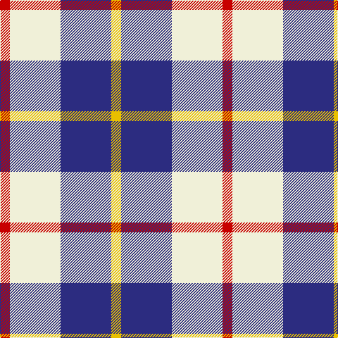

In pattern [RWBY](/patterns/rwby/).

This was sourced from register-of-tartans.  It is a [4 stripes tartan](/stripes/stripes4/).

Original link https://www.tartanregister.gov.uk/tartanDetails.aspx?ref=2750

## Attestations

This cloth appears in 2 source records; the oldest owns this page.

- 01/01/1893 — MacRae of Conchra #3 (register-of-tartans, [record](https://www.tartanregister.gov.uk/tartanDetails.aspx?ref=2750))
- 1893 — MacRae of Conchra - 1893 (Clan) (tartans-authority, [record](http://www.tartansauthority.com/tartan-ferret/display/1683/))

## Thread count
R/14 LY72 DB72 Y/14

## Palette
Each colour and its ΔE from the base-6 reference it is a variant of.

| Colour | Shade | Base | ΔE (OKLab) |
|---|---|---|---|
| DB | <code style="background-color:#2C2C80;">#2C2C80</code> `#2C2C80` | B <code style="background-color:#2C4084;">#2C4084</code> | 0.05 |
| LY | <code style="background-color:#F0F0D8;">#F0F0D8</code> `#F0F0D8` | W <code style="background-color:#F4F4F0;">#F4F4F0</code> | 0.03 |
| R | <code style="background-color:#C80000;">#C80000</code> `#C80000` | R <code style="background-color:#C80000;">#C80000</code> | 0.00 |
| Y | <code style="background-color:#E8C000;">#E8C000</code> `#E8C000` | Y <code style="background-color:#E8C000;">#E8C000</code> | 0.00 |

# Sample pattern

ID: /setts/s4/r14w72b72y14-b2c2c80-rc80000-wf0f0d8-ye8c000/
