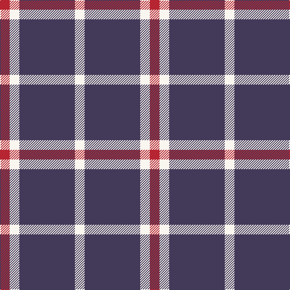

In pattern [RWBW](/patterns/rwbw/).

This was sourced from register-of-tartans.  It is a [4 stripes tartan](/stripes/stripes4/).

Original link https://www.tartanregister.gov.uk/tartanDetails.aspx?ref=10348

## Thread count
R/16 W16 N92 W/16

## Palette
Each colour and its ΔE from the base-6 reference it is a variant of.

| Colour | Shade | Base | ΔE (OKLab) |
|---|---|---|---|
| N | <code style="background-color:#433A5A;">#433A5A</code> `#433A5A` | B <code style="background-color:#2A418A;">#2A418A</code> | 0.09 |
| R | <code style="background-color:#B62531;">#B62531</code> `#B62531` | R <code style="background-color:#CC0000;">#CC0000</code> | 0.05 |
| W | <code style="background-color:#F9F5EF;">#F9F5EF</code> `#F9F5EF` | W <code style="background-color:#F7F7F7;">#F7F7F7</code> | 0.01 |

# Sample pattern

## Nearest tartans

The nearest existing variants by ΔTartan distance.

1. [Auchmaliddie Samkoma (Personal)](/setts/s4/r16w16b92w16-b003c64-rc80000-wfcfcfc/) — ΔT 0.94
1. [UEFA (Glasgow)](/setts/s6/r48b16y20b120y20b16-b3850c8-rc80000-ye8c000/) — ΔT 1.51
1. [Latin](/setts/s6/b6y18b6y18b40r6-b2c2c80-rc8002c-ybc8c00/) — ΔT 1.55
1. [Glen Moy Trade Tartan Tartan Number: 635. Earliest known date: pre 1992 Its mainly Sheep farming in Glen Moy. Off the beaten track, its a very quiet area of the Angus glens close to Cortachy castle and great for walking if you like it to yourself! Its also close to Glen Clova which is the busiest glen around here with some fantastic mountains for walking and taking photos. See products available Copyright © Blair Urquhart, Comrie, 2015](/setts/s5/b74w18b6r18w6-b202060-rc80000-we0e0e0/) — ΔT 1.60
1. [UEFA (Corporate)](/setts/s4/b120y20b16r48-b3850c8-rc80000-ye8c000/) — ΔT 1.64
1. [Buchanan VS](/setts/s6/y4b8y4b8y18k2-b59110d-k000000-yaaaaaa/) — ΔT 1.66
1. [Buchanan VS](/setts/s6/y2b4y2b4y9k1-b59110d-k000000-yaaaaaa/) — ΔT 1.66
1. [Glen App](/setts/s5/r78w18r6k18w6-k101010-r9c68a4-wfcfcfc/) — ΔT 1.66
1. [Lords of Skye (Fashion?)](/setts/s4/k92g14k16w40-g604000-k101010-wfcfcfc/) — ΔT 1.68
1. [Shembe Zulu Church](/setts/s5/k10w50r12k90w8-k101010-rc80000-wfcfcfc/) — ΔT 1.69

## Neighbour map

Every grey dot is one of 15726 variants placed by the first two principal components of the ΔTartan feature space (44% of its variance). Red is this tartan; blue dots are its nearest — click one to open its page.

<svg viewBox="0 0 640 380" role="img" style="max-width:100%;height:auto;border:1px solid #e0e0e0;border-radius:4px;display:block" xmlns="http://www.w3.org/2000/svg"><image href="/nn/cloud.v1.png" width="640" height="380"/><a href="/setts/s4/r16w16b92w16-b003c64-rc80000-wfcfcfc/"><circle cx="338.2" cy="241.7" r="4" fill="#3465a4"><title>Auchmaliddie Samkoma (Personal)</title></circle></a><a href="/setts/s6/r48b16y20b120y20b16-b3850c8-rc80000-ye8c000/"><circle cx="346.5" cy="218.6" r="4" fill="#3465a4"><title>UEFA (Glasgow)</title></circle></a><a href="/setts/s6/b6y18b6y18b40r6-b2c2c80-rc8002c-ybc8c00/"><circle cx="305.6" cy="240.3" r="4" fill="#3465a4"><title>Latin</title></circle></a><a href="/setts/s5/b74w18b6r18w6-b202060-rc80000-we0e0e0/"><circle cx="377.3" cy="200.1" r="4" fill="#3465a4"><title>Glen Moy Trade Tartan Tartan Number: 635. Earliest known date: pre 1992 Its mainly Sheep farming in Glen Moy. Off the beaten track, its a very quiet area of the Angus glens close to Cortachy castle and great for walking if you like it to yourself! Its also close to Glen Clova which is the busiest glen around here with some fantastic mountains for walking and taking photos. See products available Copyright © Blair Urquhart, Comrie, 2015</title></circle></a><a href="/setts/s4/b120y20b16r48-b3850c8-rc80000-ye8c000/"><circle cx="382.4" cy="251.2" r="4" fill="#3465a4"><title>UEFA (Corporate)</title></circle></a><a href="/setts/s6/y4b8y4b8y18k2-b59110d-k000000-yaaaaaa/"><circle cx="318.3" cy="224.4" r="4" fill="#3465a4"><title>Buchanan VS</title></circle></a><a href="/setts/s6/y2b4y2b4y9k1-b59110d-k000000-yaaaaaa/"><circle cx="318.3" cy="224.4" r="4" fill="#3465a4"><title>Buchanan VS</title></circle></a><a href="/setts/s5/r78w18r6k18w6-k101010-r9c68a4-wfcfcfc/"><circle cx="392.5" cy="187.6" r="4" fill="#3465a4"><title>Glen App</title></circle></a><a href="/setts/s4/k92g14k16w40-g604000-k101010-wfcfcfc/"><circle cx="336.6" cy="252.5" r="4" fill="#3465a4"><title>Lords of Skye (Fashion?)</title></circle></a><a href="/setts/s5/k10w50r12k90w8-k101010-rc80000-wfcfcfc/"><circle cx="316.6" cy="201.4" r="4" fill="#3465a4"><title>Shembe Zulu Church</title></circle></a><circle cx="351.3" cy="239.4" r="5" fill="#c00000"/></svg>

ID: /setts/s4/r16w16b92w16-b433a5a-rb62531-wf9f5ef/
