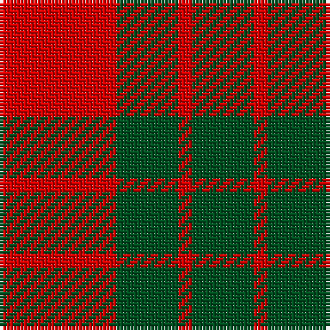

**Bands:** [RGRG](/stripes/rgrg/) · **Stripes:** [R DG R DG](/stripes/stripes4/) R DG R DG

This was sourced from register-of-tartans.  It is a [4 band tartan](/bands/bands4/).

Original link https://www.tartanregister.gov.uk/tartanDetails.aspx?ref=2460

## Also known as

This cloth is also recorded under:

- MacGregor of Glenstrae #2

## Register references

External register numbers recorded for this tartan.

- Scottish Register of Tartans: [2460](https://www.tartanregister.gov.uk/tartanDetails.aspx?ref=2460)
- Scottish Tartans World Register: 962

## Variants

Other setts woven to the same stripe pattern.

- [MacDonald Lord of the Isles](/setts/s4/r38dg2r5dg16/)
- [MacDonald Lord of the Isles](/setts/s4/r38dg2r5dg16~x2/)
- [MacDonald of Sleat - 1810 (Clan)](/setts/s4/r36dg2r5dg16~x2/)

## Thread count
R/34 G18 R4 G/18

## Palette
Each colour and its ΔE from the base-6 reference it is a variant of.

| Colour | Shade | Base | ΔE (OKLab) |
|---|---|---|---|
| G | <code style="background-color:#005020;">#005020</code> `#005020` | G <code style="background-color:#006100;">#006100</code> | 0.07 |
| R | <code style="background-color:#DC0000;">#DC0000</code> `#DC0000` | R <code style="background-color:#CC0000;">#CC0000</code> | 0.03 |

# Sample pattern

## Nearest tartans

The nearest existing variants by ΔTartan distance.

1. [MacGregor of Glenstrae](/setts/s4/r17g9r2~x2/) — ΔT 1.01
1. [Applecross](/setts/s4/r18g7r2g18~x2/) — ΔT 1.13
1. [Applecross (District)](/setts/s4/r18g7r2g18~x4/) — ΔT 1.13
1. [Lugo (2013)](/setts/s4/r10dg4ly1~x8/) — ΔT 1.20
1. [Lugo (2013)](/setts/s4/r10dg4lo1~x8/) — ΔT 1.28
1. [MacGregor of Glenstrae](/setts/s5/dg8r2dg9r16dg1~x2/) — ΔT 1.29
1. [MacKinnon #6](/setts/s4/r3dg20r25w3~x4/) — ΔT 1.43
1. [MacDonald Lord of the Isles #2](/setts/s5/dg16r5dg2r18k2~x2/) — ΔT 1.43
1. [MacDonald of Sleat](/setts/s5/dg7r3dg1r9k1~x2/) — ΔT 1.44
1. [MacDonald, Lord of The Isles (Artef)](/setts/s5/g16r5g2r18k2~x2/) — ΔT 1.45

## Neighbour map

Every grey dot is one of 14299 variants placed by the first two principal components of the ΔTartan feature space (44% of its variance). Red is this tartan; blue dots are its nearest — click one to open its page.

<svg viewBox="0 0 640 380" role="img" style="max-width:100%;height:auto;border:1px solid #e0e0e0;border-radius:4px;display:block" xmlns="http://www.w3.org/2000/svg"><image href="/nn/cloud.v1.png" width="640" height="380"/><a href="/setts/s4/r17g9r2~x2/"><circle cx="355.2" cy="293.5" r="4" fill="#3465a4"><title>MacGregor of Glenstrae</title></circle></a><a href="/setts/s4/r18g7r2g18~x2/"><circle cx="382.8" cy="292.3" r="4" fill="#3465a4"><title>Applecross</title></circle></a><a href="/setts/s4/r18g7r2g18~x4/"><circle cx="382.8" cy="292.3" r="4" fill="#3465a4"><title>Applecross (District)</title></circle></a><a href="/setts/s4/r10dg4ly1~x8/"><circle cx="331.2" cy="248.6" r="4" fill="#3465a4"><title>Lugo (2013)</title></circle></a><a href="/setts/s4/r10dg4lo1~x8/"><circle cx="349.6" cy="263.4" r="4" fill="#3465a4"><title>Lugo (2013)</title></circle></a><a href="/setts/s5/dg8r2dg9r16dg1~x2/"><circle cx="381.5" cy="238.1" r="4" fill="#3465a4"><title>MacGregor of Glenstrae</title></circle></a><a href="/setts/s4/r3dg20r25w3~x4/"><circle cx="335.1" cy="239.8" r="4" fill="#3465a4"><title>MacKinnon #6</title></circle></a><a href="/setts/s5/dg16r5dg2r18k2~x2/"><circle cx="343.2" cy="232.8" r="4" fill="#3465a4"><title>MacDonald Lord of the Isles #2</title></circle></a><a href="/setts/s5/dg7r3dg1r9k1~x2/"><circle cx="354.7" cy="237.0" r="4" fill="#3465a4"><title>MacDonald of Sleat</title></circle></a><a href="/setts/s5/g16r5g2r18k2~x2/"><circle cx="352.4" cy="240.2" r="4" fill="#3465a4"><title>MacDonald, Lord of The Isles (Artef)</title></circle></a><circle cx="349.8" cy="287.0" r="5" fill="#c00000"/></svg>

ID: /setts/s4/r17dg9r2~x2/
