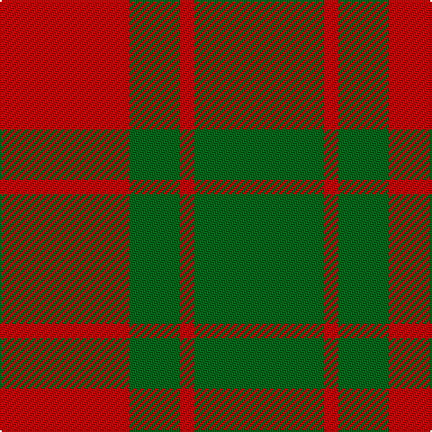

In pattern [GRGR](/stripes/grgr/).

This was sourced from tartans-authority.  It is a [4 stripe tartan](/stripes/stripes4/).

Original link http://www.tartansauthority.com/tartan-ferret/display/961/

## Thread count
R/72 G28 R8 G/72

## Palette
Each colour and its ΔE from the base-6 reference it is a variant of.

| Colour | Shade | Base | ΔE (OKLab) |
|---|---|---|---|
| G | <code style="background-color:#006818;">#006818</code> `#006818` | G <code style="background-color:#006100;">#006100</code> | 0.02 |
| R | <code style="background-color:#C80000;">#C80000</code> `#C80000` | R <code style="background-color:#CC0000;">#CC0000</code> | 0.01 |

# Sample pattern

## Nearest tartans

The nearest existing variants by ΔTartan distance.

1. [Applecross](/setts/s4/r18g7r2g18~x2/) — ΔT 0.00
1. [MacGregor of Glenstrae](/setts/s4/r17g9r2~x2/) — ΔT 0.59
1. [MacGregor of Glenstrae #2](/setts/s4/r17dg9r2~x2/) — ΔT 1.13
1. [MacGregor of Glen Strae](/setts/s5/g8r2g9r16g1~x2/) — ΔT 1.26
1. [Middleton](/setts/s4/g16r1g2r11~x8/) — ΔT 1.29
1. [Lugo (2013)](/setts/s4/r10dg4lo1~x8/) — ΔT 1.36
1. [Bryce](/setts/s4/r1g7r9ly1~x4/) — ΔT 1.46
1. [Murray, Lord George (Hose)](/setts/s5/k1r5g10r5g1~x4/) — ΔT 1.48
1. [MacDonald, Lord of The Isles (Artef)](/setts/s5/g16r5g2r18k2~x2/) — ΔT 1.50
1. [MacKinnon 11](/setts/s4/r3g20r25w3~x4/) — ΔT 1.52

## Neighbour map

Every grey dot is one of 14299 variants placed by the first two principal components of the ΔTartan feature space (44% of its variance). Red is this tartan; blue dots are its nearest — click one to open its page.

<svg viewBox="0 0 640 380" role="img" style="max-width:100%;height:auto;border:1px solid #e0e0e0;border-radius:4px;display:block" xmlns="http://www.w3.org/2000/svg"><image href="/nn/cloud.v1.png" width="640" height="380"/><a href="/setts/s4/r18g7r2g18~x2/"><circle cx="382.8" cy="292.3" r="4" fill="#3465a4"><title>Applecross</title></circle></a><a href="/setts/s4/r17g9r2~x2/"><circle cx="355.2" cy="293.5" r="4" fill="#3465a4"><title>MacGregor of Glenstrae</title></circle></a><a href="/setts/s4/r17dg9r2~x2/"><circle cx="349.8" cy="287.0" r="4" fill="#3465a4"><title>MacGregor of Glenstrae #2</title></circle></a><a href="/setts/s5/g8r2g9r16g1~x2/"><circle cx="386.8" cy="244.5" r="4" fill="#3465a4"><title>MacGregor of Glen Strae</title></circle></a><a href="/setts/s4/g16r1g2r11~x8/"><circle cx="443.1" cy="254.9" r="4" fill="#3465a4"><title>Middleton</title></circle></a><a href="/setts/s4/r10dg4lo1~x8/"><circle cx="349.6" cy="263.4" r="4" fill="#3465a4"><title>Lugo (2013)</title></circle></a><a href="/setts/s4/r1g7r9ly1~x4/"><circle cx="355.9" cy="245.7" r="4" fill="#3465a4"><title>Bryce</title></circle></a><a href="/setts/s5/k1r5g10r5g1~x4/"><circle cx="324.0" cy="239.4" r="4" fill="#3465a4"><title>Murray, Lord George (Hose)</title></circle></a><a href="/setts/s5/g16r5g2r18k2~x2/"><circle cx="352.4" cy="240.2" r="4" fill="#3465a4"><title>MacDonald, Lord of The Isles (Artef)</title></circle></a><a href="/setts/s4/r3g20r25w3~x4/"><circle cx="339.7" cy="246.1" r="4" fill="#3465a4"><title>MacKinnon 11</title></circle></a><circle cx="382.8" cy="292.3" r="5" fill="#c00000"/></svg>

ID: /setts/s4/r18g7r2g18~x4/
