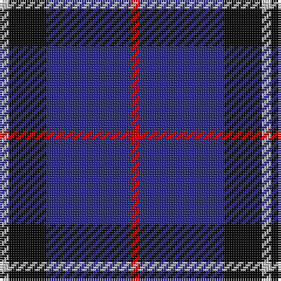

In pattern [RBKW](/stripes/rbkw/).

This was sourced from tartans-authority.  It is a [4 stripe tartan](/stripes/stripes4/).

Original link http://www.tartansauthority.com/tartan-ferret/display/2301/

## Thread count
N/4 K16 DB36 R/4

## Palette
Each colour and the base-6 reference it is a variant of.

| Colour | Shade | Base |
|---|---|---|
| DB | <code style="background-color:#2C2C80;">#2C2C80</code> `oklch(35.0% 0.138 276.6)` <small>#2C2C80</small> | B <code style="background-color:#2A418A;">#2A418A</code> |
| K | <code style="background-color:#101010;">#101010</code> `oklch(17.3% 0.000 89.9)` <small>#101010</small> | K <code style="background-color:#000000;">#000000</code> |
| N | <code style="background-color:#C0C0C0;">#C0C0C0</code> `oklch(80.8% 0.000 89.9)` <small>#C0C0C0</small> | W <code style="background-color:#F7F7F7;">#F7F7F7</code> |
| R | <code style="background-color:#C80000;">#C80000</code> `oklch(52.3% 0.215 29.2)` <small>#C80000</small> | R <code style="background-color:#CC0000;">#CC0000</code> |

# Sample pattern

## Nearest tartans

The nearest existing variants by ΔTartan distance, with this tartan at the top so the swatches line up against it.

ΔTartan

Tartan

Sett

—

<a href="/ttd/edit/#slug=r1db9k4lb1~x4">Scottish Nuclear (Corporate)</a> <a class="nn-out" href="/setts/s4/r1db9k4lb1~x4/" title="open its dictionary page">↗</a>

0.79

<a href="/ttd/edit/#slug=r5db26k12w2~x4">Mirror (Corporate)</a> <a class="nn-out" href="/setts/s4/r5db26k12w2~x4/" title="open its dictionary page">↗</a>

1.03

<a href="/ttd/edit/#slug=r21db43dt86lb10">Fong (Personal)</a> <a class="nn-out" href="/setts/s4/r21db43dt86lb10/" title="open its dictionary page">↗</a>

1.19

<a href="/ttd/edit/#slug=db14k3r3w1~x2">Bacon, Blue</a> <a class="nn-out" href="/setts/s4/db14k3r3w1~x2/" title="open its dictionary page">↗</a>

1.39

<a href="/ttd/edit/#slug=dg20r7db40w2~x2">McNiff, Kevin (Personal)</a> <a class="nn-out" href="/setts/s4/dg20r7db40w2~x2/" title="open its dictionary page">↗</a>

1.41

<a href="/ttd/edit/#slug=o11db1o3db1db9r1~x4">Dege, of Saville Row</a> <a class="nn-out" href="/setts/s6/o11db1o3db1db9r1~x4/" title="open its dictionary page">↗</a>

1.43

<a href="/ttd/edit/#slug=r1db12k5lo3db5lb1~x4">Massachusetts (Unofficial)</a> <a class="nn-out" href="/setts/s6/r1db12k5lo3db5lb1~x4/" title="open its dictionary page">↗</a>

1.44

<a href="/ttd/edit/#slug=r4k21w2k20db21k2db2~x2">St. Georges, Edgbaston</a> <a class="nn-out" href="/setts/s7/r4k21w2k20db21k2db2~x2/" title="open its dictionary page">↗</a>

1.45

<a href="/ttd/edit/#slug=db9k4lb1k4db9r1~x4">Scottish Nuclear</a> <a class="nn-out" href="/setts/s6/db9k4lb1k4db9r1~x4/" title="open its dictionary page">↗</a>

1.45

<a href="/ttd/edit/#slug=db9g16db59ly4~x2">Oxford University (Corporate)</a> <a class="nn-out" href="/setts/s4/db9g16db59ly4~x2/" title="open its dictionary page">↗</a>

1.45

<a href="/ttd/edit/#slug=r4db32k15w2~x2">Scottish Nuclear</a> <a class="nn-out" href="/setts/s4/r4db32k15w2~x2/" title="open its dictionary page">↗</a>

## Neighbour map

Every grey dot is one of 14299 variants placed by the first two principal components of the ΔTartan feature space (44% of its variance). Red is this tartan; blue dots are its nearest — click one to open its page.

<svg viewBox="0 0 640 380" role="img" style="max-width:100%;height:auto;border:1px solid #e0e0e0;border-radius:4px;display:block" xmlns="http://www.w3.org/2000/svg"><image href="/nn/cloud.v1.png" width="640" height="380"/><a href="/setts/s4/r5db26k12w2~x4/"><circle cx="330.3" cy="226.4" r="4" fill="#3465a4"><title>Mirror (Corporate)</title></circle></a><a href="/setts/s4/r21db43dt86lb10/"><circle cx="292.0" cy="257.5" r="4" fill="#3465a4"><title>Fong (Personal)</title></circle></a><a href="/setts/s4/db14k3r3w1~x2/"><circle cx="412.5" cy="224.3" r="4" fill="#3465a4"><title>Bacon, Blue</title></circle></a><a href="/setts/s4/dg20r7db40w2~x2/"><circle cx="370.8" cy="221.3" r="4" fill="#3465a4"><title>McNiff, Kevin (Personal)</title></circle></a><a href="/setts/s6/o11db1o3db1db9r1~x4/"><circle cx="329.2" cy="208.3" r="4" fill="#3465a4"><title>Dege, of Saville Row</title></circle></a><a href="/setts/s6/r1db12k5lo3db5lb1~x4/"><circle cx="324.5" cy="198.6" r="4" fill="#3465a4"><title>Massachusetts (Unofficial)</title></circle></a><a href="/setts/s7/r4k21w2k20db21k2db2~x2/"><circle cx="347.8" cy="222.1" r="4" fill="#3465a4"><title>St. Georges, Edgbaston</title></circle></a><a href="/setts/s6/db9k4lb1k4db9r1~x4/"><circle cx="382.3" cy="257.2" r="4" fill="#3465a4"><title>Scottish Nuclear</title></circle></a><a href="/setts/s4/db9g16db59ly4~x2/"><circle cx="422.9" cy="230.2" r="4" fill="#3465a4"><title>Oxford University (Corporate)</title></circle></a><a href="/setts/s4/r4db32k15w2~x2/"><circle cx="346.4" cy="208.8" r="4" fill="#3465a4"><title>Scottish Nuclear</title></circle></a><circle cx="346.7" cy="243.5" r="5" fill="#c00000"/></svg>

ID: /setts/s4/r1db9k4lb1~x4/
