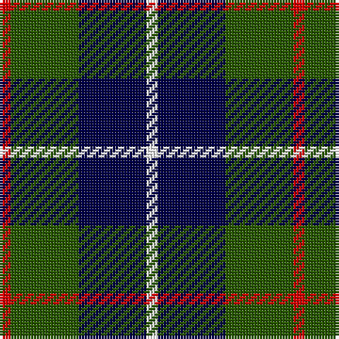

This page is one **sett** — a single exact thread-count. It belongs to the [tartan](/tartans/r1dg6db6w1/)
(the same proportion at any scale), whose colour order is pattern [RGBW](/stripes/rgbw/).

Sourced from register-of-tartans.  It is a [4 stripe tartan](/stripes/stripes4/).

Original link https://www.tartanregister.gov.uk/tartanDetails.aspx?ref=11409

## Register references

External register numbers recorded for this tartan.

- Scottish Register of Tartans: [11409](https://www.tartanregister.gov.uk/tartanDetails.aspx?ref=11409)

## Thread count
R/4 G24 DB24 W/4

## Palette

Palette: <strong>Tartan Register</strong>
<table><thead><tr><th>Colour</th><th>Threads</th><th>Shade</th><th>Base</th><th>OKLCh</th></tr></thead><tbody><tr><td>R/</td><td style="text-align:right;font-variant-numeric:tabular-nums">4</td><td><code style="background-color:#DC0000;">#DC0000</code> <small style="color:#888">#DC0000</small></td><td>R <code style="background-color:#CC0000;">#CC0000</code></td><td><small style="color:#888">oklch(56.2% 0.230 29.2)</small></td></tr><tr><td>G</td><td style="text-align:right;font-variant-numeric:tabular-nums">24</td><td><code style="background-color:#285800;">#285800</code> <small style="color:#888">#285800</small></td><td>G <code style="background-color:#006100;">#006100</code></td><td><small style="color:#888">oklch(41.0% 0.122 135.8)</small></td></tr><tr><td>DB</td><td style="text-align:right;font-variant-numeric:tabular-nums">24</td><td><code style="background-color:#000048;">#000048</code> <small style="color:#888">#000048</small></td><td>B <code style="background-color:#2A418A;">#2A418A</code></td><td><small style="color:#888">oklch(18.2% 0.126 264.1)</small></td></tr><tr><td>W/</td><td style="text-align:right;font-variant-numeric:tabular-nums">4</td><td><code style="background-color:#FFFFFF;">#FFFFFF</code> <small style="color:#888">#FFFFFF</small></td><td>W <code style="background-color:#F7F7F7;">#F7F7F7</code></td><td><small style="color:#888">oklch(100.0% 0.000 89.9)</small></td></tr></tbody></table>

# Sample pattern

## Nearest tartans

The nearest existing variants by ΔTartan distance, with this tartan at the top so the swatches line up against it.

ΔTartan

Tartan

Sett

—

<a href="/ttd/edit/#slug=r1dg6db6w1~x4">Salt Spring Island</a> <a class="nn-out" href="/setts/s4/r1dg6db6w1~x4/" title="open its dictionary page">↗</a>

1.08

<a href="/ttd/edit/#slug=k2lb2dg8db8lb1">Douglas</a> <a class="nn-out" href="/setts/s5/k2lb2dg8db8lb1/" title="open its dictionary page">↗</a>

1.08

<a href="/ttd/edit/#slug=r5o32k31w5~x2">Loganair</a> <a class="nn-out" href="/setts/s4/r5o32k31w5~x2/" title="open its dictionary page">↗</a>

1.09

<a href="/ttd/edit/#slug=k7w1g7t1~x2">Wilson's No.079</a> <a class="nn-out" href="/setts/s4/k7w1g7t1~x2/" title="open its dictionary page">↗</a>

1.09

<a href="/ttd/edit/#slug=r1k6y6b1~x10">Mayer, Chris (Personal)</a> <a class="nn-out" href="/setts/s4/r1k6y6b1~x10/" title="open its dictionary page">↗</a>

1.11

<a href="/ttd/edit/#slug=r3o16k16lb3~x4">Thompson, Dress (Clan)</a> <a class="nn-out" href="/setts/s4/r3o16k16lb3~x4/" title="open its dictionary page">↗</a>

1.12

<a href="/ttd/edit/#slug=r5y32k31w5~x2">Loganair, Uniform Skirt</a> <a class="nn-out" href="/setts/s4/r5y32k31w5~x2/" title="open its dictionary page">↗</a>

1.16

<a href="/ttd/edit/#slug=g14db2g2k8p9k2~x2">MacArthur of Milton, hunting</a> <a class="nn-out" href="/setts/s6/g14db2g2k8p9k2~x2/" title="open its dictionary page">↗</a>

1.17

<a href="/ttd/edit/#slug=db2k2db12k8g11r2~x2">Murray</a> <a class="nn-out" href="/setts/s6/db2k2db12k8g11r2~x2/" title="open its dictionary page">↗</a>

1.19

<a href="/ttd/edit/#slug=r5o32k31w5">Loganair Uniform Skirt Corporate Tartan Tartan Number: 1629. Earliest known date: c.1985 Half actual count for display. Used until 1988 See products available Copyright © Blair Urquhart, Comrie, 2015</a> <a class="nn-out" href="/setts/s4/r5o32k31w5/" title="open its dictionary page">↗</a>

1.20

<a href="/ttd/edit/#slug=k4w2g13k13t12k2~x2">Melville</a> <a class="nn-out" href="/setts/s6/k4w2g13k13t12k2~x2/" title="open its dictionary page">↗</a>

## Neighbour map

Every grey dot is one of 14299 variants placed by the first two principal components of the ΔTartan feature space (44% of its variance). Red is this tartan; blue dots are its nearest — click one to open its page.

<svg viewBox="0 0 640 380" role="img" style="max-width:100%;height:auto;border:1px solid #e0e0e0;border-radius:4px;display:block" xmlns="http://www.w3.org/2000/svg"><image href="/nn/cloud.v1.png" width="640" height="380"/><a href="/setts/s5/k2lb2dg8db8lb1/"><circle cx="168.2" cy="233.3" r="4" fill="#3465a4"><title>Douglas</title></circle></a><a href="/setts/s4/r5o32k31w5~x2/"><circle cx="210.3" cy="241.0" r="4" fill="#3465a4"><title>Loganair</title></circle></a><a href="/setts/s4/k7w1g7t1~x2/"><circle cx="222.0" cy="251.2" r="4" fill="#3465a4"><title>Wilson's No.079</title></circle></a><a href="/setts/s4/r1k6y6b1~x10/"><circle cx="191.8" cy="243.9" r="4" fill="#3465a4"><title>Mayer, Chris (Personal)</title></circle></a><a href="/setts/s4/r3o16k16lb3~x4/"><circle cx="192.7" cy="253.0" r="4" fill="#3465a4"><title>Thompson, Dress (Clan)</title></circle></a><a href="/setts/s4/r5y32k31w5~x2/"><circle cx="197.4" cy="237.5" r="4" fill="#3465a4"><title>Loganair, Uniform Skirt</title></circle></a><a href="/setts/s6/g14db2g2k8p9k2~x2/"><circle cx="177.9" cy="224.5" r="4" fill="#3465a4"><title>MacArthur of Milton, hunting</title></circle></a><a href="/setts/s6/db2k2db12k8g11r2~x2/"><circle cx="152.4" cy="240.0" r="4" fill="#3465a4"><title>Murray</title></circle></a><a href="/setts/s4/r5o32k31w5/"><circle cx="209.3" cy="239.4" r="4" fill="#3465a4"><title>Loganair Uniform Skirt Corporate Tartan Tartan Number: 1629. Earliest known date: c.1985 Half actual count for display. Used until 1988 See products available Copyright © Blair Urquhart, Comrie, 2015</title></circle></a><a href="/setts/s6/k4w2g13k13t12k2~x2/"><circle cx="166.6" cy="238.0" r="4" fill="#3465a4"><title>Melville</title></circle></a><circle cx="199.8" cy="254.4" r="5" fill="#c00000"/></svg>

ID: /setts/s4/r1dg6db6w1~x4/
